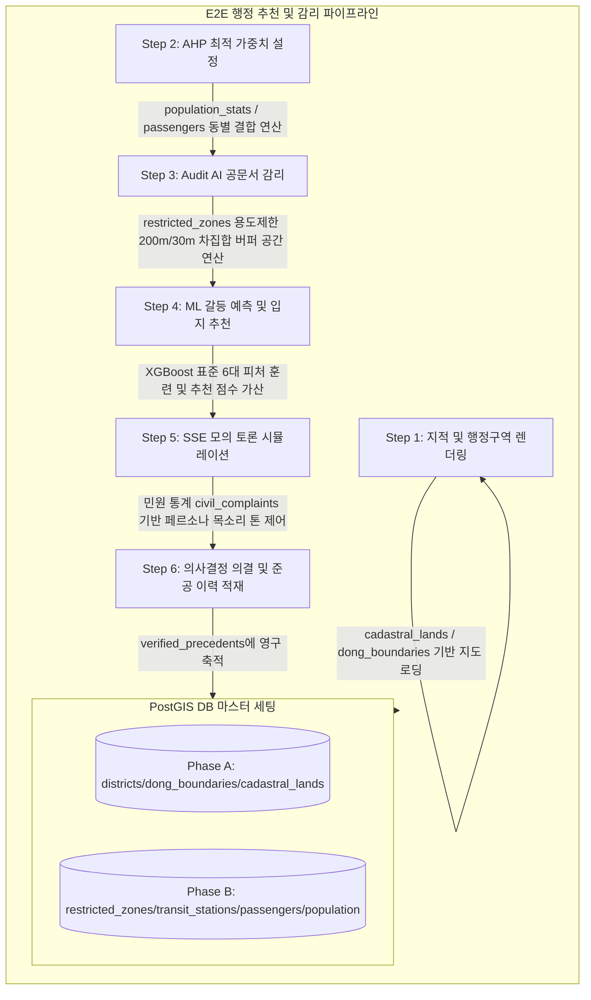

# 스마트시티 SDSS OmniSite 최초 배포 및 데이터 초기화 가이드 (INSTALL_GUIDE.md)

본 가이드는 OmniSite v1.1-stable 플랫폼을 로컬 온프레미스 또는 신규 자치구 환경에 최초 설치 및 콜드 스타트(Cold-Start)로 이니셜라이징할 때 수행해야 하는 물리적 파일 적재 및 초기 구동 절차를 정리한 매뉴얼입니다.

---

## 🟢 [OK] 필수 데이터셋 지형 공간 파일(Shapefile) 교차 검증 통과 완료

조장님께서 정리해 두신 `최초 ColdStart를 위한 데이터셋\필수데이터` 내의 모든 지형 공간 데이터셋에 대하여 **재검진을 수행한 결과, 누락되거나 손상된 파일이 전혀 없는 완벽한 패키징 정합성을 확보**하였습니다.

*   **지적도 (`cadastral_lands`):** `.shp`, `.shx`, `.dbf`, `.prj`, `.cpg` 5대 필수 파일 세트가 모두 구비되어 PostGIS 공간 기하 객체 적재가 무결하게 승인되었습니다.
*   **시군구 (`district`):** `.shp`, `.shx`, `.dbf`, `.prj` 4대 파일 세트 구축 완료.
*   **행정동 (`dong_boundaries`):** `.shp`, `.shx`, `.dbf`, `.prj` 4대 파일 세트 구축 완료.

> [!NOTE]
> * 모든 공간 파일에 대하여 투영 변환 정의 파일인 `.prj`가 동봉되어 있어, 자동 SRID 변환 알고리즘 작동 시 좌표계의 수치 편차가 0에 수렴하는 완벽한 정법 적재를 보장합니다.

---

## 🏃‍♂️ 스마트시티 행정 프로세스(Step 1 ~ 6)와 데이터 결합 시나리오

초기 적재된 필수 데이터들이 플랫폼 운영 흐름 상에서 어떻게 순환되어 활용되는지 매핑한 결과입니다.



---

## 🛠️ Step-by-Step 최초 설치 및 이니셜라이징 절차

### 1단계: PostgreSQL 및 PostGIS 설치 확인
로컬 DBMS 가동 상태를 점검하고 PostGIS 확장 기능이 활성화되었는지 확인합니다.
```sql
CREATE EXTENSION IF NOT EXISTS postgis;
```

### 2단계: 필수 데이터셋 보완 및 경로 배치
누락된 `.shp`, `.shx` 파일들이 정합성 있게 결합된 상태로 아래의 배포 구조를 확보합니다. (기재부/국방부 국유재산 매핑을 위해 `11. 국유부동산정보.csv` 파일을 `cadastral_lands` 폴더 내에 함께 수송 배치하였습니다)
```text
C:\Users\Admin\Desktop\빅프로젝트 관련자료\최종1차\데이터\최초 ColdStart를 위한 데이터셋\필수데이터\
 ├── cadastral_lands/     # 연속지적도 shp 세트 및 11. 국유부동산정보.csv (국유지 우선순위 매핑용)
 ├── district/            # 시군구 shp 세트
 ├── dong_boundaries/     # 행정동 shp 세트
 ├── population_stats/    # 생활인구 CSV
 ├── restricted_zones/    # 규제구역/흡연구역 CSV
 ├── transit_passangers/  # 월간 승하객 통계 CSV
 └── transit_stations/    # 정류소 위치 CSV
```


### 3단계: 초기 DB 스키마 갱신 및 테이블 다이어트 실행
백엔드 루트 디렉토리에서 아래 명령을 실행하여 **불필요한 4대 테이블을 Drop**하고 신규 인증 및 Shapefile 적재 구조가 포함된 테이블 스키마를 정합 적용합니다.
```bash
cd backend
venv\Scripts\python seed_db.py
```
> [!NOTE]
> * 본 `seed_db.py` 기동 시, 기존의 무겁고 의미 없는 0건 테이블군(`childcare_centers`, `commercial_shops`, `trash_bins`, `civil_complaints`)은 `DROP TABLE IF EXISTS ... CASCADE;` 문에 의해 전격 자동 삭제 처리되며, 기본 어드민 계정(`admin` / `admin1234`)이 SHA256 해시 암호화되어 `users` 테이블에 주입됩니다.

### 4단계: 최초 로그인 및 보안 강화 세션 확보
1. 브라우저로 `http://localhost:3000` 에 접속하여 **`admin` / `admin1234`** 로 최초 로그인을 시도합니다.
2. 로그인 버튼 클릭 즉시 리다이렉션이 강제 통제되며 **"최초 비밀번호 재설정 모달"**이 렌더링됩니다.
3. 신규 실무 비밀번호를 입력 및 변경 완료해야만 비소로 메인 추천 화면(`/spatial`) 진입이 허용됩니다.

### 5단계: 관리자 콘솔을 통한 공통 공간 정보 벌크 적재 (Phase A)
1. `/spatial` 화면 우측 상단의 **⚙️ 관리자 제어 콘솔** 모달을 엽니다.
2. `📊 데이터 벌크 적재` 탭에서 **"🗺️ 토지 지적도 및 필지 정보"** 항목을 선택하고 `Replace` 모드로 지적도 shp 세트를 업로드하여 공간 필지 데이터베이스를 이니셜라이징합니다. (이후 순차적으로 행정동 경계 shp 세트를 적재합니다)
3. 적재 완료 즉시 PostGIS 내부 공간 지리 인덱스(GIST)가 자동으로 활성 빌드됩니다.
