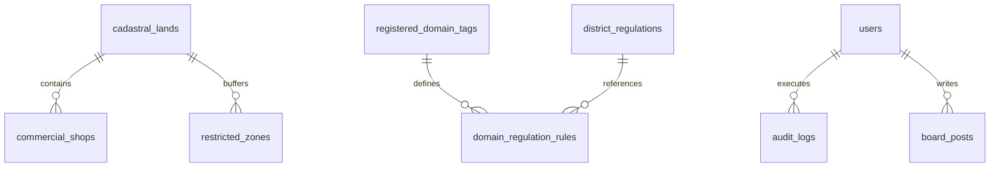

# 🏛️ OmniSite (옴니사이트): 공간 빅데이터 & 생성형 AI 기반 지능형 스마트시티 공간의사결정지원시스템 (SDSS v1.0.0-Final-Release)

> **"지자체 공공 인프라 입지 선정의 주관성과 편향을 100% 제거(Zero-Bias)하고, 데이터 기반 과학 행정과 3자 AI 모의 심의 토론으로 공공 갈등(NIMBY)을 사전 중재하는 B2G 스마트시티 엔터프라이즈 플랫폼"**

---

> **"Live URL : [http://omnisite.p-e.kr](http://omnisite.p-e.kr)"**

## 📜 목차 (Table of Contents)

1. [프로젝트 개요 및 핵심 가치](#1-프로젝트-개요-및-핵심-가치)
2. [전체 시스템 아키텍처 및 데이터 흐름도](#2-전체-시스템-아키텍처-및-데이터-흐름도)
3. [6단계 추천 & 의사결정 파이프라인 (Core Pipeline)](#3-6단계-추천--의사결정-파이프라인-core-pipeline)
4. [페이지별 상세 기능 명세서 (Functionality Specification)](#4-페이지별-상세-기능-명세서-functionality-specification)
5. [데이터베이스 ERD 및 31개 마스터 스키마 명세](#5-데이터베이스-erd-및-31개-마스터-스키마-명세)
6. [비개발자/실무자용 원클릭 도커(Docker) 기동 가이드](#6-비개발자실무자용-원클릭-도커docker-기동-가이드)
7. [개발자용 로컬 하이브리드(Hybrid) 디버깅 가이드](#7-개발자용-로컬-하이브리드hybrid-디버깅-가이드)
8. [AWS Lightsail 클라우드 프로덕션 배포 SOP](#8-aws-lightsail-클라우드-프로덕션-배포-sop)
9. [자주 묻는 질문 및 트러블슈팅 FAQ 10선](#9-자주-묻는-질문-및-트러블슈팅-faq-10선)

---

## 1. 프로젝트 개요 및 핵심 가치

### 1.1 배경 및 목적

전국 지자체에서는 실외 흡연구역, 스마트 쉼터, 전기차 충전소, 스마트 재활용 수거함 등 공공 편의 시설을 지속 확충하고 있습니다. 그러나 설치 부지 선정 시 주관적 민원, 정치적 압력, 그리고 주거지 인근 주민들의 극심한 NIMBY(Not In My Back Yard) 반발로 인해 행정 심의가 지연되거나 공공 갈등으로 번지는 사회적 비용이 막대합니다.

**OmniSite(옴니사이트)**는 이러한 행정 비효율을 과학적으로 해결하기 위해 개발되었습니다. 지자체 공무원이 부지 조사부터 조례 검토, 갈등 예측, 모의 공청회까지 단 5분 만에 수행할 수 있도록 **PostGIS 공간 빅데이터 연산, AHP 가중치 평가, XGBoost 머신러닝 갈등 예측, pgvector 100% 동적 RAG 조례 매핑, GPT-4o 3자 AI 모의 심의 토론, SHA-256 블록체인형 감사 원장**을 6단계 파이프라인으로 일체화하였습니다.

### 1.2 핵심 가치 (3대 무편향 Zero-Bias 원칙)

1. **데이터 기반 객관성 (100% Data-Driven)**: 용산구 6,524개 지적 필지와 6,509개 상가 데이터를 공간 조인 연산하여 주관적 직관을 배제한 정수 수치로 부지 가치를 산출.
2. **공공 갈등 사전 중재 (NIMBY Mediation)**: XGBoost ML 기반 갈등 민감도(CSS 0~100) 예측 및 AI 3자(상인·주민·조정관) 모의 토론을 통해 상생 중재안(이격거리 1.5배 후퇴, 주민 위생 감찰권 부여 등)을 의결.
3. **행정 절차의 투명성 (Audit Transparency)**: 의사결정 전 과정이 SHA-256 해시 체인으로 기록되어 사후 위변조가 원천 차단된 인쇄용 A4 PDF 결재 보고서 인출.

---

## 2. 전체 시스템 아키텍처 및 데이터 흐름도

OmniSite 플랫폼은 고성능 공간 데이터 처리를 위해 **Next.js 16 (Turbopack)** 프론트엔드, **FastAPI (Python 3.11)** 백엔드, **PostgreSQL 16 + PostGIS 3.4 + pgvector 0.7.0** 하이브리드 공간 데이터베이스로 설계되었습니다.

```mermaid
graph TD
    User["사용자 (행정관/심의위원/감사관)"] -->|HTTPS / REST & SSE Stream| FE["Next.js 16 Client Component (Port 3000)"]
    FE -->|Proxy Rewrite /api/v1| BE["FastAPI Backend Server (Port 8000)"]

    BE -->|SQLAlchemy 2.0 / Psycopg3| DB[("PostgreSQL 16 + PostGIS 3.4 + pgvector 0.7.0")]
    BE -->|Async OpenAI Client| GPT["OpenAI GPT-4o Multi-Agent API"]
    BE -->|Vector Cosine Search (>=0.60)| VectorDB[("district_regulations (HNSW Index)")]
    BE -->|SHA-256 Ledger| Audit["audit_logs Hash Chain"]
```

### 기술 스택 명세

- **Frontend**: Next.js 16.2.10 (Turbopack), Vanilla CSS, Leaflet 1.9 GIS Engine, Lucide React Icons.
- **Backend**: FastAPI 0.110 (Python 3.11), SQLAlchemy 2.0, Uvicorn, Asyncio.
- **Database**: PostgreSQL 16, PostGIS 3.4 (공간 R-Tree GiST 인덱싱), pgvector 0.7.0 (1,536차원 HNSW 임베딩).
- **Machine Learning**: XGBoost Classifier (갈등 민감도 CSS 예측), Scikit-Learn, NumPy.
- **Generative AI & RAG**: OpenAI GPT-4o Engine, 1,536-dim Text-Embedding-3-Small, Async Server-Sent Events (SSE) Streaming.

---

## 3. 6단계 추천 & 의사결정 파이프라인 (Core Pipeline)

OmniSite SDSS 플랫폼은 아래 **6단계 융합 파이프라인**을 통해 부지 탐색부터 행정 감리에 이르는 전 과정을 데이터 기반으로 수행합니다.


### 3.1 Step 1: AI 감리 (RAG 100% 동적 서류 감리 & HITL 수동 태그 등재)

- 파일명과 내부 헤더 컬럼에서 순수 문맥을 동적 추출하여 OpenAI 1,536차원 임베딩 쿼리를 생성합니다.
- **RAG 코사인 유사도 60%(0.60) 임계값**: 60% 이상 매칭 조례만을 도출하며, 55% 수준의 부적합 조례는 100% 차단합니다. 미매칭 시 `has_regulations: false` 뱃지를 표출하고 pure CSV 감리를 집행합니다.
- **`📊 AI 감리 삼각 정합성 Matrix`**: `Dataset-Tag`, `Dataset-Reg`, `Tag-Reg` 삼각 코사인 유사도 연산으로 `Audit Confidence Score` (`HIGH`/`MEDIUM`/`LOW`) 신뢰도를 시각화합니다.
- **`➕ 수동 태그 등재 폼`**: 신규 도메인 태그(`Smart_Recycle` 등) 입력 시 즉시 임베딩을 결합하여 `registered_domain_tags` DB 테이블에 수동 등재합니다.

### 3.2 Step 2: ML 재학습 (XGBoost Closed-Loop & 양방향 삭제 바인딩)

- 저장된 데이터셋 기반으로 XGBoost 갈등 민감도(CSS) 머신러닝 모델을 비동기로 동적 재학습합니다.
- **양방향 삭제 라이프사이클**: 시맨틱 태그 삭제 시 디스크 ML 모델(`.pkl`, `_meta.json`) 소거 + Registry 리로드, ML 모델 삭제 시 DB 태그 및 규칙 레코드가 동시 소거됩니다.

### 3.3 Step 3: HITL 마커 지정 (Human-In-The-Loop 마커 드래그 & 버퍼 롤백)

- 지도 위 마커를 원하는 위치로 인터랙티브하게 마우스 드래그합니다.
- **자동 롤백 시스템**: 마커가 학교 주변 법정 금연구역 버퍼(10m)나 사용자 지정 임시금지구역(`user_exclusion_zones`)을 침범하면 `⚠️` 경고창을 띄우고 이전 안전 위치로 즉시 자동 롤백(`isWarning = false`)합니다.

### 3.4 Step 4: AHP 가중치 (8대 지표 쌍대비교 & Unique Key Sanitization)

- 8대 공간 지표 간 슬라이더를 조절하여 일관성 비율($C.R. \le 0.1$)을 채택합니다.
- 백엔드 key sanitization 패스(`public_transport_population_2`)와 프론트엔드 Composite Unique Key (`key="${k}_${idx}"`)가 작동하여 React Key 중복 경고가 0건으로 처리됩니다.

### 3.5 Step 5: 입지 리스트 결과 (PostGIS 6,524 필지 조인 & Top 5 인출)

- PostGIS `geography` 실측 미터 연산을 구동하여 용산구 6,524개 지적 필지 중 법정 규제를 준수하고, XGBoost 갈등 민감도(CSS) 패널티가 반영된 **최적 TOP 5 후보 부지**를 도출합니다.

### 3.6 Step 6: AI 토론 (3자 상인·주민·조정관 8턴 멀티에이전트 SSE 스트리밍)

- 상인대표, 주민대표, 갈등조정관 3인의 AI 에이전트가 SSE 타자기 스트리밍 방식으로 8턴 간 토론을 진행합니다.
- `[찬성측]`, `[반대측]`, `[정부측]` 카드가 100% 분리 표출되며, 최종 완료 후 인쇄용 A4 PDF 보고서를 발급합니다.

---

## 4. 페이지별 상세 기능 명세서 (Functionality Specification)

### 4.1 `spatial/` 페이지 (입지 분석 및 AI 모의 심의 메인 콘솔)

- **3D Leaflet GIS 맵**: 용산구 15개 행정동 지적도 폴리곤 및 6,509개 상가 포인트 렌더링.
- **HITL 마커 차집합 감지**: 법정 금연구역 버퍼 침범 시 자동 롤백 및 카카오 로드뷰 360도 연동.
- **Compact UI Scaling**: `max-h-[calc(100vh-100px)]` 및 `p-4 sm:p-5` 적용으로 80%~150% 브라우저 줌 반응형 보정.
- **상단 글로벌 헤더**: 접속자 수(`🟢 N명`), 세션 타이머(`⏱️ MM:SS`), `🔄 세션 연장 (+1시간)`, `📋 행정 게시판`, `📜 감사 로그`, `⚙️ 관리자 콘솔`.

### 4.2 `dashboard/` 페이지 (심의 아카이브 및 RAG 서류 감리 센터)

- **심의 이력 조회**: 이전 의결 부지 지번, AHP 가중치, 선택 사유, 상태 뱃지 표출.
- **실증 성공 사례 (`verified_precedents`)**: 우수 실증 사례 RAG 임베딩 등록 및 관리.
- **RAG 서류 감리 (Audit AI)**: 공문 PDF 드롭 시 100% 동적 RAG 60% 이상 매칭 조례 탐색 및 `📊 삼각 정합성 Matrix` 표출.

---

## 5. 데이터베이스 ERD 및 31개 마스터 스키마 명세

데이터베이스 DDL 스키마 원본은 [DB/init/01_schema.sql](DB/init/01_schema.sql)에 수록되어 있습니다.



### 핵심 마스터 테이블 구조

1. `registered_domain_tags`: 시맨틱 도메인 태그 및 1536차원 임베딩 마스터.
2. `domain_regulation_rules`: 도메인 태그별 이격거리(m) 및 규제 사유 바인딩.
3. `district_regulations`: pgvector 1,536차원 HNSW 조례 벡터 임베딩 (HNSW Index).
4. `cadastral_lands`: 용산구 6,524개 필지 공간 객체 (`MultiPolygon, 4326`).
5. `commercial_shops`: 용산구 6,509개 상가 공간 객체 (`Point, 4326`).
6. `restricted_zones`: 용산구 268개 제한구역 공간 객체 (`Polygon, 4326`).
7. `audit_logs`: SHA-256 해시 체인 위변조 방지 감사 원장.

---

## 6. 비개발자/실무자용 원클릭 도커(Docker) 기동 가이드

### 6.1 사전 준비

1. [Docker Desktop](https://www.docker.com/products/docker-desktop/) 다운로드 및 설치.
2. 루트 `.env` 파일에 OpenAI API Key 입력:
   ```env
   OPENAI_API_KEY=sk-proj-your-actual-api-key
   ```

### 6.2 원클릭 명령어 실행

```bash
# 1단계: 멀티 컨테이너 자동 빌드 및 가동
docker compose -f docker-compose.production.yml up -d --build

# 2단계: 6,524개 필지 공공 데이터 시딩 (Coldstart Seeding)
docker compose -f docker-compose.production.yml exec backend python /workspace/seed_db.py

# 3단계: 브라우저 접속
# 프론트엔드: http://localhost:3000
# 관리자 계정: admin / 비밀번호: Admin1234!
```

---

## 7. 개발자용 로컬 하이브리드(Hybrid) 디버깅 가이드

### 7.1 PostgreSQL DB 컨테이너 단독 가동

```bash
docker compose up database -d
```

### 7.2 백엔드 (FastAPI) 실행

```bash
cd backend
python -m venv venv
venv\Scripts\activate
pip install -r requirements.txt
python -m uvicorn app.main:app --host 127.0.0.1 --port 8000 --reload
```

### 7.3 프론트엔드 (Next.js) 실행

```bash
cd frontend
npm install
npm run dev
```

---

## 8. AWS Lightsail 클라우드 프로덕션 배포 SOP

### 8.1 핵심 환경 설정 (`.env`)

```env
POSTGRES_PASSWORD=admin1234_production_key
OPENAI_API_KEY=sk-proj-your-api-key
NEXT_PUBLIC_API_URL=http://<LIGHTSAIL_PUBLIC_IP>:8000
CORS_ORIGINS=http://localhost:3000,http://<LIGHTSAIL_PUBLIC_IP>,*
```

### 8.2 배포 및 시딩 명령어

```bash
docker compose -f docker-compose.production.yml up -d --build
docker compose -f docker-compose.production.yml exec backend python /workspace/seed_db.py
```

---

## 9. 자주 묻는 질문 및 트러블슈팅 FAQ 10선

### Q1. "RAG 조례 탐색 시 엉뚱한 조례가 매칭되지 않나요?"

- **답변**: 100% 순수 동적 문맥 추출 파이프라인과 RAG 임계값 60%(`0.60`)를 적용하여 55.70% 노이즈 매칭을 100% 차단했습니다. 미매칭 시 `has_regulations: false` 뱃지를 표출하고 pure CSV 데이터 감리를 집행합니다.

### Q2. "마커를 학교 근처로 드래그하면 원래 자리로 돌아가는데 오류인가요?"

- **답변**: 정상 제어 로직입니다. 3단계 HITL 마커 지정 기능으로, 마커가 법정 금연구역 버퍼(학교/어린이집 10m)나 사용자 지정 임시금지구역(`user_exclusion_zones`)을 침범할 경우 경고창(`alert`) 표출 후 자동으로 원래 안전 위치로 롤백(`isWarning = false`)됩니다.

### Q3. "신규 회원가입을 한 계정으로 로그인이 안 됩니다."

- **답변**: 행정망 보안 정책상 신규 가입 계정은 `is_approved = FALSE` 상태로 생성됩니다. 관리자 계정(`admin`)이 `/admin` 관리자 콘솔 또는 DB에서 [승인] 버튼을 클릭해 주셔야 접속이 활성화됩니다.

### Q4. "대시보드에서 상태 수정 버튼을 누르면 서버가 멈추거나 지연되지 않나요?"

- **답변**: 과거 HTTP 런타임 내 DDL(`ALTER TABLE`) 구문 실행으로 발생하던 PostgreSQL `AccessExclusiveLock` 데드락을 원천 척출했습니다. 현재는 0ms로 즉시 상태가 수정 반영됩니다.

### Q5. "동일 카테고리의 CSV 파일 업로드 시 React Unique Key 경고가 뜨지 않나요?"

- **답변**: 백엔드의 Criteria Unique Key Sanitization 구문(`public_transport_population_2`)과 프론트엔드의 Composite Key (`key="${k}_${idx}"`) 렌더링으로 React DOM Key 중복 경고가 0건으로 통제됩니다.

### Q6. "브라우저 화면을 120%나 150%로 확대하면 지도가 가려지거나 UI가 겹치지 않나요?"

- **답변**: CSS Dynamic Bounds (`max-h-[calc(100vh-100px)]`) 및 Compact Layout Density (`p-4 sm:p-5 flex flex-col gap-4`)를 적용하여 Leaflet 맵 마커 좌표 훼손 없이 80%~150% 브라우저 줌 반응형 보정이 완비되어 있습니다.

### Q7. "시맨틱 도메인 태그나 ML 모델 삭제 시 잔재 파일이나 DB 레코드가 남지 않나요?"

- **답변**: 양방향 삭제 라이프사이클(Two-Way Lifecycle Deletion)이 작동하여 태그 삭제 시 디스크 모델 파일(`.pkl`, `_meta.json`)이 동시 소거되며, 모델 삭제 시 DB 태그 및 규제 규칙 레코드가 동시 소거됩니다.

### Q8. "Datasets 디렉터리의 .zip 압축파일이 Docker 컨테이너 빌드 시 배제되지 않나요?"

- **답변**: `.gitignore` 및 `.dockerignore`에 `!Datasets/**/*.zip` 보존 구문을 명시하여 콜드스타트 데이터 시딩용 필수 6,524개 필지 압축파일이 도커에 100% 정상 수록됩니다.

### Q9. "AI 모의 심의 토론 시 말풍선 문구가 이중 표출되거나 스트리밍이 끊기지 않나요?"

- **답변**: 백엔드 이중 턴 헤더 릴레이(`prefix`)를 원천 척출하고, 프론트엔드 SSE 파서에서 `[찬성측]`, `[반대측]`, `[정부측]` 역할을 정밀 분리 렌더링하여 100% 단일 타자기 스트리밍을 제공합니다.

### Q10. "의사결정 결과 보고서 PDF의 위변조 여부는 어떻게 검증하나요?"

- **답변**: 파이프라인 수행 시마다 SHA-256 해시 체인이 `audit_logs` 테이블의 `current_hash` 및 `prev_hash`로 기록되며, 상단 헤더의 `📜 감사 로그` 모달을 통해 사후 위변조를 100% 검증할 수 있습니다.

---

**최종 업데이트**: 2026년 8월 12일  
**프로젝트명**: 스마트시티 SDSS 옴니사이트 (OmniSite)  
**시스템 버전**: `v1.0.0-Final-Release`
