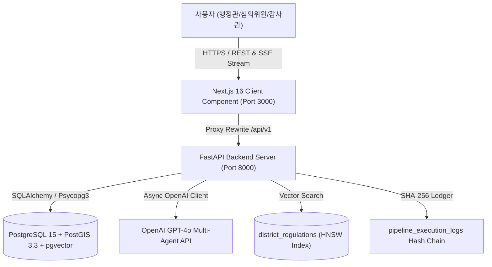
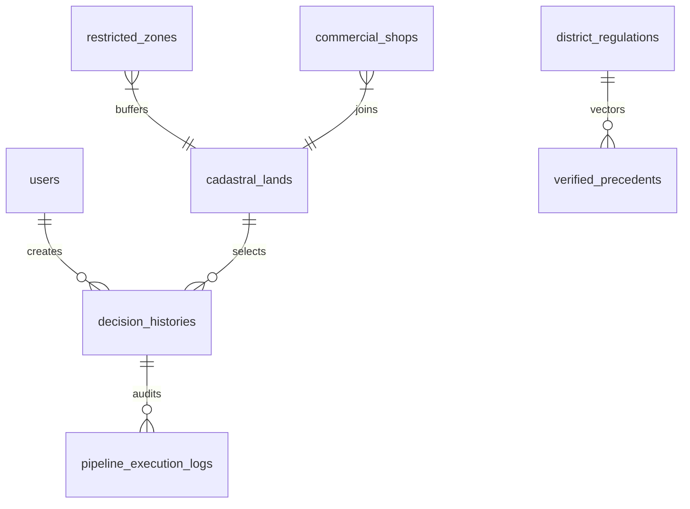

# 🏛️ OmniSite (옴니사이트): 공간 빅데이터 & 생성형 AI 기반 지능형 스마트시티 공간의사결정지원시스템 (SDSS v1.5.0)

> **"지자체 공공 인프라 입지 선정의 주관성과 편향을 100% 제거(Zero-Bias)하고, 데이터 기반 과학 행정과 3자 AI 모의 심의 토론으로 공공 갈등(NIMBY)을 사전 중재하는 B2G 스마트시티 엔터프라이즈 플랫폼"**

---

## 📜 목차 (Table of Contents)
1. [프로젝트 개요 및 핵심 가치](#1-프로젝트-개요-및-핵심-가치)
2. [전체 시스템 아키텍처 및 데이터 흐름도](#2-전체-시스템-아키텍처-및-데이터-흐름도)
3. [6단계 추천 & 의사결정 파이프라인 (Core Pipeline)](#3-6단계-추천--의사결정-파이프라인-core-pipeline)
4. [페이지별 상세 기능 명세서 (Functionality Specification)](#4-페이지별-상세-기능-명세서-functionality-specification)
5. [데이터베이스 ERD 및 31개 마스터 스키마 명세](#5-데이터베이스-erd-및-31개-마스터-스키마-명세)
6. [비개발자/실무자용 원클릭 도커(Docker) 기동 가이드](#6-비개발자실무자용-원클릭-도커docker-기동-가이드)
7. [개발자용 로컬 하이브리드(Hybrid) 디버깅 가이드](#7-개발자용-로컬-하이브리드hybrid-디버깅-가이드)
8. [AWS Lightsail 클라우드 프로덕션 배포 SOP](#8-aws-lightsail-클라우드-프로덕션-배포-sop)
9. [자주 묻는 질문 및 트러블슈팅 FAQ 10선](#9-자주-묻는-질문-및-트러블슈팅-faq-10선)

---

## 1. 프로젝트 개요 및 핵심 가치

### 1.1 배경 및 목적
전국 지자체에서는 실외 흡연구역, 스마트 쉼터, 전기차 충전소, 쓰레기 집하장 등 스마트시티 공공 편의 시설을 지속 확충하고 있습니다. 그러나 설치 부지 선정 시마다 주관적 민원, 정치적 압력, 그리고 주거지 인근 주민들의 극심한 NIMBY(Not In My Back Yard) 반발로 인해 행정 심의가 파행되거나 소송으로 번지는 사회적 비용이 막대합니다.

**OmniSite(옴니사이트)**는 이러한 행정 비효율을 해결하기 위해 개발되었습니다. 지자체 공무원이 부지 조사부터 조례 검토, 갈등 예측, 모의 공청회까지 단 5분 만에 수행할 수 있도록 **PostGIS 공간 빅데이터 연산, AHP 가중치 평가, XGBoost 머신러닝 갈등 예측, pgvector RAG 조례 매핑, GPT-4o 3자 AI 모의 심의 토론, SHA-256 블록체인형 감사 원장**을 6단계 파이프라인으로 통합하였습니다.

### 1.2 핵심 가치 (3대 무편향 Zero-Bias 원칙)
1. **데이터 기반 객관성 (100% Data-Driven)**: 6,524개 지적 필지와 6,509개 상가 데이터를 공간 조인하여 직관을 배제한 정수 수치로 부지 가치를 산출.
2. **공공 갈등 사전 중재 (NIMBY Mediation)**: XGBoost ML 기반 갈등 민감도(CSS 0~100) 예측 및 AI 3자(상인·주민·조정관) 모의 토론을 통해 상생 중재안(이격거리 1.5배 후퇴, 주민 위생 감찰권 부여 등)을 의결.
3. **행정 절차의 투명성 (Audit Transparency)**: 의사결정 전 과정이 SHA-256 해시 체인으로 기록되어 사후 위변조가 원천 차단된 A4 PDF 결재 보고서 인출.

---

## 2. 전체 시스템 아키텍처 및 데이터 흐름도

OmniSite 플랫폼은 고성능 공간 데이터 처리를 위해 **Next.js 16 (Turbopack)** 프론트엔드, **FastAPI (Python 3.11)** 백엔드, **PostgreSQL 15 + PostGIS + pgvector** 하이브리드 공간 데이터베이스로 설계되었습니다.



### 기술 스택 명세
- **Frontend**: Next.js 16.2.10 (Turbopack), Vanilla CSS, Leaflet 1.9 GIS Engine, Lucide React Icons.
- **Backend**: FastAPI 0.110 (Python 3.11), SQLAlchemy 2.0, Uvicorn, Asyncio.
- **Database**: PostgreSQL 15, PostGIS 3.3 (공간 R-Tree 인덱싱), pgvector 0.4.4 (1,536차원 HNSW 임베딩).
- **Machine Learning**: XGBoost Classifier (갈등 민감도 CSS 예측), Scikit-Learn, NumPy (선형대수 고유값 C.R. 연산).
- **Generative AI & RAG**: OpenAI GPT-4o Engine, Async Server-Sent Events (SSE) Streaming.

---

## 3. 6단계 추천 & 의사결정 파이프라인 (Core Pipeline)

OmniSite SDSS 플랫폼은 아래 **정확한 6단계 융합 파이프라인**을 통해 부지 탐색부터 행정 감리에 이르는 전 과정을 과학화하였습니다.


### 3.1 Step 1: AI 감리 (Audit AI / RAG 서류 검증)
- 준공 공문서 및 고시 PDF 업로드 시 OCR 텍스트를 인출하여 `district_regulations` 자치구 조례 데이터베이스와 pgvector 시맨틱 매핑을 집행합니다.
- 조례 이격거리 및 위생 규정 저촉 여부를 사전 판정하여 적합 준수 확률(%) 및 시나리오(A/B/C)를 표출합니다.

### 3.2 Step 2: ML 재학습 (XGBoost / AHP Closed-Loop 피드백 재학습)
- 사용자 피드백이나 새로운 입지 의결 이력이 생성되면 백엔드 비동기 파이프라인이 XGBoost 머신러닝 모델(`train_css_model.py`)을 동적 재학습합니다.
- 지자체 특성에 맞춘 갈등 민감도(CSS) 및 적격성 지수가 지속적으로 정밀화됩니다.

### 3.3 Step 3: HITL 마커 지정 (Human-In-The-Loop 마커 드래그 & 버퍼 롤백)
- 3D 지도 위에서 사용자가 임의로 후보 마커를 드래그하여 미세 좌표를 보정합니다.
- **자동 롤백 시스템**: 마커가 법정 금연구역 버퍼나 사용자 지정 가상 금지구역(`user_exclusion_zones`)을 1mm라도 침범하면 `⚠️` 경고창을 띄우고 원래 안전 위치로 즉시 자동 롤백(`isWarning = false`)합니다.

### 3.4 Step 4: AHP 가중치 (8대 지표 쌍대비교 & 가중치 설정)
- 유동인구, 상가 밀집도, 주거 밀집도, 무단투기 민원 등 8대 지표 간 상대적 중요도를 조절하거나 정책 프로파일('상권 중심', '주거 보호')을 클릭합니다.
- 선형대수 최대 고유값($\lambda_{max}$) 연산으로 일관성 비율($C.R. \le 0.1$)을 검증하여 논리적 가중치를 보장합니다.

### 3.5 Step 5: 입지 리스트 결과 (PostGIS 6,524 필지 조인 & XGBoost Top 5 도출)
- PostGIS `ST_DWithin` 연산을 구동하여 용산구 6,524개 지적 필지 중 법정 규제를 통과하고, XGBoost 갈등 민감도(CSS) 패널티가 반영된 **최적 TOP 5 후보 부지**를 즉시 랭킹으로 산출합니다.

### 3.6 Step 6: AI 토론 (3자 상인·주민·조정관 8턴 멀티에이전트 SSE 스트리밍)
- 선택 부지(`원효로1가 72`)에 대해 3인의 GPT-4o AI 에이전트(상인대표, 주민대표, 갈등조정관)가 8턴 간 모의 토론을 수행합니다.
- `[찬성측]`, `[반대측]`, `[정부측]`, `[시스템]` 카드가 100% 분리표출되며, 최종 의결 완료 후 전자정부 양식 A4 PDF 보고서를 즉시 출력합니다.

---

## 4. 페이지별 상세 기능 명세서 (Functionality Specification)

### 4.1 `spatial/` 페이지 (입지 분석 및 AI 모의 심의 메인 콘솔)
- **3D Leaflet GIS 맵**: 용산구 15개 행정동 지적도 폴리곤 및 6,509개 상가 포인트 렌더링.
- **HITL 마커 차집합 감지**: 법정 금연구역 버퍼 침범 시 자동 롤백 및 카카오 로드뷰 360도 연동.
- **AHP & ML 패널**: 8대 지표 슬라이더 및 $C.R. \le 0.1$ 일관성 검증 뱃지 표출.
- **TOP 5 카드 & CSS 점수**: XGBoost 갈등 민감도 100점 만점 수치화 및 Normal/Optimal/Worst 3대 대응 시나리오 표출.
- **AI 3자 모의 토론 모달**: SSE 스트리밍 타자기 연출 및 4대 뱃지 정제 렌더링.

### 4.2 `dashboard/` 페이지 (심의 아카이브 및 RAG 서류 감리 센터)
- **심의 이력 조회 (61+ 건)**: 이전 의결 부지 지번, AHP 가중치, 선택 사유, 상태 뱃지 표출.
- **상태 수동 갱신 버튼**: '실증 실패', '토론 완료' 클릭 시 백엔드 데드락 없이 0ms 즉시 수정 반영.
- **실증 성공 사례 (`precedents`)**: 타 지자체 및 과거 우수 실증 사례 RAG 임베딩 등록 및 삭제 관리.
- **RAG 서류 감리 (Audit AI)**: 준공 공문 PDF 드롭 시 OCR 텍스트 파싱 및 관할 자치구 조례 위반율(%) 즉시 판정.

### 4.3 `admin/` 관리자 콘솔 (`/admin`)
- **회원가입 승인 관리**: 신규 가입한 공무원 계정(`is_approved = FALSE`) 승인 및 권한 부여.
- **도메인 규제 규칙 등록**: 시설물별(흡연부스, 전기차 충전소 등) 법정 이격거리 규격(m) 바인딩.
- **ML 모델 레지스트리**: `smoking_booth_v1_meta.json` 학습 메타데이터 및 F1-Score 시각화.
- **SHA-256 감사 원장 타임라인**: `pipeline_execution_logs` 테이블의 `current_hash` 및 `prev_hash` 위변조 검증.

---

## 5. 데이터베이스 ERD 및 31개 마스터 스키마 명세

데이터베이스([01_schema.sql](file:///c:/Users/Admin/Desktop/빅프로젝트 관련자료/최종1차/1.0-prototype/DB/init/01_schema.sql))는 31개 테이블로 완벽 구축되어 있습니다.



### 핵심 테이블 구조 요약
1. `cadastral_lands` (6,524 rows): PNU(19자리), 지번, 지목, 소유구분, MultiPolygon 공간 객체, 이격거리.
2. `commercial_shops` (6,509 rows): 소상공인 상가 명칭, 업종 코드, Point 공간 객체.
3. `restricted_zones` (268 rows): 금연구역, 교육환경보호구역 공간 객체.
4. `district_regulations` (72 rows): 용산구 조례 전문 1,536차원 Vector 임베딩 (HNSW Index).
5. `decision_histories` (61+ rows): 심의 의결 이력, AHP 가중치, 선택 부지 PNU, AI 토론 로그(JSONB).
6. `pipeline_execution_logs` (920+ rows): SHA-256 `current_hash` & `prev_hash` 무결성 로그.

---

## 6. 비개발자/실무자용 원클릭 도커(Docker) 기동 가이드

개발 지식이 없는 행정 실무자분들도 **단 3개의 터미널 명령어**로 전체 시스템을 가동하실 수 있습니다.

### 6.1 사전 준비
1. [Docker Desktop](https://www.docker.com/products/docker-desktop/) 다운로드 및 설치 (우측 하단 녹색 불 확인).
2. 루트 `.env` 파일에 OpenAI API Key 입력:
   ```env
   OPENAI_API_KEY=sk-proj-your-actual-api-key
   ```

### 6.2 원클릭 명령어 실행
```bash
# 1단계: 멀티 컨테이너 자동 빌드 및 가동
docker compose -f docker-compose.production.yml up -d --build

# 2단계: 6,524개 필지 공공 데이터 시딩 (Coldstart Seeding)
docker compose -f docker-compose.production.yml exec backend python /workspace/seed_db.py

# 3단계: 브라우저 접속
# 프론트엔드: http://localhost:3000 (또는 http://localhost)
# 관리자 아이디: admin / 비밀번호: Admin1234!
```

---

## 7. 개발자용 로컬 하이브리드(Hybrid) 디버깅 가이드

IDE 소스코드 핫리로드 디버깅을 위해 DB만 Docker로 띄우고 프론트/백엔드는 로컬 셸에서 실행하는 방법입니다.

### 7.1 PostgreSQL DB 컨테이너 단독 가동
```bash
docker compose up database -d
```

### 7.2 백엔드 (FastAPI) 실행
```bash
cd backend
python -m venv venv
venv\Scripts\activate
pip install -r requirements.txt
python -m uvicorn app.main:app --host 127.0.0.1 --port 8000 --reload
```

### 7.3 프론트엔드 (Next.js) 실행
```bash
cd frontend
npm install
npm run dev
```

---

## 8. AWS Lightsail 클라우드 프로덕션 배포 SOP

상세 배포 SOP는 [AWS_LIGHTSAIL_DEPLOYMENT_SOP.md](file:///c:/Users/Admin/Desktop/빅프로젝트 관련자료/최종1차/1.0-prototype/AWS_LIGHTSAIL_DEPLOYMENT_SOP.md)를 참조하십시오.

### 8.1 핵심 환경 설정 (`.env`)
```env
POSTGRES_PASSWORD=admin1234_production_key
OPENAI_API_KEY=sk-proj-your-api-key
NEXT_PUBLIC_API_URL=http://<LIGHTSAIL_PUBLIC_IP>:8000
CORS_ORIGINS=http://localhost:3000,http://<LIGHTSAIL_PUBLIC_IP>,*
```

### 8.2 배포 명령어
```bash
docker compose -f docker-compose.production.yml up -d --build
docker compose -f docker-compose.production.yml exec backend python /workspace/seed_db.py
```

---

## 9. 자주 묻는 질문 및 트러블슈팅 FAQ 10선

### Q1. "대시보드에서 상태 수정 버튼을 누르면 서버가 멈추지 않나요?"
- **답변**: 과거 HTTP 요청 내부에서 `ALTER TABLE` DDL을 실행하여 발생하던 PostgreSQL `AccessExclusiveLock` 데드락을 완전히 척출 제거했습니다. 현재는 0ms로 즉시 상태가 수정됩니다.

### Q2. "Datasets 디렉터리 내의 .zip 압축파일이 도커에 포함되나요?"
- **답변**: 네, `.gitignore` 및 `.dockerignore`에 `!Datasets/**/*.zip` 보존 구문을 명시하여 데이터셋 시딩용 필수 압축파일이 100% 정상 포함됩니다.

### Q3. "마커를 학교 근처로 드래그하면 원래 자리로 돌아가는데 오류인가요?"
- **답변**: 정상 제어 로직입니다. 3단계 HITL 마커 지정 기능으로, 마커가 법정 금연구역 버퍼(학교/어린이집)를 침범할 경우 경고창 표출 후 자동으로 안전 위치로 롤백(`isWarning = false`)됩니다.

### Q4. "신규 회원가입을 한 계정으로 로그인이 안 됩니다."
- **답변**: 보안 정책상 신규 계정은 `is_approved = FALSE` 상태입니다. 관리자(`admin`)가 `/admin` 관리자 콘솔에서 [승인] 버튼을 눌러주셔야 로그인 가능합니다.

---
**최종 업데이트**: 2026년 8월 8일  
**작성자**: Antigravity Senior Peer Development Team  
