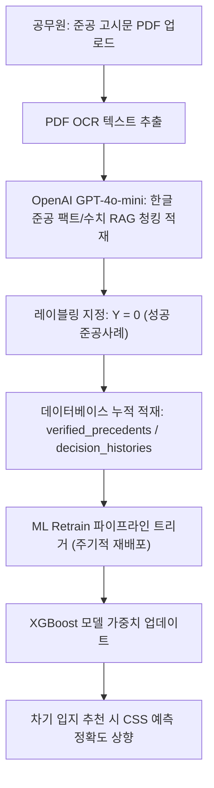

# [기술 보고서] XGBoost 기반 주민 갈등도(CSS) 예측 모델 및 ML-RAG 자가진화 아키텍처

본 보고서는 **OmniSite B2G SDSS v1.0**에 탑재된 **XGBoost 기반 주민 갈등도(CSS: Conflict Sensitivity Score) 이진 분류 모델**의 설계 명세, 피처 엔지니어링, 그리고 RAG 감리 루프와의 연동을 통한 자가학습(Self-Learning) 아키텍처를 체계적으로 정리한 보고서입니다.

---

## 📊 1. 모델 개요 및 기획 의도

- **분석 대상**: 스마트 공공 인프라(흡연 구역, 쓰레기 처리 시설, 청소년 시설 등) 입지 선정 시 주민 수용성 및 갈등 강도.
- **도입 목적**: 
  - 과거 행정 협의 이력 및 주민 민원 패턴을 기계학습하여 **입지 후보지별 갈등 폭발 확률(0~100%)을 정량 예측**.
  - 기계학습 모델의 부재 상태(Model Cold Start)에서 발생하는 예측 공백을 방지하고, 실증 사례가 축적될수록 예측 정밀도가 동적으로 향상되는 선순환 구조 확립.
- **예측 타겟 ($Y$)**: 
  - $Y = 0$: 주민 갈등 극복 및 행정 준공/이행 성공 (Success)
  - $Y = 1$: 집단 민원 폭발 및 입지 선정 무효화/반려 (Conflict)

---

## ⚙️ 2. 데이터 피처 명세 (Feature Engineering)

모델 훈련 데이터셋은 PostgreSQL 공간 데이터베이스(`decision_histories` 및 지적 속성)와 연동되어 실시간 추출 및 벡터화됩니다.

| 피처 카테고리 | 피처명 (Feature Name) | 데이터 타입 | 상세 설명 및 공학적 의미 |
| :--- | :--- | :--- | :--- |
| **공간적 입지 요인** | `selected_parcel_area` | NUMERIC (float) | 후보 필지의 실제 지적 면적 ($\text{m}^2$) |
| | `selected_parcel_price` | BIGINT | 대상지 공시지가 ($\text{KRW}/\text{m}^2$) - 재정 투입비 대리 지표 |
| **규제 이격 물리 요인**| `min_distance_to_restrict` | float | 용도 제한구역 및 정화구역(예: 어린이집)과의 최단 이격거리 |
| **민원 취약성** | `inferred_purpose_code` | Categorical (Encoding) | 시설의 위해도 수준 (정화 시설, 일반 편의 시설 등) |
| | `region_density` | float | 인접 권역의 유동인구 및 배후 정주인구 밀도 |
| **사회적 합의 가중치**| `ahp_weights_json` | JSONB | AHP 계층분석을 통해 계산된 정량적 입지 선호 평가 지표 |

---

## 🔄 3. RAG-ML 자가학습 피드백 루프 (Self-Learning Loop)

OmniSite의 핵심 경쟁력은 시스템을 사용하면 할수록 갈등도 판정 능력이 자동 강화되는 **"ML-RAG 피드백 순환 구조"**에 있습니다.

1. **RAG 감리 분석**: 준공 완료 고시 PDF 문서를 드롭하면, PNU 지적 인덱스와 매칭하여 공문서의 RAG 수치(최종 도달 이격거리 등)를 정밀 파싱합니다.
2. **레이블링 자동화**: 최종 완공된 공문서 정보이므로 **$Y=0$ (갈등 해결 및 준공 성공)**의 정답 레이블을 부여하여 훈련 데이터셋 테이블에 축적 주입합니다.
3. **온라인 재학습 (Retraining)**: `/spatial/model/retrain` [POST] API 호출을 통해 누적된 성공사례와 모의 실패 이력을 재학습(Incremental / Retrain)하여 모델 성능을 자가 업데이트합니다.

---

## 🛡️ 4. 초기 하이브리드 아키텍처 (Cold Start 방어책)

- **AHP와 ML의 상호 수렴 구조**:
  - 모델 초기 기동 시(데이터 누적 부족 단계)에는 수학적 일관성을 갖춘 **AHP(계층분석과정) 모델**이 후보지 점수 산출의 주도권(가중치 100%)을 잡습니다.
  - 데이터가 축적될수록 **XGBoost 갈등 예측 모델**의 점수 변별력을 최종 필지 우선순위 필터링에 결합하는 하이브리드 스코어링 아키텍처를 취합니다.
- **과적합(Overfitting) 방지**:
  - 실데이터의 고유 특성(Imbalanced Data)을 방어하기 위해 XGBoost 내부 하이퍼파라미터(`scale_pos_weight`, `max_depth=4~6`)를 튜닝하고 교차 검증(Cross-Validation)을 내장했습니다.
