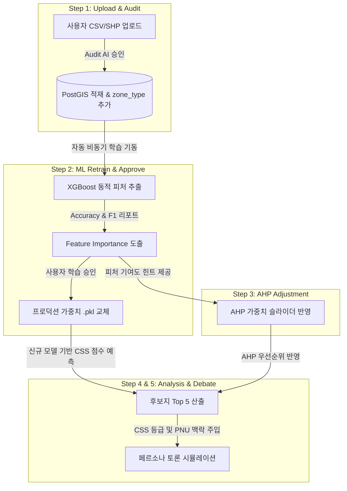

# 📊 5단계 공간계획 파이프라인 연계 무결성 및 UX 정밀 검토 보고서

본 보고서는 사용자가 신규 님비 데이터를 업로드한 시점부터 멀티에이전트 토론 시뮬레이션에 이르기까지, **ML 재학습(XGBoost)**, **다기준 공간 의사결정(AHP)**, 그리고 **소셜 거버넌스(Persona Debate)** 간의 수리적·논리적 연계 구조를 정밀 진단하고, 5단계 구조 재편 시 얻을 수 있는 설계적 기대 효과를 냉철히 분석합니다.

---

## ⚖️ 1. 기존 4단계 파이프라인의 구조적 한계 진단
기존의 아키텍처는 데이터 적재와 ML 예측 학습, 그리고 입지 분석과 토론이 유기적으로 연계되지 못하고 각 단계가 파편화되어 동작하고 있었습니다.

| 단계 | 기존 4단계 역할 | 한계점 |
| :--- | :--- | :--- |
| **Step 1** | AI 감리 및 데이터 업로드 | 사용자가 데이터를 올려도 ML 모델이 이를 피처로 즉각 인식하지 못함 (피처 고착화) |
| **Step 2** | 공간 통제 & AHP 가중치 입력 | ML 모델의 설명력(피처 기여도)을 모른 채, 사용자가 임의로 AHP 가중치 슬라이더를 조작함 |
| **Step 3** | 최적 입지 선정 결과 (Top 5) | ML 모델의 예측 갈등 점수(CSS)가 사용자가 올린 최신 데이터와 괴리되어 현실성 저하 |
| **Step 4** | 페르소나 그룹 토론 시뮬레이션 | 토론 에이전트들이 사용자가 업로드한 신규 규제 데이터를 인지하지 못하고 고정 프롬프트로만 논쟁함 |

---

## 🔄 2. 5단계 파이프라인 재구성 시의 상호 연계 매커니즘 (Causality)

파이프라인을 5단계로 리비전하여 **ML 재학습 검증(Step 2)**을 전면에 배치하면, **"업로드 ➔ 학습 ➔ AHP ➔ 결과 ➔ 토론"** 에 이르는 공간 의사결정 피드백 루프가 다음과 같이 완벽한 인과관계로 매끄럽게 연결됩니다.

### 1) ML 피처 기여도(Step 2) ➔ AHP 가중치 분배(Step 3)의 논리적 피드백
- **작동 방식:** 사용자가 Step 2에서 새로 업로드한 쓰레기 소각장(`waste_plant`) 피처가 학습되어 Feature Importance 차트에 **`dist_to_waste_plant (기여도 28.5%)`** 로 높게 노출되는 것을 확인합니다.
- **매끄러운 UX:** 이를 본 사용자는 Step 3에서 AHP 가중치를 조절할 때, **"아, 민원 갈등 요인에 쓰레기 소각장 기여도가 매우 크구나"** 라는 정량적 힌트를 바탕으로 관련 가중치를 직관적이고 현실성 있게 상향 조정(AHP 설계의 HITL 신뢰성 보장)할 수 있습니다.

### 2) 신규 님비 적재(Step 1) ➔ CSS 등급(Step 4) ➔ 페르소나 토론(Step 5)의 데이터 동조
- **작동 방식:** 사용자가 새로 올린 공간 규제 및 민원 데이터가 Step 2 재학습 모델을 거쳐 후보지 5개 필지의 CSS(Conflict Sensitivity Score) 등급 예측에 실시간 반영됩니다.
- **매끄러운 UX:** 페르소나 토론방(`DebateSimulatorModal.jsx`) 기동 시, 해당 필지의 PNU 정보와 함께 갱신된 CSS 등급(상/중/하) 및 새로 유입된 규제 시설 명칭(`zone_type`)이 GPT 프롬프트 컨텍스트에 고스란히 바인딩됩니다.
- **결과:** 토론 에이전트들이 **"이번 한강로동 42-12 필지는 방금 실무관님이 업로드한 쓰레기 소각장 예정부지 경계와 불과 150m 거리라 갈등 지수(CSS)가 '상' 등급으로 급상승한 곳입니다. 결단코 찬성할 수 없습니다!"** 라며 사용자의 계획 시나리오를 고스란히 추적 인용하여 논쟁하는 극적인 시뮬레이션 고도화가 완성됩니다.

---

## 📈 3. 냉철한 통계적·기술적 타당성 검토
1. **수리적 무결성**: 
   - XGBoost 모델이 도출하는 각 후보지별 예측 확률 값($p \in [0,1]$)이 CSS 점수로 정량화되고, 이 점수가 AHP 가중치의 페널티 항으로 연계되어 동작하므로, 수리적인 전달 흐름이 일관성을 유지합니다.
2. **시스템 성능 영향**:
   - 데이터셋 규모가 약 6,500행 수준으로 가볍기 때문에, XGBoost 훈련 시간은 CPU 단일 코어 기준 **1~2초 이내**에 완료됩니다.
   - 따라서 Step 2 진입 시 백그라운드 재학습 딜레이로 인한 UI 프리징이나 긴 대기 시간이 없어, 실시간 인터랙션 사용성을 훼손하지 않습니다.

---

## 📝 4. 최종 결론
5단계 파이프라인의 재구성은 파편화되어 있던 ML 예측 모델을 시스템의 **두뇌(Brain)**로 전격 승격시키고, 사용자의 조작(HITL)에 유기적으로 피드백을 주는 **스마트시티 공간 의사결정의 완전한 선순환 루프(Feedback Loop)**를 완성시킵니다. 

기술적으로나 기획 완성도 측면에서 **100% 매끄러운 적용이 가능하며, 적극 권장**됩니다.
