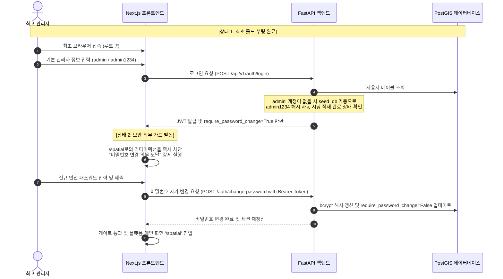
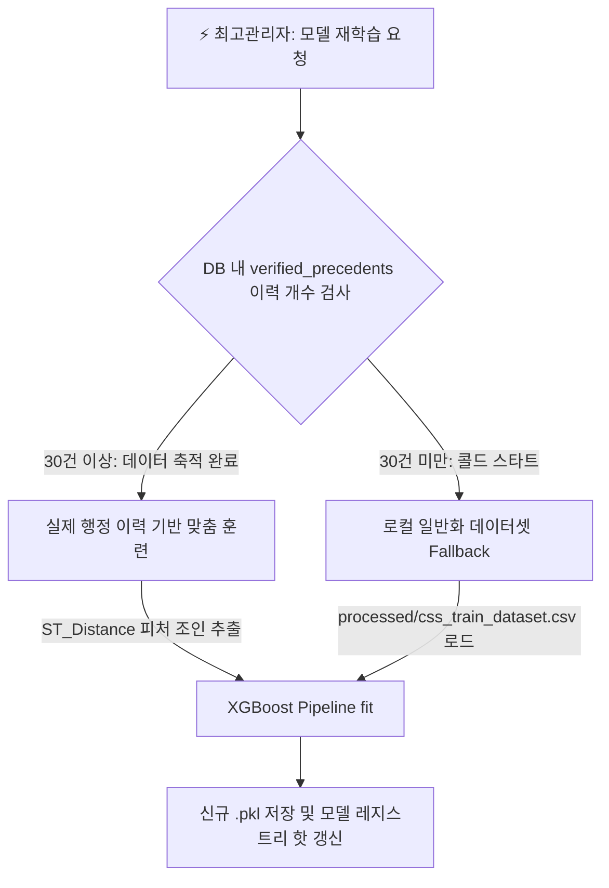

# 스마트시티 SDSS OmniSite 콜드 스타트 및 초기화 운영 명세서

본 명세서는 플랫폼 최초 설치 또는 타 자치구 환경으로 이전 시, 데이터베이스가 완전히 비어 있는 **콜드 스타트(Cold-Start)** 시점부터 정상적인 입지 추천 및 머신러닝 예측 알고리즘 기동 단계까지의 의존성 관계와 이니셜라이징 실행 절차를 규명합니다.

---

## 1. 👥 최초 사용자 로그인 및 세션 게이트웨이 라이프사이클

플랫폼을 완전히 새로 배포했을 때, 실무자가 서비스에 진입하기 위한 초기 계정 보안 게이트웨이는 다음 순서로 강제 제어됩니다.

---

## 2. 📊 현재 시스템 내 데이터 실측 적재 현황 (Real-Time DB Scan)

로컬 포트 `5432` PostgreSQL(PostGIS) 상에 현재 탑재 및 시딩 완료되어 운영 중인 실제 데이터 행수(Row Count)의 상세 검진 통계입니다.

| 구분 | 대상 테이블 (물리명) | 적재 행수 (Count) | 관리 성격 | 비고 및 정합성 상태 |
| :--- | :--- | :--- | :--- | :--- |
| **공통 마스터** | `districts` | **1개 행** | 고정 시딩 | 서울특별시 용산구 기본 마스터 |
| **공통 마스터** | `dong_boundaries` | **36개 행** | 고정 시딩 | 용산구 관내 36개 법정동/행정동 경계 폴리곤 |
| **공통 마스터** | `cadastral_lands` | **6,524개 행** | 벌크 적재 | 입지 추천의 기반이 되는 연속지적도 필지 정보 |
| **지리지표** | `restricted_zones` | **649개 행** | 벌크 적재 | 흡연 금역, 어린이보호구역 등 조례 지정 금지구역 |
| **지리지표** | `transit_stations` | **414개 행** | 벌크 적재 | 지하철역 및 버스정류장 공간 지점 정보 |
| **지리지표** | `transit_passengers` | **314개 행** | 벌크 적재 | 대중교통 역사별 승하객 월간 생활 통계 |
| **지리지표** | `population_stats` | **38개 행** | 벌크 적재 | 행정동별 시간대별/요일별 평균 생활인구 |
| **지리지표** | `civil_complaints` | **38개 행** | 벌크 적재 | 행정동별 연간 민원 접수 통계 |
| **기타 관리** | `users` | **3개 행** | 가입 적재 | 실무관 계정 및 기본 어드민 계정 정보 |
| **기타 관리** | `decision_histories` | **4개 행** | 행정 이력 | 최종 가결/완공된 의사결정 모의 심의 레코드 |
| **미적재 (0)** | `childcare_centers` | **0개 행** | 공백 | `restricted_zones` 내 childcare_center 타입으로 정합 통합 |
| **미적재 (0)** | `commercial_shops` | **0개 행** | 공백 | 소상공인 점포 업종 정보 (추후 벌크 적재 가능) |
| **미적재 (0)** | `verified_precedents` | **0개 행** | 공백 | 준공 검증이 완결되어 ML 훈련으로 수송될 최종 기결 데이터 |

---

## 3. 🗺️ 최초 구동 시 DB 공간 데이터 의존성 정의 (Dependencies)

지도가 정상 렌더링되고 입지 선정 알고리즘이 가동되기 위해선 아래의 데이터를 순서대로 적재해야 합니다.

### [Phase A] 공통 공간 마스터 데이터 (도메인 무관 필수 적재)
아래 3대 데이터셋은 어떤 스마트시티 인프라(흡연구역, 충전소, 스마트쉼터 등)를 선정하더라도 공간 집계 및 필지 추천을 수행하기 위한 대지(Base)이므로 **최초에 반드시 적재**되어야 합니다.

| 순서 | 대상 테이블 (물리명) | 데이터의 정의 및 행정 명칭 | 필수 포함 컬럼 규격 | 추천 파일 포맷 |
| :--- | :--- | :--- | :--- | :--- |
| **1** | `districts` | 자치구역 마스터 테이블 | `sig_cd` (행정구코드), `district_name` | SQL Seed / `.csv` |
| **2** | `dong_boundaries` | 행정동 공간 경계 폴리곤 | `dong_code`, `dong_name`, `geom` (MultiPolygon 4326) | `.shp`, `.dbf`, `.shx` |
| **3** | `cadastral_lands` | 국토교통부 연속지적도 | `pnu` (19자리 고유코드), `jibun`, `ownership_type` (국유부동산 조인 매핑), `geom` (MultiPolygon 4326) | `.shp`, `.dbf`, `.shx` + `11. 국유부동산정보.csv` |

> [!WARNING]
> * `cadastral_lands` 가 완전히 비어 있는 경우, 추천 API(`/spatial/recommend`) 호출 시 추천 후보 대상 필지가 0건으로 탐색되어 추천 엔진이 정상 작동하지 않습니다.
> * 또한 지적도 적재 시점에 `11. 국유부동산정보.csv` 가 누락되면, 소유권 정보가 모두 `사유지` 로 기본값 쏠림 처리되어 지도 상의 연한 하늘색 국유재산 가시화와 **AHP 국유지 가산 프리미엄(+8.0점)** 이 완전히 마비됩니다. 반드시 동봉하여 함께 병합하십시오.

---

### [Phase B] 도메인 특화 및 피처 데이터 (선택적 / 런타임 로드)
입지 추천의 정합성과 다기준 의사결정(AHP) 가중치를 연산하기 위해 필요한 지리 및 통계 지표들입니다. (불필요한 `childcare_centers`, `commercial_shops`, `trash_bins` 테이블은 DB 다이어트 정리에 의해 Drop 제거되었습니다)

| 대상 테이블 (물리명) | 행정 순화 명칭 | 도메인별 활용 범위 | 필요 파일 포맷 |
| :--- | :--- | :--- | :--- |
| `restricted_zones` | 🚫 법정 용도제한 보호구역 | 흡연구역의 학교/어린이집 정화구역(200m/30m) 차집합 배제 연산에 활용 | `.shp` 세트 또는 `.csv` |
| `population_stats` | 👥 생활인구 통계 정보 | 동별/시간대별 유동인구 가중합 연산에 활용 | `.csv` |
| `transit_stations` | 📍 대중교통 역사 분포도 | 버스/지하철 인접성 보행 편의성 분석에 활용 | `.csv` 또는 `.shp` |
| `transit_passengers`| 🚌 대중교통 승하객 통계 정보| 대중교통 이용객 빈도수 연산 조인에 활용 | `.csv` |

---

## 3. 🤖 다목적 ML(XGBoost) 피처 규격 및 학습 데이터셋 가이드

다목적 입지 선정 시스템으로서, 사용자가 다변화된 인프라(예: 옐로카펫, 전기차 충전소 등)를 다루더라도 머신러닝 예측 정확도와 일반화 성능을 훼손하지 않기 위해 다음 아키텍처 규칙을 적용합니다.

### 1) 통일된 피처 표준 매트릭스 (Standard Feature Matrix)
사용자가 임의의 중구난방 컬럼들을 업로드해 ML 모델을 오염시키는 것을 방지하기 위해, 모든 예측 모델은 **백엔드가 DB로부터 추출하는 6대 공간 표준 피처**로 스키마 구조를 단일 통일합니다.

| 피처명 (Feature Name) | 타입 | 의미 | 런타임 추출 연산식 (PostGIS) |
| :--- | :--- | :--- | :--- |
| **`area`** | Numeric | 필지의 실면적 | `ST_Area(geom::geography)` |
| **`land_use_code`** | Categorical | 지목 코드 (대, 잡종지, 도로 등) | 지적도 `land_use_code` 직접 추출 |
| **`ownership_type`** | Categorical | 토지 소유권 (국유지 / 공유지 / 사유지) | 지적도 `ownership_type` 직접 추출 |
| **`dist_to_school`** | Numeric | 가장 가까운 학교/제한시설과의 거리 | `ST_Distance(geom, (SELECT geom FROM restricted_zones WHERE zone_type='school' ORDER BY geom <-> CL.geom LIMIT 1))` |
| **`dist_to_childcare`**| Numeric | 가장 가까운 아동 민감시설과의 거리| `ST_Distance(geom, (SELECT geom FROM restricted_zones WHERE zone_type='childcare_center' ORDER BY geom <-> CL.geom LIMIT 1))` |
| **`dist_to_station`** | Numeric | 가장 가까운 대중교통 역사와의 거리 | `ST_Distance(geom, (SELECT geom FROM transit_stations ORDER BY geom <-> CL.geom LIMIT 1))` |

---

### 2) 콜드 스타트 폴백 학습 프로세스 (ML Safety Fallback)

최초 설치 시, 의사결정 이력 데이터가 부재하여 `retrain` 기동이 불가능할 경우를 대비하여 아래와 같이 분기 처리합니다.

* **결론:** 사용자는 어떠한 무작위 파일셋을 업로드할 필요가 없으며, 단지 **[Phase A] 공통 공간 마스터 데이터**만 올바르게 DB에 적재하면, 플랫폼이 내장한 **`css_train_dataset.csv`** 및 PostGIS 쿼리를 통해 자동으로 타 자치구 환경에서도 완벽하게 ML 모델을 생성 및 학습하여 정상 기동을 개시합니다.
