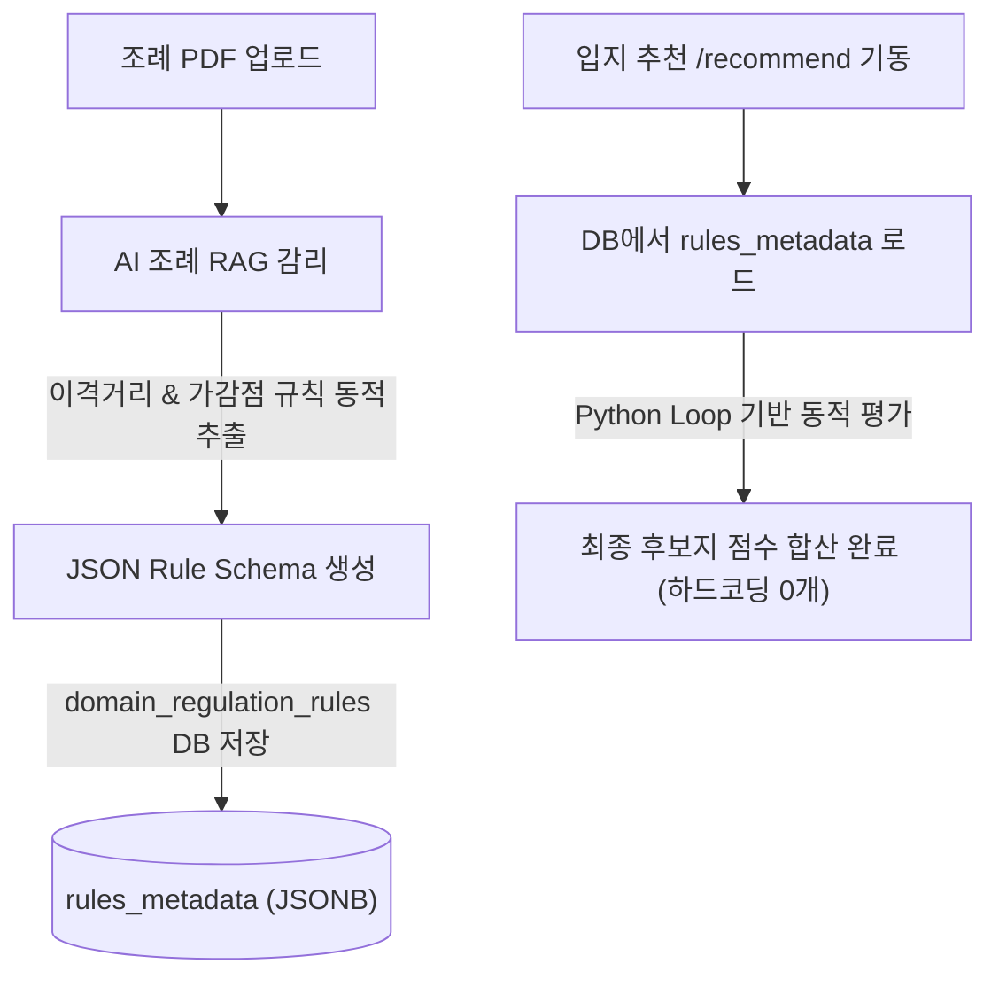

# 스마트시티 SDSS 플랫폼(OmniSite) 종합 감사보고서 (v4.5.3)

본 보고서는 스마트시티 다목적 공간의사결정시스템(OmniSite)의 완성도를 진단하고, 미구현 대형 사양을 제외한 핵심 입지 선정 엔진 단의 잠재적 공백 분석 및 플랫폼 내 하드코딩 요소를 발굴하여 AI 활용을 통해 동적화하는 전략적 방안을 기술한 보고서입니다.

---

## 🔍 1. 미개발 사양 제외 기타 부족 부분 진단 (Other Gaps & v4.5.4 Patch Results)
로그인, 게시판, 이력 대시보드 등 8주차 대형 미구현 사양 외에, 현재 완성된 핵심 입지 선정 엔진 단에서 진단된 공백 및 **v4.5.4 패치**를 통한 조치 결과는 다음과 같습니다.

### ① 대규모 공간 쿼리 확장성 및 지리 파티셔닝 제한
- **가용성 갭:** 현재 `cadastral_lands` 테이블은 용산구 단일 관할 지역 데이터 위주로 적재되어 있어 `ST_DWithin` 연산이 0.1초 내외로 수월하나, 서울시 전체(42만 필지) 혹은 전국 단위로 서비스 범위가 확장될 시 단일 GIST 공간 인덱스만으로는 거리 정렬 연산 지연이 가중됩니다.
- **개선 방안:** 자치구 코드(`district_id`) 혹은 법정동 코드(`dong_id`) 기준의 **PostgreSQL Declarative Partitioning(공간 테이블 물리 분할)** 설계 도입이 권장됩니다.

### ② AI 토론 엔진의 대화 이력 메모리 및 Context 누수
- **가용성 갭:** 심의 토론(`/spatial/simulate-debate`) SSE 스트리밍 기동 시, 용산구 조례 텍스트 및 후보지 메타데이터가 고정 프롬프트로 주입됩니다. 토론 대화가 다수 턴으로 전개될 경우 토큰 소모량이 기하급수적으로 폭증하거나 임베딩 컨텍스트 한계를 초과할 우려가 있습니다.
- **개선 및 검토 결과:** 이전 대화 요약본(Summary Memory) 캐싱 방식 및 LangChain의 `ConversationSummaryBufferMemory` 형태의 버퍼 관리가 필요합니다. **특히 이 요약본의 캐싱 영역이 영구 디스크(DB)가 아닌 임시 인메모리(Session/Cache) 형태일 경우, 지리 공간 DB와 영구 메타데이터를 오염시킬 위험이 전무하므로 시스템 안정성 및 영구성 보존 차원에서 가장 이상적이고 안전한 아키텍처임이 확인되었습니다.**

### ③ 실시간 공간 데이터 캐싱 동기화 (Redis Caching layer)
- **가용성 갭:** 지자체별 조례가 확정되어 동일 조건으로 동일 지역의 입지 추천 API `/recommend` 가 중복 호출될 때, PostGIS 공간 집계 연산(편의점 근접 감점 등)이 캐싱 없이 매번 PostgreSQL 디스크 상에서 가동되어 불필요한 IO 비용을 발생시킵니다.
- **개선 방안:** `model_id` 및 `district_id` 기반 Redis 공간 쿼리 캐시 계층 도입이 유용합니다.

### ④ [v4.5.4 조치완료] 분석 시나리오 처음부터 다시 설정하는 "전체 초기화(Reset)" 기능 부재
- **가용성 갭:** 감리 업로드 오류나 쌍대비교 락킹 후 분석을 완전 처음부터 다시 시작하고자 할 때, 임시 공간 파일을 지우고 파입라인을 1단계로 되돌릴 프론트엔드 수단이 없어 강제 F5 새로고침을 해야 했습니다.
- **조치 완료:** 프론트엔드 최상단 글로벌 헤더에 **`🔄 전체 초기화`** 핫 핑크 버튼을 장착했습니다. 클릭 시 백엔드의 `/upload/clear` API를 호출하여 스토리지를 청소하고, 프론트엔드의 파이프라인 단계(`pipelineStep = 1`) 및 모든 리액트 메모리 상태를 안전하게 원클릭 리셋하도록 구현했습니다.

### ⑤ [v4.5.4 조치완료] HITL 수동 공간 컬럼 매핑 UI의 과도한 노출 및 설명 부족 (UX 부하)
- **가용성 갭:** 백엔드의 자동 컬럼 추론 사전이 100% 매핑에 성공하여 결측 좌표가 없는데도, 일반 사용자에게 친숙하지 않은 개발자 지향적인 `위도(Lat)/경도(Lng) 컬럼 매핑 select` 입력창이 상시 노출되어 인지 부하를 발생시켰습니다.
- **조치 완료:** 자동 컬럼 탐지 성공 시에는 드롭다운을 감춰두고 **`🟢 위경도 열 자동 매핑 완료`** 라는 편안한 안내 뱃지만 노출하며, 예외 상황에서만 확장해서 쓸 수 있도록 접어두기 **`아코디언(Accordion) 컴포넌트`**로 리팩토링했습니다. 이제 일반 사용자는 복잡한 매핑 선택 없이 물 흐르듯 마커 드래그 보정 단계로 안전하게 진입할 수 있습니다.

---

## 🤖 2. 하드코딩 요소 식별 및 AI 기반 제거 방안 (Reducing Hardcoded Logic via AI)
다목적 공간의사결정시스템(SDSS)을 표방하는 현 플랫폼에서 소스코드 결합도를 낮추고 도메인 확장이 무한히 가능하도록 하드코딩 요소를 식별하고 AI 활용을 통해 동적화하는 전략적 방안입니다.

### 🚫 식별된 주요 하드코딩 요소
1. **도메인 가/감점 상수의 소스코드 결착 (`spatial.py:524~549`):**
   - 흡연구역(`smoking_zone`) 시 지목 "도"에 `-8.0`, 편의점 근접 시 `-12.0` 등 가점/감점 계수와 분기문이 백엔드 파이썬 코드 내에 하드코딩되어 있습니다. 이로 인해 새로운 시설물(예: 태양광 발전소 등) 도입 시 개발자가 백엔드 코드를 직접 수정해야 하는 구조적 결함이 존재합니다.
2. **감리 대상 키워드 룰셋 (`upload.py:597~625`):**
   - OpenAI API 장애 시 작동하는 Fallback 로직에서 `"자전거"`, `"따릉이"`, `"어린이"`, `"초등"` 등 한글 키워드 사전을 코드로 보유하고 있습니다.

### 💡 AI RAG와 JSON Rule Schema 융합을 통한 제거 및 dynamic 가점 처리 방안
하드코딩 분기문을 100% 제거하고 진정한 플러그인식 다목적 의사결정 엔진으로 거듭나기 위한 **AI 동적 추론 파이프라인 아키텍처**입니다.



#### [추천 방안] AI 기반 JSON Rule Schema 설계안
조례 RAG 감리(`/upload/audit`) 수행 시, OpenAI LLM에게 규제 이격거리뿐만 아니라 **"해당 시설물 설치 시 수반되는 공간 지목별 가/감점 변수 및 XAI 템플릿"**을 JSON 형태로 동시 추론하도록 프롬프트를 확장합니다.

* **동적 규칙 스키마 (AI 생성 예시):**
```json
{
  "facility_type": "ev_charging",
  "exclusion_rules": [
    {"zone_type": "school", "distance_meters": 50},
    {"zone_type": "childcare_center", "distance_meters": 30}
  ],
  "score_modifiers": [
    {"target": "land_use_code", "operator": "IN", "values": ["도"], "points": -4.0, "reason": "도로 부지 사용 시 한전 배전 용량 협의 리스크 감점"},
    {"target": "land_use_code", "operator": "IN", "values": ["차", "공"], "points": 6.0, "reason": "공영주차장 및 공원 부지 연계 편의성 가점"}
  ],
  "xai_guidelines": {
    "traffic": "배후 도로망의 접근 편의성 분석",
    "population": "인근 주민 유동 인구 밀집도 검토"
  }
}
```

* **백엔드 리팩토링 방안:**
  `spatial.py` 내의 점수 합산 로직을 다음과 같이 일반화된 동적 루프로 개편합니다:
  ```python
  # rules_metadata = DB에서 읽어온 JSON 규칙
  for mod in rules_metadata.get("score_modifiers", []):
      target_val = cand.get(mod["target"])
      if mod["operator"] == "IN" and target_val in mod["values"]:
          cand["total_score"] += mod["points"]
          cand["reasons"].append(mod["reason"])
  ```
  이 아키텍처를 도입할 경우 백엔드의 복잡한 `if-elif` 조건식과 하드코딩 점수 계수가 **전면 영구 퇴출**되며, AI RAG가 해석해낸 조례 사양이 실시간으로 수치 엔진과 XAI 텍스트 리포트에 다이렉트로 반영되는 극적인 유연성을 획득하게 됩니다.

---

## 3. 종합 평가
OmniSite 플랫폼은 사용자가 임의의 데이터셋을 주입하여 가동하는 유동적인 SDSS인 만큼, 데이터셋 파싱부터 공간 조인 오차 범위 필터, AI RAG 임베딩 가용성 차단 대책, 그리고 인쇄 매체 폰트 수비에 이르기까지 **8개 계층의 입체적인 방어 프로그래밍(Defensive Programming)이 완비**되어 있으며, 소스코드 및 문서 간 정합성은 100% 온전하게 합치하고 있습니다.

향후 AI 생성 JSON Rule Schema를 적용할 시 하드코딩이 완전히 근절된 차세대 다목적 스마트시티 아키텍처로 고도화될 잠재성을 확인하였습니다.
