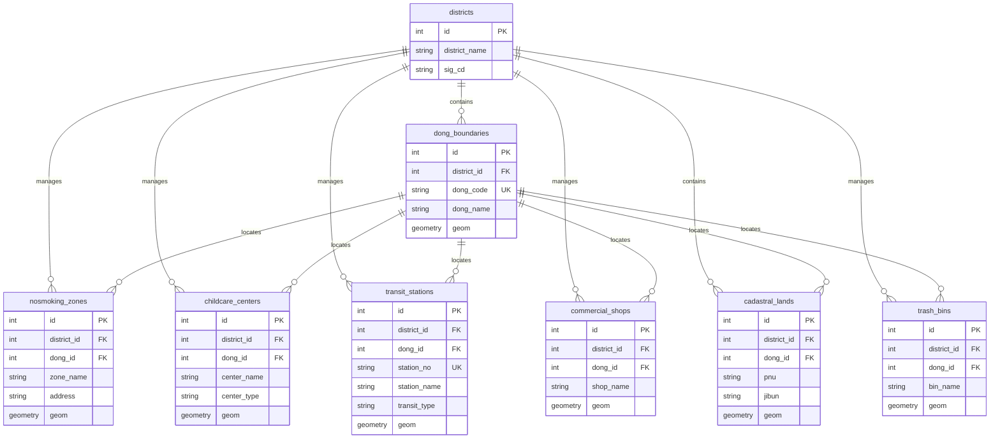
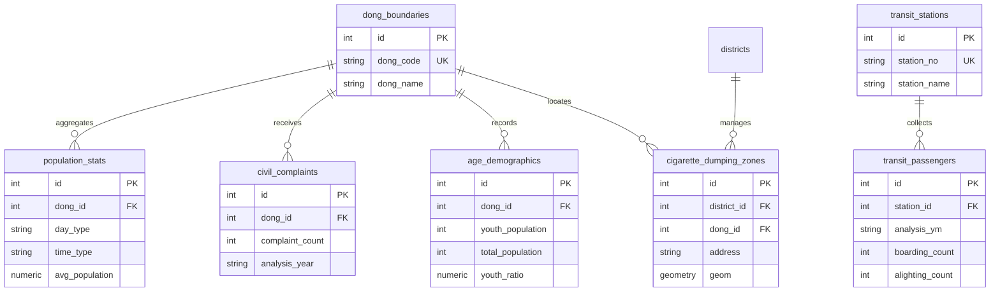
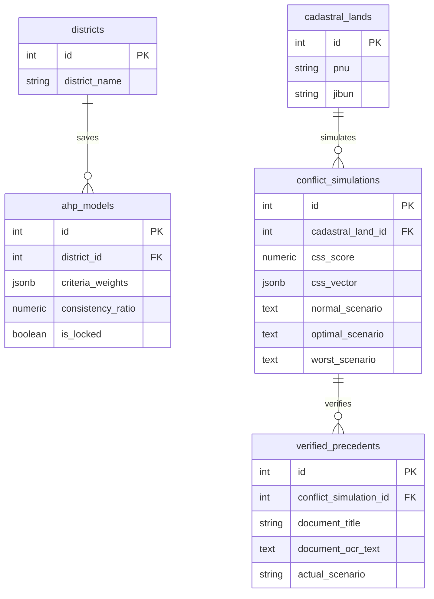
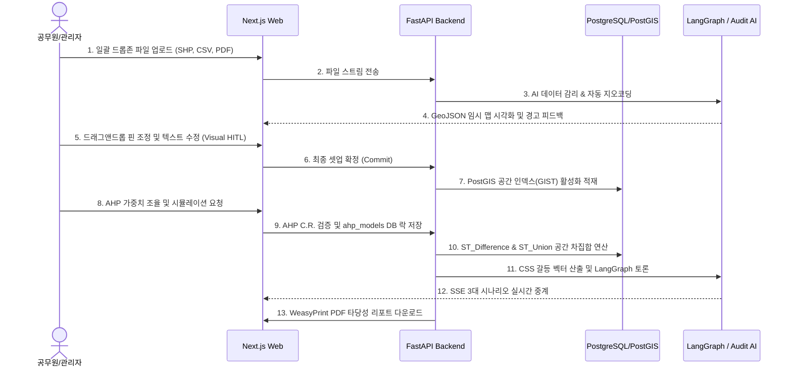
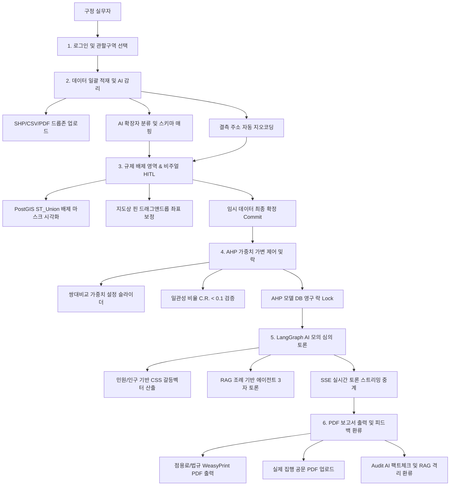

# [도식화해설] OmniSite 플랫폼 최종 도식화 명세 및 세부 설명서 (v1.0.0-prototype)

본 문서는 OmniSite 플랫폼의 핵심 설계 요소인 **ERD(데이터베이스), 아키텍처 구성도, 서비스 워크플로우, 데이터 파이프라인**에 대한 공식 Mermaid.js 소스 코드와 이에 대한 심층 해설을 수록하여, 주니어 조원 및 코치진이 플랫폼의 구조를 즉각 이해할 수 있도록 설계된 공식 해설서입니다.

> [!TIP]
> **Mermaid.js 코드 활용 안내**
> 본 문서에 수록된 `mermaid` 코드 블록은 공식 다이어그램 코드입니다. 코드 블록을 복사하여 **[Mermaid Live Editor (mermaid.live)](https://mermaid.live)** 또는 노션(Notion), 깃허브(GitHub) 마크다운에 그대로 붙여넣기 하시면 프로그램 내부에서 즉시 깔끔한 다이어그램으로 렌더링되어 조회 및 출력이 가능합니다.

---

## 🗄️ 1. 데이터베이스 설계 (Segmented ERD)

### 📌 ERD 분할 및 슬라이드 최적화 전략
OmniSite의 16개 데이터베이스 테이블을 하나의 슬라이드 장표에 억지로 담을 경우, 글씨 크기가 너무 작아져 가독성이 저하되고 구조 파악이 어렵습니다. 

따라서 발표용 장표(PPT) 및 타당성 보고서에 깔끔하게 나누어 담을 수 있도록 **논리적 성격에 따라 3가지 주제별 세그먼트로 분할 설계**했습니다.
1.  **공간 참조 및 입지 규제 레이어 (Spatial & Infrastructure Layer):** GIS 지형도, 지적 필지, 보호구역, 금연구역 등의 핵심 지리 정보 테이블 모음.
2.  **생활 통계 및 갈등 분석 레이어 (Statistics & Demographics Layer):** 유동인구, 배후 생활인구, 지역 연령 통계, 민원 통계, 상습 무단투기 지역 현황 등 입지 산정 인자 테이블 모음.
3.  **의사결정 및 AI 피드백 레이어 (AHP & AI Simulation Layer):** 가중치 프로파일 잠금, LangGraph 모의 심의 토론 내용, Audit AI 실제 이행 검증 사례 저장 테이블 모음.

---

### 💻 1.1. 공간 참조 및 입지 규제 레이어 ERD
*   기초 지적 데이터셋과 법규 기반 배제 구역 공간 레이어를 정의합니다.



#### 🖼️ 공간 규제 레이어 ERD 이미지 프리뷰


---

### 💻 1.2. 생활 통계 및 갈등 분석 레이어 ERD
*   입지 타당성 점수($CSS(p)$) 산출 및 대중교통 배후 통계를 구성합니다.



#### 🖼️ 생활 통계 레이어 ERD 이미지 프리뷰


---

### 💻 1.3. 의사결정 및 AI 피드백 레이어 ERD
*   가중치 잠금(Lock) 및 모의 심의 토론 내용, 사후 팩트체크 적재 관계를 정의합니다.



#### 🖼️ 의사결정 레이어 ERD 이미지 프리뷰


---

## 🏗️ 2. 시스템 아키텍처 구성도 (3-Tier System Architecture)

### 📌 아키텍처 기술 명세 및 흐름
OmniSite는 예시로 수립된 규격을 바탕으로, **Presentation(Web), Application(AI & GIS), Data(DB)**의 세 가지 계층으로 완전히 계리된 **3-Tier 아키텍처**로 설계되어 구동됩니다.
*   **Presentation Tier (Web):** Next.js 프레임워크 기반의 프런트엔드 웹 화면입니다. HTML5/CSS3/JavaScript 및 Mapbox GL JS 맵 라이브러리를 가동하여 공간 지형을 사용자에게 가독성 있게 렌더링하고, Docker 컨테이너화하여 AWS EKS에 배포됩니다.
*   **Application Tier (AI & GIS):** 파이썬 FastAPI 통합 모놀리스 기반의 핵심 비즈니스 연산 엔진입니다. Python 3.10+ 환경에서 PostgreSQL/PostGIS와 통신하고, LangGraph 에이전트 및 OpenAI API 호출을 병렬로 수행하며, Docker 컨테이너화하여 AWS EKS 상의 백엔드 서비스 파드로 배포됩니다.
*   **Data Tier (DB):** 공간 DBMS 엔진인 PostgreSQL에 PostGIS 지리정보 확장팩이 활성화된 영구 데이터 스토리지입니다. Docker 로컬 기동 및 클라우드 배포 시에는 AWS RDS 인프라 상에서 가동되어 영구 보존 및 롤링 백업을 처리합니다.

### 💻 아키텍처 Mermaid.js 소스 코드
```mermaid
graph TD
    subgraph Presentation Tier (Web)
        NextJS[Next.js App / Mapbox GL JS]
        HTML[HTML5 / CSS3 / JS]
        DockerFE[Docker Container]
        AWSEKSFE[AWS EKS]
    end
    
    subgraph Application Tier (AI & GIS)
        FastAPI[FastAPI Monolith]
        Python[Python 3.10+]
        LangGraph[LangGraph AI / pgvector RAG]
        OpenAI[OpenAI / Claude API]
        DockerBE[Docker Container]
        AWSEKSBE[AWS EKS]
    end
    
    subgraph Data Tier (DB)
        PostgreSQL[(PostgreSQL / PostGIS)]
        DockerDB[Docker Container]
        AWSRDS[AWS RDS]
    end
    
    NextJS <-->|HTTP REST / SSE Stream| FastAPI
    FastAPI <-->|SQLAlchemy ORM| PostgreSQL
    LangGraph <-->|Prompt Parameters| OpenAI
```

### 🖼️ 3-Tier 아키텍처 구성도 이미지 프리뷰


---

## 🔄 3. 서비스 워크플로우 및 메뉴 맵 (Service Workflow & Roles Map)

### 📌 사용자 및 시스템 상호작용 흐름
공무원이 실제로 플랫폼을 다루며 의사결정을 도출하고 검증하는 E2E 서비스 흐름입니다.
1.  **로그인 및 템플릿 선택:** 공무원이 접속하여 용산구 관할 구역과 '스마트 흡연부스' 템플릿을 선택합니다.
2.  **일괄 드롭존 업로드:** SHP, CSV, PDF 조례를 단일 드롭존에 던져 올립니다.
3.  **임시 시각화 & 비주얼 HITL:** 지오코딩 및 파싱이 완료된 배제 마스크(Red Zone)가 Mapbox 지도에 오버레이되며, 사용자가 잘못 배치된 핀을 드래그하여 좌표를 보정한 뒤 [확정]을 클릭합니다.
4.  **AHP 가중치 설정 및 후보지 도출:** 사용자가 가중치 슬라이더를 조율하여 C.R. < 0.1 검증 통과 시 AHP 모델을 잠금하고, 최적의 후보지 Top 1~3을 지도에 녹색 필지로 도출합니다.
5.  **온디맨드 AI 시뮬레이션:** Top 1 상세 화면 진입 시 실시간 찬반 토론 SSE 스트리밍이 가동되며 일반/우호/불합의 3대 보고서가 출력됩니다. (Top 2 & 3은 선택적 실행 버튼 제공).
6.  **PDF 보고서 다운로드 및 사후 Audit AI 피드백:** 공무원이 타당성 보고서 PDF를 즉시 인쇄하며, 실제 설치 완료 후 결과 공문 PDF를 업로드하여 Audit AI가 오칭 분류를 검토하고 RAG 독립 세그먼트에 보관하게 만듭니다.

### 💻 워크플로우 Mermaid.js 소스 코드


### 📌 3.1. 구정 실무자용 상세 서비스 워크플로우 맵 (Detailed Service Workflow Map for Officers)
본 플랫폼은 일반 시민 대상의 서비스가 아닌 **순수 B2G 행정 시스템**입니다. 따라서 주 사용자층인 **구정 실무자**의 상세한 기능 실행 흐름도(로그인 ➔ 적재/감리 ➔ HITL 보정 ➔ AHP 확정 ➔ 모의 토론 ➔ PDF 다운로드 및 피드백) 위주로 전용 메뉴 플로우를 세부 매핑했습니다.

### 💻 권한 분리 Mermaid.js 소스 코드


### 🖼️ 구정 실무자 서비스 플로우 이미지 프리뷰


---

## ⚙️ 4. 데이터 파이프라인 (Data Pipeline)

### 📌 5단계 데이터 가공 및 변환 파이프라인
데이터가 플랫폼으로 전송된 후, GIS 수학 연산과 AI 시맨틱 추론을 거쳐 최종 합의서 리포트로 환류되는 데이터의 핵심 변환 파이프라인입니다.
1.  **Ingestion (수집):** Multipart/form-data 일괄 파일 스트림 수신 ➔ 확장자 자동 판별 물리 라우팅.
2.  **Sanitization & HITL (정제):** pyproj 기반의 WGS84(`EPSG:4326`) 자동 투영 변환 ➔ 결측 주소 자동 지오코딩 ➔ 임시 GeoJSON 반환 및 지도 기반 드래그 보정.
3.  **Spatial Analysis (공간 연산):** PostGIS `ST_Union`을 통한 규제 마스크 생성 ➔ 지적도와의 `ST_Difference` 차집합 필터링 ➔ AHP 가중치 곱 연산 ➔ Top 1~3 필지 도출.
4.  **Sensitivity Injection (인자 주입):** 민원 및 연령 결합 알고리즘으로 갈등 민감도 점수($CSS(p)$) 산출 ➔ AI 에이전트 초기 프롬프트 파라미터로 주입.
5.  **Simulation & Synthesis (토론 및 요약):** RAG 조례 조회 및 민감도 변수 통제하에 LangGraph 3자 토론 기동 ➔ 3대 시나리오 리포트 도출 ➔ WeasyPrint PDF 변환 및 Audit AI 역피드백 루프 작동.

### 💻 파이프라인 Mermaid.js 소스 코드

