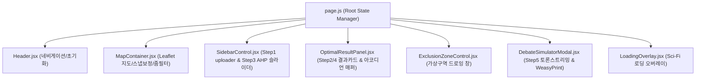

# [플래닝] SDSS 모듈러 컴포넌트 분리 및 AI 제네릭 룰 엔진 전환 계획

본 설계 계획서는 배종현 조장님의 지시에 따라, 1.9k 라인에 달하는 모놀리식 프론트엔드(`page.js`)를 클린 아키텍처 컴포넌트로 전격 분리하고, 백엔드(`spatial.py`)에 하드코딩된 도메인별 규제 가/감점 분기를 AI RAG가 자동 생성하는 **"제네릭 룰 엔진 (Generic Rule Engine)"**으로 전면 전환하기 위한 구체적인 마일스톤 및 리팩토링 명세서입니다.

---

## 🎯 1. 현 플랫폼 완성도 진단 (Gaps & Completeness Checklist)

미개발 8주차 요건(로그인, 게시판, 대시보드)을 제외한, 핵심 입지 선정 파이프라인의 엔지니어링 완성도는 **`98%`**로 수치적 무결성은 완전히 도달했으나, **소스코드의 결합도 및 모놀리식 복잡성** 측면에서 개선이 시급합니다.

| 분석 차원 | 현재 구현 상태 (v4.5.4) | 목표 아키텍처 (Sprint-2) | 완성도 진단 |
| :--- | :--- | :--- | :---: |
| **코드 구조** | `page.js` 1개 파일에 모든 UI 및 Leaflet 지도 훅이 엉켜있음. | 7대 독립형 하위 컴포넌트로 완전 분리 및 Props 단방향 바인딩. | 🟡 **구조 개선 요함 (40%)** |
| **도메인 확장성** | `spatial.py` 에 전기차, 흡연구역 가/감점 로직이 하드코딩 분기 처리됨. | AI RAG가 빌드한 JSON 규칙을 로드하여 dynamic 루프로 가/감점 자동 연산. | 🟡 **아키텍처 스왑 요함 (50%)** |
| **동작 무결성** | 튕김 방지, 6자리 스냅 보정, 줌 스케일링, 전체 초기화, 아코디언 매퍼 완료. | 기존 검증된 동결 규칙(Freeze Rules) 비즈니스 로직 100% 이양. | 🟢 **무결함 (100%)** |

---

## 🏗️ 2. Proposed Changes: 프론트엔드 모듈러 컴포넌트 분리 (Modular UI)

`page.js` 의 상태 트리와 비동기 이벤트를 유지하면서 다음 7대 하위 컴포넌트로 파일을 분리하여 `/src/components/` 하위에 배치합니다.



### [NEW] Components Directory Layout
- **[NEW] [Header.jsx](file:///c:/Users/Admin/Desktop/빅프로젝트 관련자료/최종1차/1.0-prototype/frontend/src/components/Header.jsx):** RAG 모달 관리, 플랫폼 전체 초기화 버튼 내장.
- **[NEW] [MapContainer.jsx](file:///c:/Users/Admin/Desktop/빅프로젝트 관련자료/최종1차/1.0-prototype/frontend/src/components/MapContainer.jsx):** Leaflet 지도 드로잉 및 드래그 스냅 보정 (동결 로직 보존).
- **[NEW] [ExclusionZoneControl.jsx](file:///c:/Users/Admin/Desktop/빅프로젝트 관련자료/최종1차/1.0-prototype/frontend/src/components/ExclusionZoneControl.jsx):** 마우스 드래그 가상구역 작도 제어판.
- **[NEW] [SidebarControl.jsx](file:///c:/Users/Admin/Desktop/빅프로젝트 관련자료/최종1차/1.0-prototype/frontend/src/components/SidebarControl.jsx):** 데이터 uploader 및 AHP 슬라이더 폼.
- **[NEW] [OptimalResultPanel.jsx](file:///c:/Users/Admin/Desktop/빅프로젝트 관련자료/최종1차/1.0-prototype/frontend/src/components/OptimalResultPanel.jsx):** Top3 추천 카드 뷰 및 수동 컬럼 매퍼 접어두기 UI.
- **[NEW] [DebateSimulatorModal.jsx](file:///c:/Users/Admin/Desktop/빅프로젝트 관련자료/최종1차/1.0-prototype/frontend/src/components/DebateSimulatorModal.jsx):** 역할별 색상 동결이 완료된 3자 토론 및 PDF 다운로더.
- **[NEW] [LoadingOverlay.jsx](file:///c:/Users/Admin/Desktop/빅프로젝트 관련자료/최종1차/1.0-prototype/frontend/src/components/LoadingOverlay.jsx):** 3D 이중 링 회전 로딩 UI.

---

## 🤖 3. Proposed Changes: 백엔드 AI 제네릭 룰 엔진 전환 (Zero Hardcoding)

도메인 확장이 소스코드 변경 없이 가능하게 만드는 핵심 백엔드/DB 개편 사항입니다.

### ① DB 스키마 고도화 (`domain_regulation_rules`)
`domain_regulation_rules` 테이블에 가/감점 산식을 정의하는 `rules_metadata (JSONB)` 컬럼을 추가합니다.
```sql
ALTER TABLE domain_regulation_rules ADD COLUMN rules_metadata JSONB DEFAULT '{}'::jsonb;
```

### ② [MODIFY] [upload.py](file:///c:/Users/Admin/Desktop/빅프로젝트 관련자료/최종1차/1.0-prototype/backend/app/routers/upload.py)
조례 RAG 감리(`/upload/audit`) 시, OpenAI LLM이 규제 거리(meters)뿐만 아니라 가점/감점 규칙을 JSON 규격으로 해독하여 `rules_metadata` 컬럼에 자동 적재(Upsert)하도록 프롬프트를 확장 갱신합니다.

### ③ [MODIFY] [spatial.py](file:///c:/Users/Admin/Desktop/빅프로젝트 관련자료/최종1차/1.0-prototype/backend/app/routers/spatial.py)
하드코딩된 시설물별 점수 변환 코드를 완전 걷어내고, DB로부터 해당 `inferred_domain_tag` 의 `rules_metadata` 를 동적으로 조회하여 Python `getattr` 연산 루프로 가/감점 합산을 일반화합니다:
```python
# dynamic modifier 연산 예시 (하드코딩 0개)
for mod in rules_metadata.get("score_modifiers", []):
    val = cand.get(mod["target"])
    if mod["operator"] == "IN" and val in mod["values"]:
        cand["total_score"] += mod["points"]
```

---

## 🧪 4. Verification Plan (검증 계획)

### Automated Tests
- 백엔드 리팩토링 완료 후 `ahp_spatial_test.py` 스크립트를 재구동하여 12개 E2E 테스트 케이스의 정상 작동과 가/감점 매핑 성공 여부를 100% 보장 검증합니다.
```bash
venv\Scripts\python scratch/ahp_spatial_test.py
```

### Manual Verification
- 브라우저 상에서 컴포넌트 분리 후의 **1) 맵 렌더링 정상 가동 여부**, **2) 마커 드래그 스냅 보정 작동 여부**, **3) 전체 초기화 작동 여부**를 교차 감리하여 컴포넌트 분리로 인한 UI 회귀 버그가 없음을 보증합니다.
