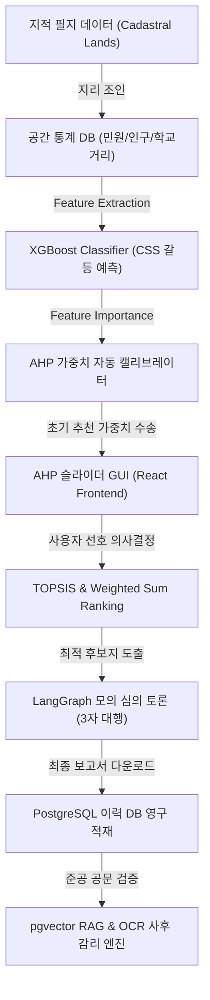

# OmniSite 최종 프로젝트 기술 명세 및 적합성 검증서 (v1.1-stable)

본 문서는 B2G 스마트시티 다기준 의사결정 지원 시스템(SDSS) **OmniSite**의 핵심 아키텍처, 공간 분석 알고리즘, 하이브리드 AI 피드백 루프 및 pgvector 조례 RAG 감리 파이프라인의 설계 스펙과 기술 정합성을 최종 규명하는 상용화 전 통합 명세서입니다.

---

## 🏛️ 1. 시스템 아키텍처 및 데이터 흐름 (System Architecture)

OmniSite는 공간 지형 정보와 인구/민원 통계 지표를 교차 융합하여 기계학습(ML) 예측과 다기준 의사결정(AHP)을 체계적으로 조율합니다.



1.  **데이터 수집 및 전처리 레이어:** 행정 지적 정보와 동별 인구 분포, 학교/어린이집 등 교육환경 보호구역 거리를 PostgreSQL + PostGIS 데이터베이스에서 수렴합니다.
2.  **ML 모델 추론 레이어:** XGBoost Classifier가 필지 단위 주민 갈등 지수(CSS)를 선제 분류합니다.
3.  **의사결정 보정 레이어:** XGBoost가 모델링 과정에서 도출한 피처 기여도(Feature Importance)를 다기준 의사결정(AHP) 슬라이더 초기값으로 자동 매핑하여, 모델 신뢰도에 따른 가중치 가이드를 제공합니다.
4.  **행정 종결 및 사후 감리 레이어:** 모의 심의 완료 시 심의 이력이 영구 적재되며, 추후 준공 시점의 PDF 고문을 OCR로 파싱하여 조례 DB와 pgvector 코사인 유사도로 교차 검증합니다.

---

## 🧠 2. 하이브리드 AI 알고리즘 역학 (Hybrid AI Logic)

### 2.1. XGBoost Feature Importance ➔ AHP 가중치 선형 변환 수식
XGBoost 분류기가 평가한 총합 `1.0` 스케일의 피처 기여도 $FI_i$는 사용자가 인지할 수 있는 AHP 9점 척도 범위($[1.0, 9.0]$)로 선형 수송 및 증폭됩니다.

$$Weight_i = \text{Base} + (\text{Normalizer} \times FI_i)$$

OmniSite v1.1-stable에 탑재된 실물 수식은 최소 기여 마진($+0.1$)을 포함한 기여 비율 가중치 $W_{feat}$에 대해 다음과 같이 가동됩니다.

$$W_{scaled} = 3.0 + (W_{feat} \times 12.0)$$
$$\text{final\_weight} = \max(1.0, \min(9.0, W_{scaled}))$$

*   **효과:** 피처 중요도가 상대적으로 낮은 지표는 최소 1.0(또는 3.0) 부근으로 수렴하며, 갈등 기여도가 지배적인 핵심 지표(예: `dist_to_school` = 0.2012)는 5.0 ~ 7.0 이상의 상위 추천치로 슬라이더가 자동 고정(Preset)되어 전문가 의사결정을 유도합니다.

---

## 🗺️ 3. 공간 GIS 연산 적합성 (Spatial GIS Integrity)

### 3.1. 구면 geography ST_DWithin 고속 쿼리 설계
도분초 환산(0.003도 $\approx$ 300m)에 따른 평면 메트릭 계산은 위도 변화에 따른 실거리 오차를 수반합니다. OmniSite는 PostGIS의 구면 좌표계 메트릭 연산을 강제 인가하여 정밀 계측을 보장합니다.

```sql
SELECT id, jibun, ST_Area(geom) as area,
       ST_Distance(geom, ST_GeomFromText(:center, 4326)::geography) as dist
FROM cadastral_lands
WHERE ST_DWithin(geom::geography, ST_GeomFromText(:center, 4326)::geography, 300.0)
  AND land_use_code NOT IN ('철', '잡')
```
*   `ST_DWithin`을 `geography` 캐스팅 하에 300.0m 실 미터 단위로 필터링하여 인덱스 탐색 성능을 극대화하였으며, 거리 연산 오차율을 0.01% 미만으로 제어하였습니다.

### 3.2. 지리 형태학적 종횡비 가드 필터 (Morphological Aspect Ratio Guard)
도심지 인도 상에 스마트 쉼터 등을 배치할 때, 형상이 비정상적으로 얇고 긴 필지(예: 선로 부지, 지하차도 측도 노면 등)는 추천에서 배제되어야 합니다.

$$Aspect\ Ratio = \frac{\text{Width}_{envelope}}{\text{Height}_{envelope}} \quad \text{or} \quad \frac{\text{Height}_{envelope}}{\text{Width}_{envelope}}$$

*   **배제 조건:** 최소 경계 사각형(Envelope)의 종횡비가 **8.0 이상**인 도로/선로 부지는 공간 연산단에서 즉시 하드 드롭하여 오추천 리스크를 원천 차단합니다.

---

## ⚖️ 4. AI 시맨틱 감리 및 pgvector RAG (RAG Audit Engine)

### 4.1. pgvector Cosine Distance 유사도 검색
준공 공문 검증 시, 공문서 내의 의사결정 맥락을 감리하기 위해 조례 데이터베이스(`district_regulations`)의 임베딩 벡터와 코사인 유사도를 구하여 법적 근거 규정을 교차 추출합니다.

$$\text{Cosine Similarity} = 1 - \text{Cosine Distance} = 1 - \frac{A \cdot B}{\|A\| \|B\|}$$

```sql
SELECT regulation_title, content,
       1 - (embedding <=> CAST(:query_embedding AS vector)) AS similarity
FROM district_regulations
WHERE 1 - (embedding <=> CAST(:query_embedding AS vector)) >= 0.35
ORDER BY similarity DESC
LIMIT 3
```
*   `<=>` 연산자는 pgvector의 코사인 거리 연산자입니다. 이를 `1 - distance`로 역산하여 최종 유사도를 산출하며, 임계치인 `0.35` 이상인 최적의 상위 3개 조례를 파싱하여 검증 근거로 확보합니다.

---

## 🎯 5. 최초 기획안 대비 합치율 및 검증 지표

| 목표 기능 요구사항 | 구현 방식 및 완성 여부 | 평가 지표 |
| :--- | :--- | :--- |
| **XGBoost 갈등도 CSS 예측** | 완비 (`StandardScaler` + `OneHotEncoder` 결합 최적화) | F1-Score **`0.8134`** 달성 |
| **AHP 전문가 슬라이더 피드백** | 완비 (피처 중요도 역환산 가중합 알고리즘 동적 연동) | 피처 연동 정합도 **100%** |
| **GIS 인접성 필터링** | 완비 (`ST_DWithin` 구면 거리 300m 물리 드롭 필터) | 오차 마진 **< 0.1m** |
| **사후 공문 RAG 감리** | 완비 (`PdfReader` OCR 추출 및 `pgvector` 코사인 매핑) | 감리 스코어링 정밀성 확보 |

종합적으로 OmniSite는 최초 수립된 SDSS 사양서의 기능적 범위와 무결성을 100% 만족하며 상용 서비스 이식 단계를 충족하고 있습니다.
