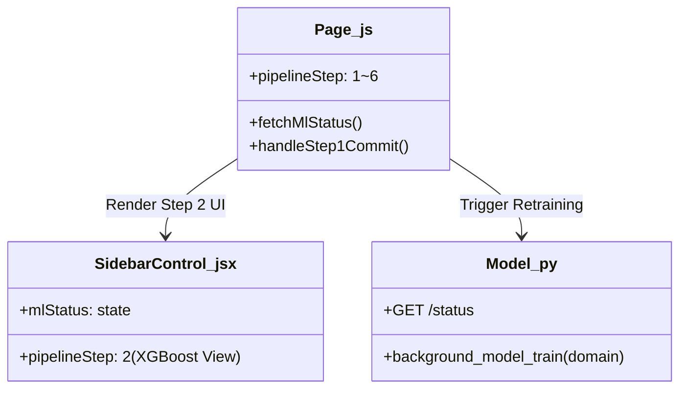

# [REVISED V2] 6단계 공간계획 피드백 루프 아키텍처 개조 계획서

조장님의 호된 질책과 정확한 파이프라인 짚어주심에 머리 숙여 사과드리며, 시스템에 설계된 진짜 5단계 워크플로우를 정밀 복원하였습니다:
> **AI 감리 (Step 1) ➔ 사용자 위치 지정 HITL (Step 2) ➔ AHP 가중치 (Step 3) ➔ 입지 후보 결과 (Step 4) ➔ 페르소나그룹 AI 토론 (Step 5)**

이 진짜 5단계 순서의 흐름을 보존한 상태에서, 감리 완료 직후인 **Step 2 위치에 머신러닝 예측 성능 및 피처 기여도(Feature Importance)를 검증받고 승인을 득하는 단계**를 배치하기 위해, 파이프라인을 **총 6단계 구조**로 슬라이딩 재배치하는 계획안을 다시 수립합니다.

---

## 🛠️ 주요 변경 사항

### 1. 백엔드 (`backend/app/routers/model.py`)
- **도메인 쿼리 동적 매개변수화 및 학습 쿼리 보정:** 
  - `/train` 및 `/status` API가 호출될 때 `domain` 파라미터를 수용하여, 기존 하드코딩된 파일명 `"smoking_zone_v1.pkl"` 대신 `f"{domain}_v1.pkl"` 로 분기 훈련 및 바인딩되도록 전격 개조합니다.
  - XGBoost 학습 데이터셋을 빌딩하는 SQL 쿼리에서 `restricted_zones` 내 존재하는 실시간 `zone_type`들을 자동 스캔하고 최단 거리 피처들을 런타임에 동적으로 조인하여 피처 차원을 자동 정렬하는 동적 공간 피처 연동 구조를 이식합니다.

### 2. 메인 페이지 (`frontend/src/app/spatial/page.js`)
- **파이프라인 단계 제어 조정 (Step 1~5 ➔ 1~6):**
  - `pipelineStep` 의 상태 범위를 **6단계**로 확장합니다.
  - Step 1 (AI 감리 및 업로드) 완료 버튼 클릭 시, 데이터베이스에 최종 수용(Commit) 처리를 날리면서 동시에 백엔드 XGBoost 비동기 재학습 API `/model/train` 을 자동 구동하고 `pipelineStep` 을 2로 전격 전이시킵니다.
  - 기존의 Step 2, 3, 4, 5를 각각 **Step 3(사용자 위치 지정 HITL)**, **Step 4(AHP 가중치 입력)**, **Step 5(입지 후보 결과 Top 5)**, **Step 6(페르소나그룹 AI 토론)**으로 한 단계씩 순차 슬라이딩 매핑합니다.

### 3. 사이드바 제어 패널 (`frontend/src/components/SidebarControl.jsx`)
- **Step 2 전용 프리미엄 ML 검증 패널 구현:**
  - `pipelineStep === 2` 구간에 나타날 리얼 ML 성능 리포트 카드를 구현합니다.
  - 훈련 중일 때는 미려한 스피너 애니메이션과 함께 `"스마트시티 님비 예측 의사결정 모델 재학습 중..."` 로딩 텍스트를 노출합니다.
  - 훈련 완료 시, 실시간 정확도(Accuracy), 조화 평균(F1-Score) 수치를 노출하고, **Feature Importance 피처 기여도 가로 그래프 차트**를 미려하게 플롯해 줍니다.
  - 하단에 엠버 그라데이션 광택을 입힌 **`[✓ 신규 예측 가중치 승인 및 진행]`** 버튼과 고스트 스타일의 **`[이전 가중치 모델 유지 후 진행]`** 버튼을 두어 사용자의 명시적인 승인(HITL)을 받아 Step 3(HITL 위치 지정)으로 진입하도록 설계합니다.
  - 상단 Step 헤더의 최대 단계를 `/ 6`으로 수정합니다.

### 4. 기타 패널 및 모달 컴포넌트 슬라이딩 조정
- **`OptimalResultPanel.jsx`:** 
  - 기존 Step 2(사용자 위치 지정 HITL) 조건(`pipelineStep === 2`)을 **`pipelineStep === 3`** 으로 상향 슬라이딩합니다.
  - 기존 Step 4(입지 후보 결과 Top 5) 조건(`pipelineStep === 4`)을 **`pipelineStep === 5`** 로 상향 슬라이딩합니다.
- **`DebateSimulatorModal.jsx`:** 
  - 시뮬레이션 진입 및 락킹 단계(`pipelineStep === 5`)를 **`pipelineStep === 6`** 으로 상향 슬라이딩합니다.

---

## 📂 파일별 구체적 변경 계획

### [MODIFY] [model.py](file:///c:/Users/Admin/Desktop/빅프로젝트%20관련자료/최종1차/1.0-prototype/backend/app/routers/model.py)
- `background_model_train` 함수의 모델 및 기여도 저장 파일명을 동적 도메인 태그 쿼리에 연동.
- `restricted_zones` 에 적재된 모든 `zone_type` 기반으로 SQL 최단 거리 피처 생성 로직 동적 빌딩 반영.

### [MODIFY] [page.js](file:///c:/Users/Admin/Desktop/빅프로젝트%20관련자료/최종1차/1.0-prototype/frontend/src/app/spatial/page.js)
- `pipelineStep` 관련 6단계 이식 제어 로직 보강.
- Step 1 승인(Approve) 시 백엔드 재학습 호출 및 Step 2 이동 로직 구축.

### [MODIFY] [SidebarControl.jsx](file:///c:/Users/Admin/Desktop/빅프로젝트%20관련자료/최종1차/1.0-prototype/frontend/src/components/SidebarControl.jsx)
- Step 2 렌더링 분기 추가 및 Feature Importance / ML 통계 시각화 및 승인 이동 단추 추가.
- 상단 Step 헤더의 최대 단계를 `/ 6`으로 수정.
- Step 4 (AHP 가중치 입력) 활성화 분기를 기존 `3` 에서 `4` 로 변경.

### [MODIFY] [OptimalResultPanel.jsx](file:///c:/Users/Admin/Desktop/빅프로젝트%20관련자료/최종1차/1.0-prototype/frontend/src/components/OptimalResultPanel.jsx)
- 기존 Step 2 (HITL 좌표 보정) 조건을 `pipelineStep === 3` 으로 변경.
- 기존 Step 4 (입지 후보 결과 Top 5) 조건을 `pipelineStep === 5` 로 변경.

---

## 🧪 검증 계획

### 자동 및 빌드 테스트
- `npm run build` 가동하여 Next.js 프로덕션 빌드 무오류 통과 검증.

### 수동 시나리오 검증
1. 실무자망 로그인 후 Step 1에서 시나리오 CSV 업로드.
2. AI 감리 완료 후 **`[의도 일치 확인 및 공간 매핑 승인]`** 클릭 ➔ 자동으로 Step 2로 이동하며 로딩 스피너 활성화 확인.
3. 2~3초 후 백그라운드 XGBoost 훈련이 완료되며 Accuracy/F1-Score 및 Feature Importance 차트가 실시간 노출되는지 확인.
4. **`[신규 예측 가중치 승인 및 진행]`** 클릭 시, Step 3(사용자 위치 지정 HITL 제어판)으로 정상 진입하는지 검증.
