# OmniSite 차세대 아키텍처 로드맵 및 코드 정밀 감리 보고서 (v1.2.0-alpha-FutureAudit)

본 보고서는 조장(USER)의 직접 명령에 의거하여, 현 단계 **OmniSite v1.2.0-stable**의 핵심 백엔드 소스코드를 정밀 감사(Code Audit)하여 런타임 잠재 결함 요인을 파악하고, 본 솔루션을 차세대 엔터프라이즈 스마트시티 SDSS(공간 의사결정 지원 시스템)로 확장하기 위한 미래 고도화 로드맵을 무편향·냉철 시각으로 제안하기 위해 작성되었습니다.

---

## ⚙️ 1. 핵심 백엔드 소스코드 정밀 감사 (Code Audit)

### ① `backend/app/routers/ahp.py` (AHP 계층분석 연산 모듈)
- **감리 의견 (우수)**:
  - Numpy의 선형대수 모듈(`np.linalg.eigvals`)을 활용하여 일관성 지수(C.I.)와 최대 고유값($\lambda_{max}$)을 수학적으로 대단히 정밀하게 산출하고 있습니다.
  - 가중치가 0으로 유입되어 런타임 제로 디비전 에러(Zero Division Error)가 나는 현상을 `val_j == 0` 필터링으로 견고하게 방어하고 있습니다.
- **잠재 취약점**:
  - `RI_TABLE` 상의 9가지 학술 기준 지표를 초과하는 지표 수(예: 가중치 인자 $n > 10$)가 사용자에 의해 임의로 유입될 경우, `RI_TABLE.get(n, 1.49)`에 의해 R.I. 값이 1.49로 고정되어 미세한 소수점 정밀도 분산 편차가 발생할 수 있습니다. (다만 실무적으로 $n > 10$인 AHP 쌍대비교는 일관성 유지가 불가능해 거의 사용되지 않아 영향도는 매우 낮음)

### ② `backend/app/routers/model.py` (XGBoost CSS 예측 파이프라인)
- **감리 의견 (우수)**:
  - 서버 최초 기동 시 캐싱된 학습 메타 정보(`smoking_zone_v1_meta.json`)를 비동기로 자동 파싱하여 복원하는 로직(`load_initial_model_status`)이 우수하게 설계되어 있습니다.
  - XGBoost 모델에 `max_depth=3`, L1/L2 규제 규격을 견고하게 적용하여 자치구 외삽(Extrapolation) 시 발생할 수 있는 오버피팅을 성공적으로 통제하고 있습니다.
- **잠재 취약점**:
  - DB 상의 의사결정 이력이 아예 존재하지 않는 극단적 콜드스타트 런타임 단계에서 `background_model_train`이 수행되면, 훈련용 학습 데이터셋 크기가 0이 되어 XGBoost 피팅 시 파이썬 `ValueError: empty dataset` 예외를 뱉을 수 있습니다. 최소 데이터셋 크기(예: 10건 이상) 충족 시에만 모델 훈련을 허가하는 안전성 체크 루틴 보완이 권장됩니다.

### ③ `backend/app/utils/spatial.py` & `upload.py` (공간 LSMD 벌크 적재)
- **감리 의견 (우수)**:
  - 매 지적도 행(Row)마다 DB 트랜잭션을 날려 Contains 쿼리를 검사하던 비효율을 완전히 걷어내고, 벌크 인서트 후 PostGIS의 Spatial Join UPDATE 쿼리 한 방으로 읍면동 ID를 10초 만에 갱신하는 성능 100배 개선 로직이 완벽하게 가동 중입니다.

---

## 🚀 2. OmniSite 차세대 고도화 4대 로드맵 (Future Roadmap)

OmniSite가 프로토타입을 넘어 전국 자치구 및 스마트 국토 연구망에 채택되는 1급 솔루션으로 진화하기 위한 차세대 4대 확장 전략입니다.

```mermaid
graph TD
    A["OmniSite v1.2.0 (현 수준)"] --> B["AHP-ML 피드백 루프 연동 (Closed-Loop)"]
    A --> C["다목적 인프라 지표 템플릿 레지스트리"]
    A --> D["Vision OCR 기반 RAG 규제 해석기"]
    A --> E["MVT 벡터 타일 스트리밍 (PostGIS 튜닝)"]
    
    style A fill:#1e1e2f,stroke:#4f46e5,stroke-width:2px;
```

### ① AHP와 ML의 상호 피드백 연동 (Closed-Loop SDSS)
- **내용**: 현재 별개로 연산되는 AHP 점수와 XGBoost 주민 갈등도(CSS) 점수를 결합합니다. 
- **아키텍처**: AHP로 입지 순위를 계산할 때, 머신러닝이 예측한 해당 필지의 갈등 민감도 점수를 역수 형태의 패널티(Penalty Weight)로 AHP 고유벡터 점수에 곱합니다. 이를 통해 **"주민 갈등 위험을 사전 인지하여 입지 추천 지수를 실시간으로 보정하는 피드백 루프"** 알고리즘으로 극적 진화합니다.

### ② 다중 인프라 표준 평가지표 템플릿 레지스트리 구축
- **내용**: 사용자가 선정하려는 인프라 도메인을 선택하면 자동으로 지표와 데이터 파이프라인이 셋업되도록 표준화합니다.
- **아키텍처**: '전기차 충전소', '공유 킥보드 거치대', '안심 옐로카펫', '스마트 버스 쉘터' 등 주요 도시기반시설 20여 종에 대한 **표준 AHP 지표 템플릿 레지스트리**를 내장합니다. 도메인 선택 시 관련 인근 레이어(예: 킥보드 거치대의 경우 버스 정류장 밀집도, 옐로카펫의 경우 어린이집 및 학교 경계선)가 자동으로 로드 매핑되도록 지원합니다.

### ③ 멀티모달 Vision OCR을 활용한 RAG 공문서 감리 엔진 고도화
- **내용**: 텍스트 OCR 수준인 RAG 검증 모듈을 복합 설계도면 해석 수준으로 고도화합니다.
- **아키텍처**: 행정 종결 고시문 PDF 내부의 표(Table) 구조나 CAD 설계 도면, 구획 정보 이미지를 파싱할 수 있는 **멀티모달 LLM(Vision API)** 파이프라인을 RAG 모듈 전위에 주입합니다. 이를 통해 실제 면적, 법정 이격 안전 거리 요건의 일치성 검증도를 오차 범위 1% 이내로 수렴시킵니다.

### ④ PostGIS MVT (Mapbox Vector Tile) 벡터 타일 스트리밍 변환
- **내용**: 지도 위에서 지적 필지를 GeoJSON으로 통째로 전송하는 렌더링 병목 현상을 해결합니다.
- **아키텍처**: PostGIS 데이터베이스 내부에서 **`ST_AsMVT`** 쿼리를 기동하여, 공간 지적 필지를 바이너리 벡터 타일로 즉시 조각내어 클라이언트에 캐시 전송합니다. 용산구에 국한되지 않고 서울시 전체 25개 자치구의 수백만 필지 지적 데이터네트워크 오버헤드 없이 0.5초 만에 웹 맵 상에 드로잉(Drawing)하는 고가용성을 확보합니다.
