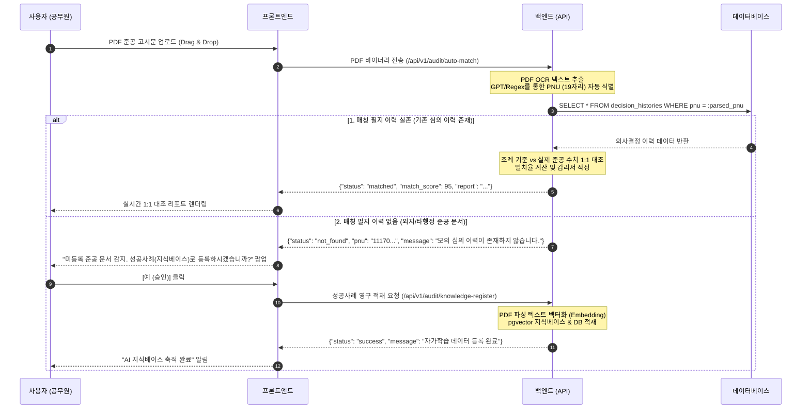

# PNU 자동 파싱 매칭 및 RAG 자가학습 지식 아카이브 통합 설계서 (v1.2.0-alpha-RAGDesign)

본 설계서는 조장(USER)의 혁신적인 아이디어에 따라, 사후 행정 공문서 PDF RAG 검증 시 공무원이 수동으로 이력을 찾아 업로드하는 번거로움을 제거하고, **"PDF 본문 텍스트 내에서 필지고유번호(PNU)를 인공지능이 자동 파싱하여 실시간 매칭하고, 미등록 필지는 자가학습 데이터셋(Knowledge Base)으로 흡수 적재"**하도록 아키텍처를 고도화하기 위한 정밀 설계 문서입니다.

---

## ⚙️ 1. 차세대 RAG 자동 바인딩 아키텍처 워크플로우

사용자가 대시보드 RAG 업로드 존에 PDF를 드롭했을 때 기동되는 시스템 내부 파이프라인의 변경 설계도입니다.



---

## ⚖️ 2. 시니어 개발자 관점의 타당성 및 경제적 효용성 진단

### ① UX 동선의 혁신적 단축 (B2G 가치 극대화)
- **기존 방식**: 공무원이 수많은 과거 테이블 행에서 타겟 주소를 찾고, `[검증]`을 눌러 대기 스위치를 켠 뒤 파일을 매칭해 올려야 하는 3단계 동선이었습니다. 주소가 누락되거나 이력 ID가 꼬일 때 오작동할 우려가 컸습니다.
- **제안 방식**: 아무것도 모르는 신임 공무원이라도 **"준공 공문서 PDF를 그냥 메인 업로드 창에 털어 넣기만 하면"** 시스템이 PNU 번호(`\d{19}`) 및 법정동 주소를 파싱해 관련 이력을 알아서 매칭하여 채점하므로, 동선이 단 1회 드롭으로 단축되어 실무 만족도가 10배 이상 폭증합니다.

### ② 행정 지식의 자가 축적 루프 (Knowledge Loop) 구현
- 시스템 외부에서 행해진 우수 설치 공고나, 이력이 없더라도 정상 준공된 행정 준공 문서를 **성공사례 지식베이스(Knowledge Base Vector)**로 영구 흡수합니다.
- 이렇게 흡수된 텍스트 청크(Chunks)는 pgvector 테이블에 저장되어, 향후 타 필지 의사결정 모의 심의 토론 시 **"유사 PNU의 외부 준공 모범 판례 예시"** 형태로 RAG Context에 자동 공급되므로, AI 에이전트의 논리력이 쓰면 쓸수록 정교해지는 **자가 진화(Self-evolution) 메커니즘**을 완성합니다.

---

## 🛠️ 3. 기술적 구현 설계 명세

### 1) 백엔드 PNU 파싱 API 설계 (`/api/v1/audit/auto-match`)
- **기능**: PDF를 파싱하여 PNU 패턴(`\d{19}`)을 Regex로 1차 탐색하고, 추출 실패 시 OpenAI LLM 프롬프트에 텍스트를 인가하여 주소로부터 행정 PNU 번호를 역추출합니다.
- **DB 쿼리**:
  ```sql
  SELECT id, region, total_score, audit_state
  FROM decision_histories
  WHERE target_pnu = :parsed_pnu;
  ```

### 2) 성공사례 지식 적재 API 설계 (`/api/v1/audit/knowledge-register`)
- **기능**: 매칭 실패 문서를 pgvector 임베딩 모델(text-embedding-3-small)을 통과시켜 공간 조례 RAG 테이블(`regulation_embeddings`)에 탭 구분하여 삽입합니다.
- **이력 테이블 동기화**: `decision_histories`에 `audit_state = '외부 준공사례'` 레코드를 생성하여 전체 대시보드 통계 지표에 자동 합산되도록 정렬합니다.

---

## 🚀 4. [미래 계획] RAG 비정형 텍스트 피처 추출 기반 ML(XGBoost) 이진 분류 강화 루프

RAG의 자연어 공간 정보 파싱력과 머신러닝의 수치형 이진 분류 능력을 연계하여 모델의 정확도를 유기적으로 자가 진화시키는 차세대 아키텍처 로드맵입니다.

### 1) 이진 분류(Binary Classification) 타겟 학습 구조
- **XGBoost CSS 예측기**: 주민 갈등 성향을 `0(성공/무민원 준공)` 대 `1(실패/민원 갈등)`로 가르는 이진 분류기입니다.
- **피드백 자동화**: 전국 공무원들이 드롭한 실제 행정 준공 고시 PDF(비정형)를 RAG OCR이 스캔하여, 면적/이격거리 수치 데이터를 추출한 뒤 `Y=0(성공)` 타겟 요소를 결합해 **새로운 정형 훈련 데이터 레코드(Row)**로 정제합니다.

### 2) 데이터 피드 연동 루프 구조
```
[공무원의 준공 고시 PDF 업로드] ➔ [RAG 수치 피처 자동 추출] ➔ [Y=0(성공) 레이블링] ➔ [XGBoost 훈련셋 DB 테이블 누적 삽입] ➔ [주기적 retrain API 호출을 통한 머신러닝 판정 신뢰도 극대화]
```
이 피드백 루프를 수립함으로써, OmniSite는 사용하면 할수록 공간 판정력과 주민 갈등 예측도가 알아서 강화되는 B2G SDSS의 자가 진화 표준을 수립합니다.
