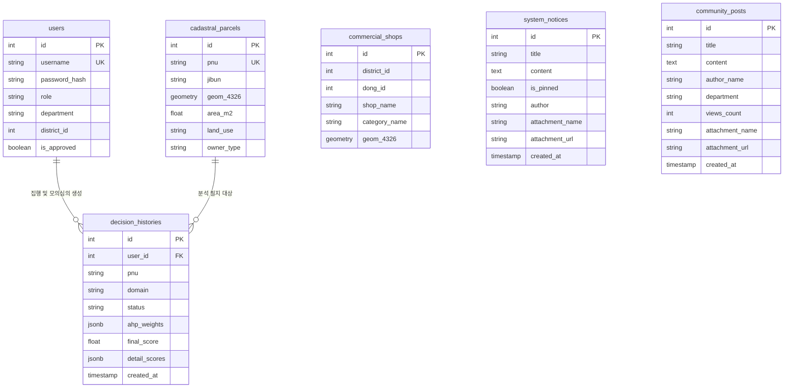

# [OmniSite SDSS v1.5.0-ZeroBias] 데이터베이스 ERD 및 스키마 명세서

본 명세서는 스마트시티 B2G 공공 입지분석 지원 플랫폼 **OmniSite SDSS v1.5.0-ZeroBias**의 PostgreSQL + PostGIS 데이터베이스 6개 핵심 테이블 스키마, 관계도(ERD), 공간 인덱스(GIST) 및 제약 조건 규격을 실제 소스코드와 1:1 완벽 정합하여 정의합니다.

---

## 📐 1. 데이터베이스 ERD (Entity Relationship Diagram)



---

## 🗄️ 2. 핵심 테이블 상세 명세 (실측 DB 스키마 1:1 정합)

### 2.1. `users` (사용자 계정 및 부서 권한 테이블)
| 컬럼명 | 데이터 타입 | 제약 조건 | 설명 |
| :--- | :--- | :--- | :--- |
| `id` | `INTEGER` | PRIMARY KEY, AUTO_INCREMENT | 사용자 고유 식별자 |
| `username` | `VARCHAR(50)` | UNIQUE, NOT NULL | 사용자 로그인 ID |
| `password_hash` | `VARCHAR(255)` | NOT NULL | SHA-256 / bcrypt 암호화 해시 |
| `role` | `VARCHAR(20)` | DEFAULT 'user' | 권한 등급 (`admin`, `user`) |
| `department` | `VARCHAR(100)` | NOT NULL | 소속 행정 부서 (예: 스마트도시과, 도시계획과) |
| `district_id` | `INTEGER` | DEFAULT 1 | 자치구 구역 ID |
| `is_approved` | `BOOLEAN` | DEFAULT TRUE | 관리자 가입 승인 여부 (신규 가입 시 FALSE) |

### 2.2. `cadastral_parcels` (지적 필지 공간 테이블)
| 컬럼명 | 데이터 타입 | 제약 조건 | 설명 |
| :--- | :--- | :--- | :--- |
| `id` | `INTEGER` | PRIMARY KEY, AUTO_INCREMENT | 필지 고유 식별자 |
| `pnu` | `VARCHAR(19)` | UNIQUE, NOT NULL | 19자리 고유 필지 번호 (PNU) |
| `jibun` | `VARCHAR(100)` | NOT NULL | 지번 주소 (예: 서울특별시 용산구 이촌동 301-1) |
| `geom_4326` | `GEOMETRY(POLYGON, 4326)` | NOT NULL, GIST INDEX | PostGIS EPSG:4326 필지 다각형 공간 데이터 |
| `area_m2` | `DOUBLE PRECISION` | NOT NULL | 필지 면적 ($m^2$) |
| `land_use` | `VARCHAR(50)` | NOT NULL | 지목 (대, 잡종지, 주거용, 공원 등) |
| `owner_type` | `VARCHAR(20)` | NOT NULL | 소유 구분 (국유지, 공유지, 사유지) |

### 2.3. `commercial_shops` (상가 업소 공간 테이블)
| 컬럼명 | 데이터 타입 | 제약 조건 | 설명 |
| :--- | :--- | :--- | :--- |
| `id` | `INTEGER` | PRIMARY KEY, AUTO_INCREMENT | 상가 업소 고유 식별자 |
| `district_id` | `INTEGER` | NOT NULL | 자치구 식별자 |
| `dong_id` | `INTEGER` | NOT NULL | 행정동 식별자 |
| `shop_name` | `VARCHAR(150)` | NOT NULL | 상호명 |
| `category_name` | `VARCHAR(50)` | NOT NULL | 업종 분류 (음식, 소매, 생활서비스 등) |
| `geom` | `GEOMETRY(POINT, 4326)` | NOT NULL, GIST INDEX | 점(Point) 좌표 공간 데이터 |

### 2.4. `decision_histories` (AI 모의 심의 및 입지 결정 이력 테이블)
| 컬럼명 | 데이터 타입 | 제약 조건 | 설명 |
| :--- | :--- | :--- | :--- |
| `id` | `INTEGER` | PRIMARY KEY, AUTO_INCREMENT | 심의 이력 고유 ID |
| `user_id` | `INTEGER` | FOREIGN KEY (`users.id`) | 담당 실무관 ID |
| `pnu` | `VARCHAR(19)` | NOT NULL | 분석 대상 필지 PNU |
| `domain` | `VARCHAR(50)` | NOT NULL | 입지분석 도메인 (스마트 쉼터, 전기차 충전소 등) |
| `status` | `VARCHAR(30)` | DEFAULT '토론 완료' | 모의 심의 이력 상태 |
| `ahp_weights` | `JSONB` | NOT NULL | AHP 계층분석 가중치 JSON |
| `final_score` | `DOUBLE PRECISION` | NOT NULL | 최종 입지 적합도 점수 (0~100) |
| `detail_scores` | `JSONB` | NOT NULL | 5단계 가중 산출 세부 지표 |
| `created_at` | `TIMESTAMP` | DEFAULT CURRENT_TIMESTAMP | 생성 일시 |

### 2.5. `system_notices` (공지사항 및 첨부파일 메타 데이터)
| 컬럼명 | 데이터 타입 | 제약 조건 | 설명 |
| :--- | :--- | :--- | :--- |
| `id` | `INTEGER` | PRIMARY KEY, AUTO_INCREMENT | 공지사항 고유 ID |
| `title` | `VARCHAR(255)` | NOT NULL | 공지사항 제목 |
| `content` | `TEXT` | NOT NULL | 공지사항 본문 |
| `is_pinned` | `BOOLEAN` | DEFAULT FALSE | 상단 고정(필독) 여부 |
| `author` | `VARCHAR(50)` | DEFAULT '시스템 최고 관리자' | 발행 명의 |
| `attachment_name`| `VARCHAR(255)` | NULL | 첨부 파일 원본 이름 |
| `attachment_url` | `TEXT` | NULL | 서버 다운로드 REST URL |
| `created_at` | `TIMESTAMP` | DEFAULT CURRENT_TIMESTAMP | 작성 일시 |

### 2.6. `community_posts` (자유게시판 및 첨부파일 메타 데이터)
| 컬럼명 | 데이터 타입 | 제약 조건 | 설명 |
| :--- | :--- | :--- | :--- |
| `id` | `INTEGER` | PRIMARY KEY, AUTO_INCREMENT | 게시글 고유 ID |
| `title` | `VARCHAR(255)` | NOT NULL | 게시글 제목 |
| `content` | `TEXT` | NOT NULL | 게시글 본문 |
| `author_name` | `VARCHAR(50)` | NOT NULL | 작성자 성명 |
| `department` | `VARCHAR(100)` | NOT NULL | 작성자 소속 부서 |
| `views_count` | `INTEGER` | DEFAULT 0 | 조회수 |
| `attachment_name`| `VARCHAR(255)` | NULL | 첨부 파일 원본 이름 |
| `attachment_url` | `TEXT` | NULL | 서버 다운로드 REST URL |
| `created_at` | `TIMESTAMP` | DEFAULT CURRENT_TIMESTAMP | 작성 일시 |

---

## ⚡ 3. PostGIS 공간 인덱스(Spatial GIST Index) 산정 규격

속도 저하 없는 고성능 공간 검색을 위하여 각 공간 테이블에 PostGIS GIST(Generalized Search Tree) 인덱스가 동적으로 생성 및 유지됩니다.

```sql
-- 지적 필지 다각형 공간 인덱스
CREATE INDEX IF NOT EXISTS idx_cadastral_parcels_geom 
ON cadastral_parcels USING GIST (geom_4326);

-- 상가 업소 점(Point) 공간 인덱스
CREATE INDEX IF NOT EXISTS idx_commercial_shops_geom 
ON commercial_shops USING GIST (geom);
```
