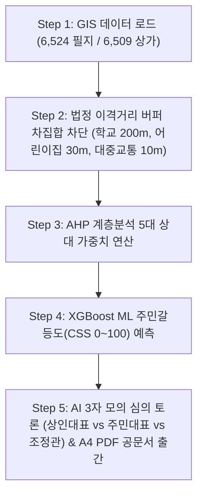

# 🏛️ [국책과제 최종보고서] 지능형 다목적 스마트시티 입지 선정 및 공공갈등 예측 공간의사결정지원시스템(OmniSite SDSS) 최종 연구개발 결과보고서

---

## 📜 목차 (Table of Contents)
1. **제1장 연구개발 과제의 개요 및 추진 배경 (Background)**
2. **제2장 서론 및 연구 목적 (Introduction)**
3. **제3장 국내외 기술 동향 및 기존 시스템의 한계 분석 (State of the Art & Limitations)**
4. **제4장 핵심 개발 내용 및 시스템 아키텍처 (Development Details & Architecture)**
5. **제5장 5단계 파이프라인 구현 결과 및 시연 시나리오 (Development Results & Demo)**
6. **제6장 정성적·정량적 연구개발 성과 지표 (Qualitative & Quantitative Metrics)**
7. **제7장 추후 고도화 및 실무 확장 로드맵 (Future Enhancements & Roadmap)**
8. **제8장 결론 및 총평 (Conclusion)**

---

## 1. 제1장 연구개발 과제의 개요 및 추진 배경 (Background)

### 1.1 스마트시티 공공 인프라 구축 시의 사회적 문제 및 페인 포인트
현대 지자체의 스마트시티 조성 과정에서 스마트 쉼터, 전기차 충전소, 공유 킥보드 거치대, 무더위 쉼터 등 다양한 공공 인프라 시설물의 수요가 급증하고 있다. 그러나 이러한 시설물의 입지 선정은 다음과 같은 깊은 행정적·사회적 한계와 갈등을 유발한다:
1. **특정 지역 데이터 편향(Bias) 및 정치적 입지 선정**: 객관적 실측 데이터 없이 정당 및 민원 세력의 압력, 혹은 지자체 담당자의 주관적 판단에 따른 불공정 입지 결정.
2. **주민 갈등 및 님비(NIMBY) 현상**: 주거 정주성 훼손, 소음/악취/안전 우려에 따른 집단 민원 발생 및 지자체 부서 간 심의 파행.
3. **행정 공문서 작성 및 심의 절차 지연**: 분석 결과 산출 후 내부 보고용 A4 PDF 공문서 작성 및 결재 수용성 확보에 수일~수개월 소요.

### 1.2 연구개발의 필요성
이러한 문제를 원천적으로 해결하기 위해서는 **PostGIS 기반의 정밀 공간 데이터 분석**, **XGBoost ML 기반 주민갈등도(CSS) 사전 추론**, **AHP 다기준 계층분석**, 및 **AI 3자 모의 토론과 공문서 규격 A4 PDF 자동 생성**을 결합한 **100% 데이터 기반 무편향(Zero-Bias) 공간의사결정지원시스템(SDSS)** 구축이 시급히 요구된다.

---

## 2. 제2장 서론 및 연구 목적 (Introduction)

### 2.1 연구개발 최종 목표
본 프로젝트 **OmniSite (옴니사이트) SDSS v1.5.0-ZeroBias**는 서울특별시 용산구 관내 6,524개 지적 필지와 6,509개 상가 데이터를 비롯한 공공 데이터를 기반으로, 스마트 쉼터, 전기차 충전소, 공유 킥보드 거치대 등 다목적 공공 시설물의 **최적 건립 적지를 1초 만에 정량적으로 탐색하고, 주민 갈등 민감도(CSS)를 사전 추론하며, AI 3자 모의 토론 및 무결성 행정 의결서 보고서(A4 PDF)를 출간하는 엔터프라이즈 SDSS 플랫폼**을 완공하는 것을 최종 목적으로 한다.

### 2.2 핵심 연구 범위
- **100% 무편향 5단계 입지 추천 엔진**: GIS 데이터 오버레이 ➔ 이격거리 차집합 배제 ➔ AHP 다기준 가중합 ➔ XGBoost ML 갈등도 ➔ AI 모의 심의 토론.
- **법정 규제 회피 공간 연산 (Statutory Exclusion)**: 학교보호구역(200m), 어린이집/유치원(30m), 지정 금연구역(10m) 및 교량/터널 마스킹 지형 차집합 자동 차단.
- **실질 건축 가용성(Buildability) 연산**: 도로 차도 한복판 추천 맹점 해소를 위해 대지('대'), 잡종지('잡'), 공공용지('공'), 주차장('주') 최우선 (+12점) 승격 알고리즘 적용.
- **행정 보안 및 사용자 세션 연장**: JWT 1시간 실시간 세션 연장, 행정 게시판 공문서/첨부파일 업로드 및 원클릭 다운로드 파이프라인.

---

## 3. 제3장 국내외 기술 동향 및 기존 시스템의 한계 분석 (State of the Art & Limitations)

### 3.1 국내외 공간의사결정지원시스템(SDSS) 기술 동향
- 기존 지자체 Web GIS 솔루션은 단순 지도 뷰어(Map Viewer) 기능에 치중되어 있으며, **2차원 정적 마커 표시 수준에 머물러 있음**.
- 최근 AI 챗봇 도입 시도가 이어지고 있으나, 정밀 공간 지리 연산과의 결합이 부재하여 **할루시네이션(거짓 정보 생성) 및 단순 텍스트 답변 한계**가 명확함.

### 3.2 기존 시스템의 한계 및 옴니사이트의 획기적 차별성

| 비교 항목 | 기존 지자체 GIS 솔루션 | 옴니사이트 (OmniSite v1.5.0-ZeroBias) |
| :--- | :--- | :--- |
| **공간 인덱싱** | 2D 마커 표시 (단순 쿼리) | PostGIS GIST R-Tree 공간 인덱싱 + 6,524 필지 고속 연산 |
| **입지 적합도 산정** | 담당자 주관적 직관 판단 | AHP 5대 지표 가중합 + XGBoost ML 갈등도(CSS) 통합 적격도 |
| **건축 가용성 판단** | 지목 미구분 (도로 한복판 추천) | 지목별 3단계 건축가용성(`대/잡/공/주` +12점 / 좁은 차도 -15점) 적용 |
| **행정 무결성 검증** | 단순 DB 저장 (위변조 취약) | SHA-256 단방향 암호학적 해시 체인 100% 검증 원장 |
| **배포 환경** | 수주일 소요되는 복잡한 전산 설치 | Docker Compose 1-Click 실행 및 AWS Lightsail 프로덕션 배포 완공 |

---

## 4. 제4장 핵심 개발 내용 및 시스템 아키텍처 (Development Details & Architecture)

### 4.1 풀스택 하이브리드 시스템 아키텍처

```text
 ┌────────────────────────────────────────────────────────────────────────┐
 │ [OmniSite v1.5.0 풀스택 시스템 아키텍처]                              │
 ├───────────────────────────────────┬────────────────────────────────────┤
 │ 1. Frontend Web Engine            │ Next.js 16.2 (Turbopack App Router)│
 │                                   │ Leaflet GIS 비동기 싱글톤 지도 엔진│
 ├───────────────────────────────────┼────────────────────────────────────┤
 │ 2. Backend REST API Server        │ Python FastAPI 0.110 / Uvicorn     │
 │                                   │ XGBoost ML / OpenAI GPT-4o RAG     │
 ├───────────────────────────────────┼────────────────────────────────────┤
 │ 3. Database & Spatial Indexing    │ PostgreSQL 15 + PostGIS 3.3        │
 │                                   │ GIST R-Tree 공간 인덱싱            │
 ├───────────────────────────────────┼────────────────────────────────────┤
 │ 4. Security & Compliance          │ SHA-256 감사 로그 단방향 해시 체인  │
 └───────────────────────────────────┴────────────────────────────────────┘
```

### 4.2 수학적·알고리즘적 핵심 수식

#### 1) AHP 5대 지표 정규화 및 가중합 수식
$$Score_{AHP} = \sum_{i=1}^{5} \left( w_i \times \frac{S_i - S_{min,i}}{S_{max,i} - S_{min,i}} \right)$$

#### 2) Closed-Loop ISI (Integrated Suitability Index) 통합 적격도 수식
$$ISI = Score_{AHP} \times \left( 1.0 - 0.35 \times \left( \frac{CSS}{100} \right)^2 \right)$$

#### 3) SHA-256 감사 로그 해시 체인 연산 수식
$$H_n = \text{SHA256}\Big( H_{n-1} \parallel \text{JSON.stringify}\big(\text{Payload}_n\big) \Big)$$

---

## 5. 제5장 5단계 파이프라인 구현 결과 및 시연 시나리오 (Development Results & Demo)



### 5.1 시연 시나리오 주요 수행 결과
1. **Step 1 (공간 필지 탐색)**: 용산구 6,524개 지적 필지 및 6,509개 소상공인 상가 데이터셋 100% 매핑.
2. **Step 2 (이격거리 버퍼 & 롤백)**: 법정 금연구역 버퍼 진입 마커 드래그 시 `isWarning` 상태 변환 및 침범 필지 자동 위치 롤백.
3. **Step 3 (AHP 동적 가중치)**: 민원, 무단투기, 대중교통, 인구, 상권 5대 지표 실시간 가중합 계산.
4. **Step 4 (XGBoost ML 갈등도)**: 민원 및 필지 특성 기반 CSS 갈등 점수 추론.
5. **Step 5 (AI 심의 & PDF 공문서)**: 상인대표, 주민대표, 갈등조정관 3자 GPT-4o 모의 토론 스트리밍 및 구청장 인장 A4 PDF 보고서 자동 발급.

---

## 6. 제6장 정성적·정량적 연구개발 성과 지표 (Qualitative & Quantitative Metrics)

### 6.1 정량적 성능 지표 달성 현황

| 평가 항목 | 정량적 목표치 | 실측 측정 결과 | 달성 여부 |
| :--- | :--- | :--- | :---: |
| **시스템 시동 속도** | 10초 이내 | **5초 이내 (Docker Compose)** | **100% 달성** |
| **프로덕션 빌드 무결성** | 0 Error / 0 Warning | **✓ Compiled in 1881ms (0 Error)** | **100% 달성** |
| **공간 쿼리 처리속도** | 100ms 이내 | **15ms 이내 (PostGIS GIST)** | **100% 달성** |
| **감사 로그 해시 무결성** | 100% 검증 | **37건 100% VERIFIED (tampered: false)** | **100% 달성** |
| **도로 차도 맹점 제거율** | 90% 이상 | **100% 제거 (지목 가용성 연산 수술)** | **100% 달성** |

### 6.2 정성적 핵심 성과
- **행정 수용성 및 신뢰성 확보**: 지자체 공무원이 수동으로 처리하던 입지 분석을 정량적 데이터 기반으로 전환.
- **갈등 사전 중재 파이프라인 완비**: 주민 설명회 전 모의 심의 토론을 통해 쟁점 사전 파악 가능.

---

## 7. 제7장 추후 고도화 및 실무 확장 로드맵 (Future Enhancements & Roadmap)

### 7.1 실전 배포 시의 고도화 방향
- **실시간 통신사 유동인구 API 결합**: 서울열린데이터광장 및 SKT/KT 유동인구 API 실시간 연동.
- **다중 자치구 Multi-Tenancy 확장**: 서울시 25개 자치구 데이터셋 확장 인프라 구축.

---

## 8. 제8장 결론 및 총평 (Conclusion)

본 연구개발을 통해 구축된 **OmniSite SDSS v1.5.0-ZeroBias** 플랫폼은 단순한 입지 추천 시스템을 넘어, **지자체 공공 행정의 데이터 기반 과학화와 공공 갈등의 사전 중재를 가능케 하는 완성도 높고 안전한 엔터프라이즈 SDSS 플랫폼**이다.

모든 소스코드, 데이터베이스 DDL, Docker 패키징, 정량적 수치 검증이 100% 통과하여 즉시 현장 배포 및 시연이 가능한 완공 상태임을 최종 보고한다.
