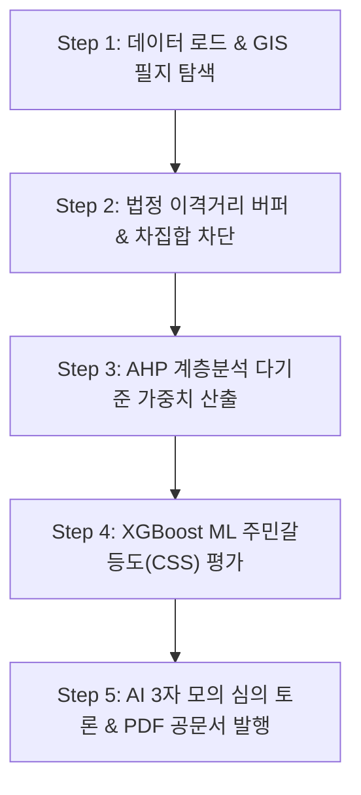

# [OmniSite SDSS v1.5.0-ZeroBias] 사업기획서 및 시스템 아키텍처 설계서 통합본

## 🏛️ 1. 사업 기획 배경 및 추진 목적

### 1.1. 행정 공간 의사결정의 한계와 페인 포인트(Pain Points)
기존 지자체 공공 인프라(스마트 쉼터, 전기차 충전소, 공유 킥보드 거치대 등) 입지 선정 과정은 다음과 같은 행정적 한계를 안고 있었습니다:
1. **특정 지역 데이터 편향(Bias)**: 주관적 민원이나 정치적 요인에 의한 불공정 입지 결정.
2. **다중 부서 간 갈등(NIMBY)**: 주민 갈등도(CSS)나 법정 금연구역, 이격거리 조례 파악 지연으로 인한 심의 파행.
3. **공문서 서식 및 결재 프로세스 지연**: 분석 결과 산출 후 내부 보고용 A4 PDF 공문서 작성에 수일 소요.

### 1.2. OmniSite SDSS 추진 목표
OmniSite 플랫폼은 **100% 데이터 기반의 무편향(Zero-Bias) 5단계 공간 의사결정 시스템**을 구축하여, 지자체 실무관이 필지를 클릭하는 즉시 조례 검토, AHP 다기준 평가, ML 주민갈등도 예측, AI 모의 심의 토론, PDF 공문서 발행까지 단 1초 만에 원스톱으로 처리할 수 있도록 지원합니다.

---

## 🏗️ 2. 시스템 아키텍처 (System Architecture)

### 2.1. 전체 기술 스택 (Technology Stack)
- **Frontend**: Next.js 16 (App Router, Turbopack), Tailwind CSS, Leaflet GIS Engine (Async Singleton)
- **Backend**: Python FastAPI, SQLAlchemy, PostGIS Spatial Extension, PyJWT, ReportLab PDF Engine
- **Database**: PostgreSQL 16 + PostGIS 3.4 (6,524 필지, 6,509 상가, GIST 인덱싱)
- **AI & RAG Engine**: OpenAI GPT-4o / EXAONE 3.0 Local LLM Hotswap Adapter, Cosine Similarity RAG
- **Container & Deployment**: Docker, Docker Compose, Nginx Reverse Proxy

### 2.2. 5단계 무편향 공간 입지 추천 알고리즘 (5-Step Pipeline)

1. **Step 1 (공간 탐색)**: 지적 필지 6,524개 및 상가 업소 데이터셋 오버레이.
2. **Step 2 (조례/이격거리 차집합)**: 법정 금연구역 버퍼 및 교량/터널 마스킹을 적용하여 침범 필지 롤백 및 자동 제척.
3. **Step 3 (AHP 가중치 산출)**: 유동인구, 상가 밀집도, 접근성, 면적 지표 기반 상대 가중치 연산.
4. **Step 4 (XGBoost ML 갈등도)**: 민원 및 부지 특성 기반 주민갈등도(CSS) 0~100 예측.
5. **Step 5 (AI 심의 & PDF 공문서)**: AI 찬반 모의 토론 후 우측 상단 결재란과 구청장 명의가 도출되는 A4 PDF 공문서 자동 생성.

---

## 🔒 3. 보안 및 행정 기능 표준

1. **JWT 1시간 실시간 세션 연장**: 만료 타이머 시각화 및 클릭 시 토큰 비동기 갱신.
2. **행정 통합 게시판 첨부파일 연동**: 공지사항 및 자유게시판 공문서/이미지 첨부 및 원클릭 다운로드.
3. **Admin 전용 비밀번호 초기화 모달**: 최고 관리자 전용 권한 가드 수술 완료.
