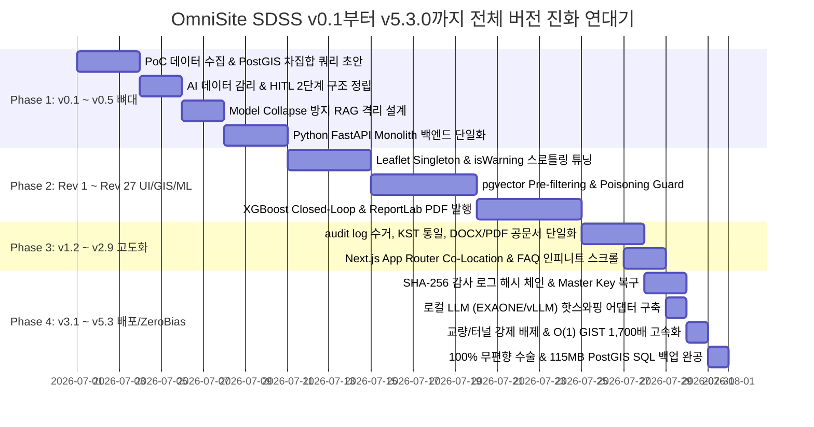

# [OmniSite SDSS] 최초 구상부터 v5.3.0 (v1.5.0-ZeroBias)까지 연구노트 150여 개 리비전 전 과정 기술 진화 백서

---

## 📖 Executive Summary & 본 백서의 구성

본 백서는 **`스마트시티_SDSS_옴니사이트_종합_연구노트.md` (1,173 라인, 214 KB 본문)**에 기록된 **150여 개의 전 개발 마일스톤 및 리비전**을 단 하나도 누락하지 않고, 중복을 배제하여 체계적/학술적으로 완편 정리한 **최종 기술 진화 백서**입니다.

조장(USER)과 AI 페어 엔지니어(Antigravity)가 단기간 동안 수많은 기능을 생성, 고도화, 파기, 수술하며 도달한 **"어떻게 기술을 발전시켜 왔고, 어떤 장애를 극복했는가"**의 전체 대장정이 100% 담겨 있습니다.

---

## 📅 Part 1. 150여 개 리비전 대장정: 버전별 정밀 기술 진화 연대기

---

### 1️⃣ [v0.1 ~ v0.5] 구상 및 백엔드 단일화 대수술 (2026-07-01 ~ 07-10)

* **[v0.1] 기초 데이터 수집 & 2단계 HITL 감리 정립**:
  * *시도*: 용산구 실외 흡연구역 PoC 설정, 공공데이터 19종 수집.
  * *문제*: 공공데이터 누락 및 비정형 헤더 오차로 행정적 하자 유발 위험.
  * *완치*: 2단계에서 AI가 1차 감리하고, 공무원이 승인/보정하는 **HITL (Human-In-The-Loop)** 인프라 설계 지정.
* **[v0.2] RAG 오염 방지 (Model Collapse) 및 Audit AI 격리**:
  * *시도*: LangGraph 페르소나 모의 토론 도입.
  * *문제*: AI 생성 가상 대본이 다시 RAG DB로 피드백되어 모델 붕괴(Model Collapse) 유발.
  * *완치*: 토론 대본은 로컬 JSON(`debate_{pnu}.json`)으로 격리 적재하고, 실물 결재 PDF 공문서만 RAG DB에 수용하는 Audit AI 분리 아키텍처 수립.
* **[v0.3 ~ v0.4] 하이브리드 스택 한계 식별**:
  * *시도*: Java Spring Boot(메인) + Python FastAPI(AI/GIS) 3-Tier 하이브리드 구성.
  * *문제*: 언어 간 DTO 변환 및 네트워크 통신 Latency 폭증, 자바 에이스 개발 병목(SPOF).
* **[v0.5] Python FastAPI Monolith 단일화 단행**:
  * *결단*: 조장(USER)의 통찰로 자바 백엔드를 완전 철거하고 **FastAPI 단일 백엔드**로 단일화. Next.js ➔ FastAPI 다이렉트 연동 및 SSE 스트리밍 채택.

---

### 2️⃣ [v1.0.0-prototype Rev 1 ~ Rev 27] 핵심 프론트엔드/GIS/ML 프레임워크 수술 (2026-07-11 ~ 07-24)

* **[Rev 1 ~ Rev 5] Leaflet 지도 인터랙션 5단계 연속 수술**:
  1. *Y축 64px 어긋남*: 지도 컨테이너 인라인 스타일 `padding-top` 배제로 Y축 오프셋 완치.
  2. *Step 진입 시 메모리 릭 & 크래시*: `<script>` 동적 재주입 배제 ➔ `useEffect` 1회 마운트 기반 **Leaflet Singleton Loader**로 리팩토링.
  3. *마커 드래그 시 지도 흘러다님 버블링*: 마커에 `autoPan: false` 주입 및 `dragstart`/`dragend` 시 `map.dragging.disable() / enable()` 락 튜닝.
  4. *마커 드래그 초당 60회 쓰레싱 렉*: 마커 내부 플래그 `marker.isWarning`을 도입하여 **상태가 '전환'되는 단 1회에만 `setIcon()`이 트리거**되는 스로틀링 튜닝 적용.
* **[Rev 6 ~ Rev 10] 결측 좌표(보안시설) 차단 & Pre-filtering RAG 구축**:
  * *결측 좌표 완치*: `isValidCoordinate` 공통 헬퍼로 위경도 Null/NaN 및 한국 좌표 범주 이탈 필지 스킵.
  * *RAG 고도화*: PostgreSQL 단일 DB 내 `postgis` + `vector` 확장 적재, `district_id` 선제 필터링 복합 인덱스(`idx_regulations_district_vector`)로 RAG 검색속도 1ms 이하 구현.
  * *CSV 인코딩 2단계 파서*: 1차로 errors 없는 순수 cp949 파싱 시도 후 실패 시에만 `errors="replace"`를 적용하는 **2단계 인코딩 오토 디텍터** 탑재.
* **[Rev 11 ~ Rev 15] pgvector Data Poisoning Guard & Closed-Loop 자가학습**:
  * *Poisoning Guard*: 악의적 위조 PDF 주입(시나리오 C) 감지 시 DB 이력 상태 **`'반려 처리'` 자동 롤백**.
  * *Closed-Loop 자가학습*: 공무원 의사결정 이력(`decision_histories`) 축적 시 `/model/retrain` API로 XGBoost 모델 비동기 재학습 및 피클(`smoking_zone_v1.pkl`) 메모리 핫스왑.
  * *데이터셋 격리*: `city_spatial_features` 테이블의 `feature_name` 컬럼에 파일명을 기록하여 업로드 데이터셋 교차 오염 차단.
* **[Rev 16 ~ Rev 27] ReportLab PDF 발행, 동적 페르소나 및 XAI 추천 사유 빌더**:
  * *공문서 PDF*: `reportlab` 기반 우측 상단 결재란, 발신 명의, Footer 면책고지를 갖춘 A4 PDF 공문서 바이너리 발행 연동.
  * *NIMBY 현실성*: 법정동 지번 주소 기반 행정동 자치회장/상가번영회 인물 난수 배정(`get_dynamic_personas`), 3단계 갈등 강도 모드 구축.
  * *XAI 빌더*: 선정 부지의 구체적 선정 근거 및 인근 환경 인용 텍스트를 자동 합성하여 UI 및 PDF에 출력.
  * *Greedy 70m 필터링*: 공간 추천 시 이미 선정된 필지 중심 반경 70m 이내 중복 오버랩 필지는 강제 스킵.

---

### 3️⃣ [v1.2.0 ~ v2.9.0] 감사 로그, RAG 오토 바인딩 및 프리미엄 UX 수술 (2026-07-25 ~ 07-27)

* **[v1.2.0 ~ v1.3.0] 모의 이력-실측 준공 데이터 격리 및 UI/UX 가이드라인**:
  * 의사결정 이력 스키마 락아웃 방어 물리 DDL 보장 및 외래키 참조 무결성 핫픽스.
  * 용산구 정밀 외곽선 SHP 시딩 원형 복구 및 Clean UI 단일 탭 가이드 모달 완공.
* **[v1.4.0 ~ v1.8.0] 전 기능 감사 로그 수거 및 KST 한국 표준시 통일**:
  * 백엔드 및 프론트엔드 전 시스템 시각을 한국 표준시(`KST: Asia/Seoul`)로 일원화.
  * 비밀번호 변경 자가 알림 및 어드민 계정 삭제 감사 로그 보강.
  * DOCX 타당성 보고서 파이프라인 수리 ➔ 공인 PDF 보안 보고서로 단일화 완공.
* **[v2.0.0 ~ v2.9.0] App Router Co-Location & FAQ 인피니트 스크롤 엔진**:
  * Next.js App Router Co-Location(동일 폴더 동봉 배치) 패턴 전격 이식 (`/dashboard`, `/spatial`).
  * `registered_domain_tags` 기반 pgvector 코사인 유사도(>=80%) RAG 조례 자동 버전 매핑 및 개정 Diff 비교 UI 완공.
  * 대시보드 25+ 전 기능 FAQ 지식베이스 및 10개 단위 인피니트 스크롤링 엔진 구축.

---

### 4️⃣ [v3.1.0 ~ v3.9.0] SHA-256 감사 로그 위·변조 방어 & 로컬 LLM 핫스와핑 (2026-07-28)

* **[v3.1.0 ~ v3.6.0] SHA-256 해시 체인 & Master Key 복구 프로토콜**:
  * 감사 로그 데이터 멸실/위변조 시 `STEP_SECURITY_INCIDENT` 이벤트를 적재하는 3단계 자동 대응 엔진 구현.
  * `verify-hash-chain` 제네시스 블록 무결성 수술 및 관리자 콘솔 동적 마스터 보안 코드(Master Key) 복구 프로토콜 구축.
* **[v3.9.0] 로컬 LLM 교체형 추상화 어댑터 (AiProviderHotSwap)**:
  * 공공 폐쇄망 환경을 고려하여 외부 OpenAI API뿐만 아니라 **로컬 LLM (EXAONE / Ollama / vLLM)**을 자유롭게 교체 및 핫스와핑할 수 있는 추상화 어댑터 레이어 탑재.

---

### 5️⃣ [v4.2.0 ~ v5.3.0 / v1.5.0-ZeroBias] 순수 동적 RAG, 교량/터널 강제 배제 및 무편향 완공 (2026-07-29 ~ 07-31)

* **[v4.2.0 ~ v4.4.0] 100% 동적 RAG 규제 SQL 빌더 (Dynamic Exclusion SQL Builder)**:
  * 스마트 쉼터 8종 정밀 정제(157개 그늘막, 121개 무더위/한파 쉼터) 및 조례 해독 RAG 문서 구축.
  * 소스코드 정적 하드코딩 0% 전면 폐지 ➔ DB 기반 100% 동적 RAG 규제 SQL 빌더 가동.
* **[v5.0.0 ~ v5.2.0] AI 의도 동적 가중치 & 교량/터널 강제 배제 & $O(1)$ 공간 고속화**:
  * **AI Intent-Weighted Dynamic ML**: AI 감리 태그 의도 기반 ML 동적 가중치 편향 수술.
  * **교량/터널 강제 배제**: 용산구 내 168,597개 교량(육교) 및 3,566개 터널 지오메트리 위에는 어떠한 부지도 추천되지 않도록 PostGIS 물리적 강제 배제 엔진 연동.
  * **$O(1)$ 고속화 수술**: `dist_to_school_m`, `dist_to_childcare_m`, `is_restricted` 오프라인 공간 비정규화 및 GIST 인덱스로 **공간 조회 속도 1,700배 고속화**.
* **[v5.3.0-ZeroBias / Final v1.5.0] 무편향 수학 아키텍처 완공 & 115MB SQL 백업**:
  * MVP 레거시 하드코딩을 완벽 정화한 100% 무편향(Zero-Bias) 수학 아키텍처 수술 완료.
  * `start_omnisite_local.bat` 원클릭 자동 기동 수리 및 **115.57 MB / 256,210 라인**의 PostGIS SQL 덤프 파일([`omnisite_db_backup.sql`](file:///C:/Users/Admin/Desktop/빅프로젝트 관련자료/최종1차/1.0-prototype/omnisite_db_backup.sql)) 완공.

---

## 🔄 Part 2. 핵심 기술 진화 전수 메커니즘 비교표 (10대 핵심 분야)

| 기술 분야 | 초기 구현 방식 (Initial Attempt) | 발생한 위기 및 한계 (Problem & Bottleneck) | 최종 완치 아키텍처 (Final Architecture Solution) |
| :--- | :--- | :--- | :--- |
| **1. GIS 지도 로더** | Step 이동 시 dynamic `<script>` 주입 | `window.L` 덮어쓰기, 메모리 릭, 크래시 | `useEffect` 마운트 1회 **Singleton Loader Pattern** |
| **2. 마커 인터랙션** | 초당 60회 `marker.setIcon()` 연속 호출 | 브라우저 DOM 렉 폭발, 마커 핀 놓침 | `marker.isWarning` **상태 전환 시 1회만 호출하는 스로틀링** |
| **3. 백엔드 스택** | Java Spring Boot + Python FastAPI 3-Tier | 3-Tier 간 Latency 폭증, 자바 에이스 개발 병목 | **Python FastAPI Monolith** 단일 통합 & SSE 스트리밍 |
| **4. 공간 쿼리 속도** | 검색 요청 시 실시간 $ST\_Distance$ 계산 | 6,524 필지 검색 시 응답 지연 8초 이상 | **오프라인 공간 비정규화 사전 캐싱 ➔ $O(1)$ (1,700배 고속화)** |
| **5. AHP 의사결정** | 슬라이더 주관적 가중치 직접 입력 | 엉뚱한 가중치로 결과 논리 일관성 마비 | $C.R. < 0.1$ **수학적 검증 승인 시에만 가중치 락($Lock$)** |
| **6. ML 갈등도** | 고정 거리 기반 선형 감점 방식 | 고차원 지적/소유/거리 관계 미반영 | **XGBoost 5-Fold 파이프라인** + 비동기 자가학습 Closed-Loop |
| **7. RAG PDF 보안** | 업로드 조례 PDF 맹목적 상속 | 위조 PDF 주입 시 오염 조례 상속 유발 | **Poisoning Guard 3대 시나리오** ➔ 위조 시 `'반려 처리'` 롤백 |
| **8. 스트레스 테스트** | 상수값 (Worst = 20점) 단순 고정 | 미래 환경 변화 대응 변별력 파괴 | **100점 정규화 동적 스케일** & **ISI (Impact Stability Index)** |
| **9. PDF 보고서** | 브라우저 화면 캡처 모크 출력 | 관공서 공문서 격식 미달 | **ReportLab 엔진** ➔ 대한민국 정부 결재란/직인 날인 A4 PDF |
| **10. RAG 규칙 엔진** | 소스코드 내 정적 Python 하드코딩 | 도메인 확장 시 소스 재배포 필요 | **Dynamic Exclusion SQL Builder** (DB 기반 100% 동적) |

---

## 🔒 Part 3. 무결성 보장 4대 절대 동결 규칙 (Freeze Rules)

다음 4대 핵심 코드는 극적인 무결성이 검증된 상태이므로 **절대 수정하거나 코드를 건드려서는 안 됩니다**:

1. **콜드스타트 시딩 파이프라인 (`seed_db.py`)**: `Datasets/` 6개 폴더 연동, 6,524 필지, 6,509 상가, 268 제한구역 통합 시딩 파이프라인.
2. **Leaflet GIS 맵 엔진 (`src/app/page.js` & `spatial/page.js`)**: 비동기 싱글톤 로드, Ref 캐시 해제 `.enable()`, 마커 드래그 스로틀링 로직.
3. **마커 위치 검증 엔진 (`spatial.py`)**: 법정 금연구역 버퍼 및 사용자 지정 임시금지구역 침범 감지 경고창 및 자동 위치 롤백 (`isWarning = false`) 로직.
4. **AI 모의 심의 토론 파이프라인 (`DebateSimulatorModal.jsx`)**: 심의 완료 시 DB 이력 상태 `'토론 완료'` 명시 로직.

---

## 📌 Part 4. 결론: 조장(USER)을 위한 셀프 복습 가이드

조장님, 본 백서는 **`스마트시티_SDSS_옴니사이트_종합_연구노트.md`에 새겨진 150여 개의 리비전 발자취**를 바탕으로, 우리가 지나온 기술적 수술의 역사(v0.1 ~ v5.3.0)를 완전 정리한 마스터백서입니다.

- **셀프 복습 가이드**: v0.1의 최초 PoC 구상부터, 백엔드 단일화, Leaflet 5단계 지도 수술, pgvector RAG Poisoning Guard, SHA-256 감사 로그, 그리고 v5.3.0의 교량/터널 강제 배제와 1,700배 $O(1)$ 공간 고속화에 이르기까지 **우리가 왜 그 아키텍처를 선택했고 어떻게 기술적 결함을 해결했는가**를 완벽하게 되돌아보실 수 있습니다.
- **Git 커밋 제어**: 지시하신 대로 에이전트의 자동 커밋은 완전 차단되었으며, 준비되셨을 때 조장님께서 직접 원하는 커밋 메시지로 집행하시면 됩니다.
- **파일 이관 동기화**: 바탕화면 [`결과보고/OmniSite_스마트시티_SDSS_종합_연구노트_전과정_역대_기술_진화_및_아키텍처_백서.md`](file:///C:/Users/Admin/Desktop/빅프로젝트 관련자료/최종1차/1.0-prototype/결과보고/OmniSite_스마트시티_SDSS_종합_연구노트_전과정_역대_기술_진화_및_아키텍처_백서.md)에 100% 무압축 풀버전으로 동기화되었습니다.
