# 🏛️ [OmniSite v1.7.0] 전체 시스템 정밀 기술 해설서 (Technical Whitepaper)
> **지자체 공간 빅데이터 및 AI 기반 스마트시티 공간 의사결정 지원 플랫폼 (SDSS)**

---

## 📌 1. 전체 시스템 총괄 개요 (System Overview)

**OmniSite(옴니사이트)**는 지자체 공공 인프라(흡연부스, 전기차 충전소, 옐로카펫 등) 선정 시 발생하는 **법적 규제 검증, 공간 입지 가치 연산, 주민 갈등 예지, 행정 심의 의사결정**을 한 번에 통합 처리하는 **웹 기반 스마트시티 공간 의사결정 지원 플랫폼(SDSS)**입니다.

```mermaid
graph LR
    S1["Step 1. 데이터 업로드 & AI 감리"] --> S2["Step 2. HITL 맵 마커 좌표 보정"]
    S2 --> S3["Step 3. AHP 상대 가중치 잠금"]
    S3 --> S4["Step 4. PostGIS & Closed-Loop 추천"]
    S4 --> S5["Step 5. AI 모의 심의 & 보고서 편찬"]

    style S1 fill:#0f172a,stroke:#3b82f6,stroke-width:2px;
    style S4 fill:#1e1e2f,stroke:#10b981,stroke-width:2px;
    style S5 fill:#172554,stroke:#6366f1,stroke-width:2px;
```

---

## ⚙️ 2. Step 1. 데이터 일괄 업로드 및 시맨틱 AI 감리 엔진

### 1) 어떤 식으로 되는가? (작동 방식)
- 사용자가 지자체 유동인구, 민원 접수 내역, 대중교통 노드 등의 공간 CSV/Shapefile/PDF 조례 파일을 drag-and-drop으로 일괄 업로드합니다.
- 시스템이 파일 텍스트 및 속성을 파싱하여 시맨틱 AI 감리를 수행하고, 사용자가 승인 버튼을 누르면 백엔드 ML 모델 재학습이 자동 기동됩니다.

### 2) 어떤 원리로 일어나는가? (엔지니어링 원리)
- **RAG 기반 시맨틱 태깅 (`inferred_domain_tag`)**:
  - 업로드된 헤더 속성명(`유동인구`, `민원수`, `정류장`)과 PDF 조례 문장의 코사인 유사도(Cosine Similarity)를 pgvector 파이프라인으로 측정합니다.
  - 이를 통해 해당 파일이 `smoking_zone`(흡연부스), `ev_charging`(전기차충전소) 중 어떤 도메인인지 자동 추론합니다.
- **ML 모델 동적 재학습 기동 (`/api/v1/model/retrain`)**:
  - 감리가 승인되는 즉시 백엔드 파이썬 프로세스가 해당 도메인의 최신 공간 지표(유동인구, 민원건수, 학교 이격거리 등)를 모아 **XGBoost ML 모델을 동적 재학습 및 pkl 모듈로 레지스트리에 락 적재**합니다.

### 3) 결과는 어떻게 나타나는가? (출력 결과)
- 시맨틱 도메인 태그 뱃지 표시 (`inferred_domain_tag: smoking_zone`)
- 감리 승인 팝업 및 ML 모델 재학습 성공 캡션 (`Accuracy: 0.7671, F1-score: 0.8058`)

---

## 🗺️ 3. Step 2. 비주얼 HITL 미세 좌표 보정 & 360도 로드뷰 연동

### 1) 어떤 식으로 되는가? (작동 방식)
- 3D Leaflet GIS 지도 위에서 실무자가 추천 기준점 위치를 마커 드래그(Drag)하여 핀포인트로 보정합니다.
- 지도 조작 시 카카오 로드뷰 API와 실시간 연동되어 360도 실제 현장 가시 이미지를 동시 확인하고, 마우스 드로잉으로 가상 금지구역(`user_exclusion_zones`)을 추가합니다.

### 2) 어떤 원리로 일어나는가? (엔지니어링 원리)
- **Leaflet 비동기 싱글톤 & 드래그 스로틀링 (동결 로직)**:
  - 브라우저 메모리 누수를 막기 위해 Leaflet 싱글톤 객체를 비동기로 유지하며, 마커 이동 시 발생하는 마우스 이벤트 좌표를 스로틀링(Throttling) 처리해 부드럽게 갱신합니다.
- **PostGIS 4중 공간 차집합 연산 (`user_exclusion_zones`)**:
  - 사용자가 지도에 그린 서클/다각형 가상 금지구역에 대해 PostGIS의 `ST_Intersects`, `ST_Within`, `ST_Contains`, `ST_DWithin` 4중 공간 연산을 적용합니다.
  - 1mm라도 금지구역 내부에 들어가거나 침범하는 필지는 후보지 검색에서 원천 사전 배제(Complete Drop)됩니다.

### 3) 결과는 어떻게 나타나는가? (출력 결과)
- 3D 지적도 맵 위 마커 핀포인트 이동 및 좌표(`lat`, `lng`) 실시간 갱신
- 카카오 로드뷰 360도 현장 스카이뷰 화면 표출
- 붉은색 가상 금지구역 폴리곤 하이라이팅

---

## 📐 4. Step 3. AHP 가중치 잠금 & 선형대수 일관성 비율($C.R.$) 엔진

### 1) 어떤 식으로 되는가? (작동 방식)
- 사용자가 5개 주요 입지 평가 항목(유동인구, 민원건수, 무단투기, 교통접근성, 공시지가)의 중요도를 직관적인 슬라이더(0~100)로 조절합니다.
- 백엔드가 일관성을 검증하여 $C.R. \le 0.1$ (10% 이내) 조건 통과 시에만 가중치 프로파일을 DB에 **락(Lock) 저장**합니다.

### 2) 어떤 원리로 일어나는가? (수학적 원리)
- **정규화 가중치 비중 ($0 \sim 1.0$)**:
  - 사용자가 설정한 5개 슬라이더 값 ($w_1, w_2, \dots, w_5$)의 전체 합으로 각 값을 나누어 **합이 정확히 1.0 (100%)이 되는 비중**을 계산합니다.
- **쌍대비교 행렬 $A$ 복원 및 최대 고유값 ($\lambda_{max}$)**:
  - 5개 비중 사이의 상대적 비율($a_{ij} = \frac{w_i}{w_j}$)을 5×5 행렬로 구성하고, Numpy 선형대수 엔진(`np.linalg.eigvals(A)`)으로 **최대 고유값 $\lambda_{max}$**을 연산합니다.
- **일관성 비율 $C.R. (Consistency Ratio)$ 검증**:
  - 일관성 지수 $C.I. = \frac{\lambda_{max} - n}{n - 1}$ 연산 후, 무작위 난수 지수 $R.I.$ ($n=5$일 때 $R.I. = 1.12$)를 나눕니다:
    $$C.R. = \frac{C.I.}{R.I.}$$
  - **$C.R. \le 0.1$ (통과)**: 의사결정 모순(A>B>C>A)이 없는 완벽한 가중치로 인정되어 DB에 `is_locked = True` 저장!
  - **$C.R. > 0.1$ (초과)**: 논리 모순 발생으로 판정하여 HTTP 422 에러로 DB 락 저장을 튕겨냄.

### 3) 결과는 어떻게 나타나는가? (출력 결과)
- `C.R. = 0.042 (통과)` 초록색 뱃지 표출
- DB `ahp_models` 테이블에 가중치 프로파일 락(Lock) 보존 저장

---

## ⚡ 5. Step 4. PostGIS 공간 필터링 & AHP-ML Closed-Loop 적격 입지 추천 엔진

### 1) 어떤 식으로 되는가? (작동 방식)
- 추천 실행 클릭 시, 기준점 300m 반경 내 용산구 **6,524개 지적 필지 및 6,509개 상가 데이터**를 실시간 구면 검색합니다.
- 법정 제한구역(학교 200m, 어린이집 50m) 배제 후, AHP 점수와 XGBoost ML 주민갈등도를 결합한 **Closed-Loop ISI(통합 적격성 지수)** 순으로 Top 1~Top 5 후보지를 추천합니다.

### 2) 어떤 원리로 일어나는가? (수학 및 공간 연산 원리)
- **PostGIS 구면 거리 감쇠 AHP 점수 ($Score_{AHP}$)**:
  - 6,524개 필지의 정규화된 5대 지표와 Step 3 AHP 가중치의 선형 결합에 **구면 하버사인 거리 감쇠 지수($e^{-\frac{dist}{150.0}}$)**를 곱합니다:
    $$Score_{AHP, k} = \left( \sum_{m=1}^{n} w_m \cdot x_{k,m} \right) \times e^{-\frac{dist}{150.0}}$$
- **법정 제한구역 Complete Drop**:
  - 학교정화구역(200m), 어린이집(50m) 다각형 경계선과 1mm라도 겹치는 필지는 쿼리 단계에서 **100% 완전 사전 배제**.
- **AHP-ML Closed-Loop ISI 통합 연산식**:
  - XGBoost ML이 예측한 주민갈등 민감도($CSS \in [10, 95]$)를 AHP 점수에 이차 패널티로 소급 적용합니다:
    $$ISI = Score_{AHP} \times \left(1.0 - 0.35 \times \left(\frac{CSS}{100.0}\right)^2\right)$$
  - 갈등 위험이 높은 부지(CSS > 70)는 최대 -35%까지 감점 처리되어 **고갈등 부지 1위 선출 0% 차단**.

### 3) 결과는 어떻게 나타나는가? (출력 결과)
- 우측 결과 패널에 Top 1 ~ Top 5 후보지 카드 렌더링
- `⚡ Closed-Loop 피드백 적격도 (ISI: 13.731점)` 파란색 뱃지 및 감점 패널티(`-23.5%`) XAI 추천 사유 표출

---

## 💬 6. Step 5. 3자 AI 모의 심의 토론 & 보고서 자동 편찬 엔진

### 1) 어떤 식으로 되는가? (작동 방식)
- Top 1 부지에 대해 **[찬성측(상인대표)], [반대측(주민대표)], [정부측(갈등조정관)]** 3자 AI 페르소나가 실제 행정 공청회를 진행하는 모의 토론 모달이 기동됩니다.
- 8턴 토론 완료 후 DB에 `status: '토론 완료'` 상태가 자동 기록되며, 클릭 한 번으로 전자정부 표준 양식 보고서가 인출됩니다.

### 2) 어떤 원리로 일어나는가? (엔지니어링 원리)
- **OpenAI Multi-Agent SSE 스트리밍**:
  - GPT-4o 멀티 에이전트에 찬성/반대/정부 페르소나 프롬프트를 주입하고, 대사 중간에 시스템 브라켓 기호(`[반대측]`)가 오염되지 않도록 텍스트 파서 가드를 적용해 real-time SSE 스트리밍으로 대화를 연출합니다.
- **19자리 PNU 자동 역매핑 및 ReportLab PDF/DOCX 바이너리 인출**:
  - 국토교통부 19자리 필지 고유번호(PNU) 및 지번, AHP 가중치 표, ML 패널티%를 자동 추출하여 ReportLab 엔진이 바이너리 스트림으로 **PDF 및 DOCX 전자정부 보고서를 1초 만에 인출**합니다.

### 3) 결과는 어떻게 나타나는가? (출력 결과)
- 실시간 3자 AI 모의 심의 토론 텍스트 터미널 뷰어
- `✓ AI 멀티에이전트 모의 심의 토론 완료` 뱃지
- PDF 및 DOCX 전자정부 표준 타당성 보고서 다운로드

---

## 🔒 7. 행정 보안 및 5단계 감사 로그(Audit Log) 추적 시스템

### 1) 어떤 식으로 되는가? (작동 방식)
- `sessionStorage` 기반의 100% 순수 세션 JWT 라우트 가드가 작동하여 미인증 접근을 튕겨냅니다.
- 5단계 파이프라인이 진행될 때마다 **PostgreSQL DB `pipeline_execution_logs` 테이블에 실시간 행정 감사 로그가 자동 적재**되며, 상단 `📜 감사 로그` 버튼으로 타임라인을 조회할 수 있습니다.

### 2) 어떤 원리로 일어나는가? (엔지니어링 원리)
- **Pure Session JWT & Inline Modal Guard**:
  - `localStorage` 잔재를 전면 제거하여 탭 분리나 브라우저 재진입 시 보안 사고를 차단하고, 토큰 만료 시 그 자리에서 재인증하는 Glassmorphism 인페이지 로그인 모달을 기동합니다.
- **Audit Log DB Schema (`pipeline_execution_logs`)**:
  - `save_pipeline_log(step_number, action_type, detail_json)` 헬퍼가 Step 1~5 수행 시점에 `session_id`, `step_number` (`STEP_1`~`STEP_5`), JSON 세부 인수를 타임스탬프와 함께 보장 저장합니다.

### 3) 결과는 어떻게 나타나는가? (출력 결과)
- 미인증 진입 시 라우트 가드 작동 및 Glassmorphism 로그인 모달 팝업
- 상단 `📜 감사 로그` 클릭 시 5단계 행정 타임라인 및 JSON 세부 적재 내역 뷰어 표출

---

## 👨‍💻 8. 조장님(리더)을 위한 1분 핵심 말하기 족보 (Speech Script)

> *"옴니사이트는 **Step 1에서 데이터셋을 올리면 AI가 시맨틱 태그를 감지해 ML을 자동 재학습**하고, **Step 2에서 실무자가 로드뷰를 보며 맵 마커를 HITL로 보정**합니다. **Step 3에서는 5개 항목 슬라이더를 조절하면 선형대수 고유값 연산으로 C.R. 10% 이내의 논리적 모순이 없는 가중치만 DB에 락(Lock)**을 겁니다. **Step 4에서는 PostGIS가 6,524개 지적 필지 중 법정 제한구역을 100% 배제하고 XGBoost ML 갈등도를 반영한 Closed-Loop ISI 통합 점수**로 Top 1~Top 5 최적지를 추천하며, **Step 5에서 3자 AI 모의 심의 토론을 거쳐 PNU 역매핑 전자정부 PDF 보고서를 인출**하고 **모든 파이프라인 이력을 DB 감사 로그(Audit Log)로 보관**하는 스마트시티 B2G SDSS 플랫폼입니다."*
