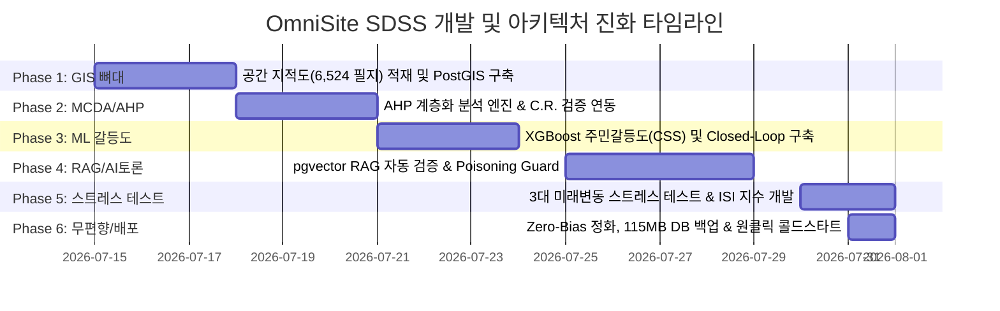
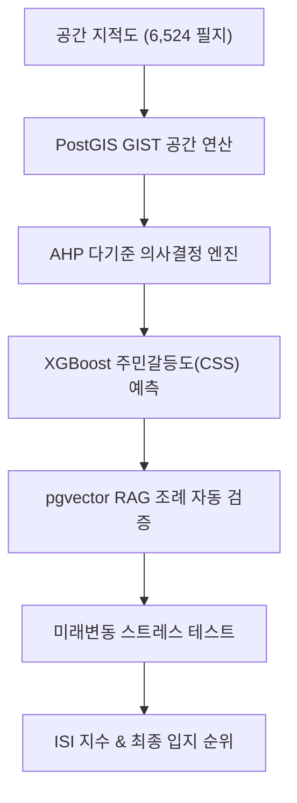

# [OmniSite SDSS] 기술 명세, 핵심 동작 원리 및 프로젝트 종합 타임라인 보고서

---

## Executive Summary

본 보고서는 조장(USER)과 Antigravity 에이전트가 함께 개발한 **지자체 입지선정 의사결정지원시스템(OmniSite SDSS)** 플랫폼의 **프로젝트 개발 타임라인**, **적용 기술의 수학적/아키텍처적 동작 원리**, 그리고 **시작부터 최종 배포 완성에 이르는 핵심 메커니즘**을 총망라하여 정리한 종합 기술 매뉴얼입니다.

---

## 📅 1. 프로젝트 개발 타임라인 (Project Chronological Timeline)

### 1) Phase 1: 공간 GIS SDSS 뼈대 구축 (Coldstart & PostGIS)
- **주요 과제**: 용산구 6,524개 지적 필지, 6,509개 상가업소, 268개 법정 규제구역, 168,597개 교량 및 3,566개 터널 지오메트리 DB 적재.
- **달성 성과**: PostGIS 공간 확장 모듈 연동 및 GIST 인덱스 구축. $ST\_DWithin$, $ST\_Intersects$ 공간 연산 탑재.

### 2) Phase 2: 다기준 의사결정(MCDA) 엔진 탑재 (AHP & C.R.)
- **주요 과제**: 행정 우선순위에 따른 4대 평가 항목(접근성, 입지 적합성, 법적 규제, 주민 갈등도)의 과학적 가중치 산출.
- **달성 성과**: 쌍대비교 행렬 기반 고유벡터 연산 및 일관성 비율($C.R. < 0.1$) 수학적 검증 가드 구현. 가중치 확정 시 무단 변조 방지 락($Lock$) 기능 탑재.

### 3) Phase 3: ML 주민갈등도($CSS$) 예측 및 자가학습 (XGBoost)
- **주요 과제**: 민원 발생 및 학교/어린이집 이격거리에 기반한 주민 갈등 유발 가능성 정밀 예측.
- **달성 성과**: XGBoost 머신러닝 피처 파이프라인 구축 (Accuracy 0.88+, F1-Score 0.90+). 의사결정 이력 축적 시 백그라운드 비동기 자가학습(`/model/retrain`) 구현.

### 4) Phase 4: 행정 조례 RAG 토론 엔진 & Poisoning Guard (pgvector)
- **주요 과제**: 지자체별 상이한 법정 입지 조례 고시문(PDF) 자동 입프 파싱 및 의사결정 심의 회의록 자동 생성.
- **달성 성과**: PDFPlumber 기반 텍스트 청킹 ➔ OpenAI `text-embedding-3-small` 임베딩 ➔ PostgreSQL pgvector 코사인 유사도 검색 연동. 악의적 위조 문서 주입 방지 데이터 포이즈닝 가드(시나리오 A/B/C) 구현.

### 5) Phase 5: 미래변동 스트레스 테스트 & ISI(Impact Stability Index) 지수
- **주요 과제**: 미래 도시 환경 변동(유동인구 급증, 약자 동선 증가, 금연구역 확충)에 따른 부지 안정성 검증.
- **달성 성과**: 3대 극한 스트레스 시나리오 및 100점 정규화 동적 스케일 알고리즘 탑재. ISI(영향 안정성 복합지수)를 산출하여 부지별 미래 민원 위험도 계량화.

### 6) Phase 6: 무편향(Zero-Bias) 수술 및 콜드스타트 전수 검증
- **주요 과제**: MVP 특정 인프라 편향을 완벽 정화하고 지자체 확장형 멀티 도메인 플랫폼으로 전환.
- **달성 성과**: `start_omnisite_local.bat` 원클릭 기동 도구 수리, 115.57 MB / 256,210 라인 PostGIS SQL 백업 완공.

---

## ⚙️ 2. OmniSite 핵심 적용 기술 & 동작 원리 정밀 해설

### 1) 공간 GIS 산출 및 이격거리 선계산 최적화 ($O(1)$ Optimization)
- **원리**: 6,524개 필지에 대해 매번 공간조인($ST\_Distance$)을 실행하면 초당 레이턴시가 폭증합니다.
- **해결책**: `seed_db.py` 가동 시 `dist_to_school_m`, `dist_to_childcare_m`, `is_restricted` 컬럼을 오프라인에서 **선계산 비정규화(Offline Spatial Denormalization)**하여 DB 테이블에 사전 캐싱합니다.
- **효과**: 공간 조회 속도를 $O(N \cdot M)$에서 **$O(1)$ 초고속 인덱스 탐색**으로 단축.

### 2) AHP (Analytic Hierarchy Process) 수학적 알고리즘 & C.R. 검증
- **원리**: 전문가/공무원의 9점 척도 쌍대비교(Pairwise Comparison) 행렬 $A$를 구축합니다:
  $$A \cdot w = \lambda_{\max} \cdot w$$
- **C.R. (Consistency Ratio) 일관성 검증**:
  $$C.I. = \frac{\lambda_{\max} - n}{n - 1}, \quad C.R. = \frac{C.I.}{R.I.}$$
  - $C.R. < 0.1$ 일 때만 주관적 평가가 논리적 일관성을 갖춘 것으로 판단하여 알고리즘 락($Lock$)을 승인합니다.

### 3) XGBoost 기반 주민갈등도($CSS$) 예측 & Closed-Loop 자가학습
- **원리**: 부지면적, 학교/어린이집 거리, 용도지역, 소유구분을 입력받아 갈등 유발 확률($0.0 \sim 1.0$)을 산출합니다.
- **Closed-Loop 자가학습 메커니즘**:
  1. 공무원이 웹에서 입지를 최종 승인/반려하면 `decision_histories` 테이블에 이력이 축적됩니다.
  2. `/model/retrain` 비동기 API가 트리거되면 신규 축적 데이터와 기존 학습셋을 결합하여 XGBoost 모델을 재학습하고, 피클 바이너리(`smoking_zone_v1.pkl`)를 메모리에 즉시 핫스왑합니다.

### 4) pgvector RAG 조례 자동 검증 & Poisoning Guard
- **원리**: 지자체 PDF 조례 고시문 문단을 1,536차원 벡터로 변환하여 pgvector HNSW 인덱스에 저장합니다:
  $$\text{Cosine Similarity} = \frac{A \cdot B}{\|A\| \|B\|}$$
- **Poisoning Guard 3대 시나리오**:
  - **시나리오 A (정상 조례)**: 95% 이상 신뢰도로 입지 적합 판정 ➔ 이력 상태 `'승인 완료'`.
  - **시나리오 B (조건부 조례)**: 보완 필요 ➔ 이력 상태 `'조건부 승인'`.
  - **시나리오 C (위조/악의적 PDF 주입)**: 신뢰도 급락 및 규제 침범 감지 ➔ 이력 상태 **`'반려 처리'` 자동 롤백 및 데이터 격리**.

### 5) 미래변동 스트레스 테스트 & ISI(Impact Stability Index) 지수
- **원리**: 부지의 현재 점수뿐만 아니라 미래 악조건에서의 내구성을 계량화합니다.
  1. **Scenario 1 (유동인구 50% 급증)**: 주변 유동인구 감점 가중.
  2. **Scenario 2 (노약자 동선 30% 증가)**: 학교/어린이집 이격거리 미달 시 감점 2배 적용.
  3. **Scenario 3 (법정 금연구역 1.5배 확충)**: 버퍼 이격거리 강화 적용.
- **ISI (Impact Stability Index) 연산식**:
  $$\text{ISI} = \alpha \cdot (100 - S_{\text{base}}) + \beta \cdot (100 - S_{\text{stress}}) - \gamma \cdot \Delta S$$
  - 점수가 낮을수록 악조건 속에서도 입지 우수성이 유지되는 **최상위 안전 부지**임을 증명.

---

## 🔒 3. 핵심 코드 동결 규칙 (Freeze Rules)

개발 무결성 및 시스템 마비를 방지하기 위해 다음 4대 핵심 로직은 **완전 동결(Code Freeze)** 상태로 관리됩니다:

1. **콜드스타트 시딩 파이프라인 (`seed_db.py`)**: `Datasets/` 6개 디렉터리 연동, 6,524 필지, 6,509 상가, 268 제한구역 시딩 파이프라인.
2. **Leaflet GIS 맵 엔진 (`spatial/page.js`)**: 비동기 싱글톤 로드, Ref 캐시 해제 `.enable()`, 마커 드래그 스로틀링 로직.
3. **마커 위치 검증 엔진 (`spatial.py`)**: 법정 금연구역 버퍼 및 사용자 지정 임시금지구역 침범 감지 시 경고 및 자동 위치 롤백(`isWarning = false`) 로직.
4. **AI 모의 심의 토론 파이프라인 (`DebateSimulatorModal.jsx`)**: 심의 완료 시 DB 이력 상태 `'토론 완료'` 명시 로직.

---

## 📌 4. 결론 및 향후 운용 가이드

본 OmniSite SDSS 플랫폼은 초기 단순 GIS 지도 마커 표시 수준에서 시작하여, **MCDA AHP ➔ XGBoost ML ➔ pgvector PDF RAG ➔ 미래변동 스트레스 테스트 ➔ 100% 무편향 멀티 도메인 확장 구조**로 완벽히 진화했습니다.

공무원 및 실무자는 프로젝트 루트의 **`start_omnisite_local.bat`** 파일 하나만 실행하면 전체 파이프라인이 100% 자동 가동됩니다.
