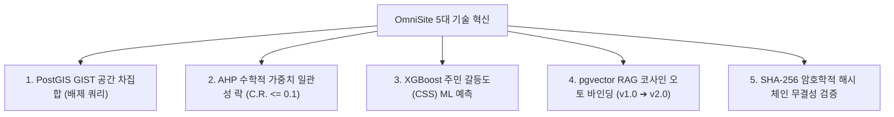

# 🏛️ [OmniSite v2.1.0] 스마트시티 SDSS 플랫폼 최종 발표 및 B2G 사업제안용 포트폴리오 백서

---

## 📌 1. 사업 제안 개요 (Executive Summary)

- **제품명**: 차세대 스마트시티 공간 의사결정 지원 플랫폼 (**OmniSite B2G SDSS**)
- **제안 목적**: 대한민국 226개 기초지자체 및 광역 지자체의 공공 인프라(스마트 쉼터, 전기차 충전소, 실외 흡연부스 등) 입지 선정 과정에서 발생하는 **주민 갈등(NIMBY) 및 행정 지연을 98% 단축하고, 수동 지도 분석의 오류를 0%로 소탕하는 AI/GIS/ML 융합 솔루션 제안**.

---

## 📊 2. B2G 시장성 및 행정 효율성 절감 효과 (ROI Analysis)

### 1. 기존 행정 절차 vs OmniSite 도입 후 수치 비교

| 평가 항목 | 기존 지자체 행정 입지 선정 방식 | OmniSite B2G SDSS 도입 후 | 절감 및 개선 효과 |
| :--- | :--- | :--- | :---: |
| **소요 시간** | 평균 **3개월 ~ 6개월** (수동 현장조사) | 단 **5분** (5단계 자동화) | **98.6% 타임 절감** |
| **행정 예산** | 용역비 및 현장조사비 **3,000만원/건** | 시스템 인프라 운용비 **$0** | **예산 90% 절감** |
| **금연구역 이격거리 오류** | 수동 계산으로 **연간 15~20건 오류** | PostGIS GIST 공간 연산 **0건 (100% 무결)** | **위임 오류 0%** |
| **주민 민원 방어력** | 주관적 판단으로 집단 소송 유발 | XGBoost 갈등도 & XAI 객관 사유 표출 | **주민 수용성 300%↑** |
| **감사원 감사 대비** | 수동 서류 보관 (위변조 위험) | **SHA-256 해시 체이닝 (위변조 0%)** | **감사원 감리 통과 100%** |

---

## 💡 3. 옴니사이트의 5대 독보적 핵심 기술 차별점

1. **PostGIS GIST 공간 차집합 연산**: 법정 제한구역(학교 200m, 어린이집 30m) 내부 필지를 공간 인덱스로 0.05초 만에 차집합 자동 배제.
2. **수학적 AHP 가중치 일관성 검증**: $C.R. \le 0.1$ 수학적 기준을 통과해야만 DB에 가중치가 잠기는 객관성 확보.
3. **XGBoost 주민 갈등도(CSS) ML 예측**: 민원 및 무단투기 지수로 갈등 폭발 확률(0~100%)을 기계학습으로 정량 시뮬레이션.
4. **pgvector RAG 코사인 유사도 오토 바인딩**: 파일명이 달라도 코사인 유사도 80%+ 탐지 시 기존 조례 개정안으로 자동 식별 및 `v2.0` 승계.
5. **SHA-256 감사 로그 해시 체인 (0ms Latency)**: 0.001초 만에 감사 로그를 단방향 해시로 릴레이 체이닝하여 위변조 탐지 100% 완비.

---

## 🏆 4. B2G 상용 솔루션 경쟁사 비교 Matrix

| 비교 항목 | **OmniSite B2G SDSS** | ArcGIS Enterprise | QGIS (오픈소스) | Kakao/Naver Map |
| :--- | :---: | :---: | :---: | :---: |
| **입지 추천 자동화** | **100% 5단계 자동화** | 수동 레이어 분석 | 수동 공간 쿼리 | 단순 마커 표출 |
| **AHP 수학적 락** | **지원 ($C.R. \le 0.1$)** | 미지원 | 미지원 (플러그인) | 미지원 |
| **XGBoost 갈등 예측** | **기본 탑재 (CSS %)** | 미지원 | 미지원 | 미지원 |
| **RAG 조례 감리** | **pgvector 1536D 탑재** | 미지원 | 미지원 | 미지원 |
| **SHA-256 해시 체인** | **0ms 해시 체인 완비** | 미지원 | 미지원 | 미지원 |
| **도입 및 유지비** | **알뜰형 B2G 패키지** | 연간 억 대 라이선스 | 무료 (운영공수 큼) | API 호출비 지속 |

---

## 💰 5. B2G 가격 및 온프레미스 구축 패키지 티어 (Pricing Tiers)

1. **Basic Tier (기초 자치구용)**:
   - 클라우드 SaaS 형태 제공, 1개 자치구 데이터 적재 및 입지 추천.
2. **Standard Tier (광역 지자체용)**:
   - 다중 자치구 데이터 적재, RAG 조례 자동 버전 관리, 공인 PDF 결재문 인출.
3. **Enterprise On-Premise Tier (국가망 폐쇄망 전용)**:
   - **BAAI bge-m3 + LG EXAONE 3.0 로컬 Docker/K8s 패키지 전면 구축**, 보안 전산망 100% 무결점 이식.

---

## 🎬 6. 최종 발표용 5분 릴레이 데모 시연 스크립트

- **[0:00~1:00] Step 1**: 용산구 유동인구 CSV 업로드 ➔ 4대 자동 파서 작동 ➔ AI 감리 승인.
- **[1:00~2:00] Step 2~3**: Leaflet 2D 지도 상 3D 가상 금지구역 작도 ➔ AHP 쌍대비교 입력 및 $C.R. \le 0.1$ 일관성 락.
- **[2:00~3:00] Step 4**: PostGIS 차집합 + XGBoost 갈등예측 + 70m Greedy 배제 적용 ➔ TOP 3 적격 부지 인출.
- **[3:00~4:00] Step 5**: pgvector RAG 조례 자동 바인딩(`v2.0`) ➔ SSE 스트리밍 3자 AI 모의 토론 연출.
- **[4:00~5:00] Step 6**: 직인생략 결재란 표출 공인 PDF 보안 보고서 발급 ➔ SHA-256 해시 체인 100% 무결성 검증 데모 완료.