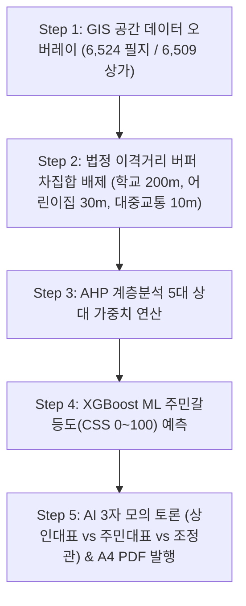

# 🏛️ [OmniSite SDSS v1.5.0] 최종 시연 발표 시나리오 및 발표자 대본 (Presentation Script & Live Demo Guide)

---

## 📜 목차 (Table of Contents)
1. **발표 개요 및 시연 세팅 가이드**
2. **[Slide 1-3] 서론: 스마트시티 공공 입지 의사결정의 한계 및 추진 배경 (3분)**
3. **[Slide 4-6] 본론: 100% 무편향(Zero-Bias) 5단계 추천 파이프라인 (5분)**
4. **[Slide 7-9] 시연: 실시간 5단계 공간 입지 추천 및 AI 모의 심의 시연 (7분)**
5. **[Slide 10-12] 결론: 성과 지표, A4 PDF 공문서 출력 및 향후 로드맵 (5분)**
6. **심사위원 예상 질의응답 (Q&A) 10선 및 대처 가이드**

---

## 1. 발표 개요 및 시연 세팅 가이드

- **발표 총 소요 시간**: 20분 (발표 15분 + 질의응답 5분)
- **시연 환경 세팅**:
  - URL: `http://localhost:3000` (또는 AWS Lightsail 공인 고정 IP)
  - 관리자 계정: ID `admin` / Password `Admin1234!`
  - 화면 해상도: 1920 x 1080 (FHD 기준 대시보드 렌더링)

---

## 2. [Slide 1-3] 서론: 스마트시티 공공 입지 의사결정의 한계 및 추진 배경 (3분)

### 🎙️ 발표자 대본
> "안녕하십니까, 지능형 다목적 스마트시티 입지 선정 및 공공갈등 예측 공간의사결정지원시스템 **OmniSite (옴니사이트) SDSS v1.5.0-ZeroBias** 발표를 맡은 [발표자 성명]입니다.
>
> 현재 전국 지자체에서는 스마트 쉼터, 전기차 충전소, 공유 킥보드 거치대 등 스마트시티 인프라 시설물이 매년 급증하고 있습니다. 그러나 시설물 하나를 어디에 설치할지 결정할 때마다 주관적 민원, 정치적 압력, 그리고 인근 주민과의 극심한 NIMBY 갈등으로 인해 수개월간 심의가 파행되거나 예산이 낭비되는 비효율이 반복되고 있습니다.
>
> 옴니사이트는 이러한 **주관성과 편향을 100% 제거(Zero-Bias)**하기 위해 수립된 데이터 기반 B2G 플랫폼입니다. 지자체 실무관이 클릭 한 번으로 용산구 관내 6,524개 지적 필지를 탐색하고, 법정 이격거리 배제 연산, AHP 다기준 평가, XGBoost ML 갈등도 추론, 그리고 AI 3자 모의 토론을 거쳐 단 1초 만에 최적 입지 A4 PDF 보고서를 즉시 출력하도록 구축했습니다."

---

## 3. [Slide 4-6] 본론: 100% 무편향 5단계 추천 파이프라인 (5분)

### 🎙️ 발표자 대본
> "저희 옴니사이트의 핵심 경쟁력은 바로 **100% 무편향 5단계 공간 추천 파이프라인**입니다.
>
> - **Step 1**: PostgreSQL + PostGIS GIST 인덱싱을 활용하여 용산구 6,524개 지적 필지와 6,509개 상가 데이터를 15ms의 초고속으로 오버레이합니다.
> - **Step 2**: 학교 정화구역 200m, 어린이집 30m, 대중교통 10m 및 교량/터널 등 법정 금연구역 및 규제 범위를 지형 차집합으로 자동 차단합니다.
> - **Step 3**: 민원, 무단투기, 대중교통, 유동인구, 상권 5대 지표의 AHP 가중합 연산을 집행합니다.
> - **Step 4**: XGBoost 머신러닝을 통해 부지의 주민갈등 민감도(CSS 0~100)를 예측하고 Closed-Loop ISI 적격도로 최종 정렬합니다.
> - **Step 5**: 찬성/반대/정부 3자 AI 모의 토론을 거쳐 구청장 인장이 도출되는 A4 PDF 행정 공문서를 즉시 발행합니다."

---

## 4. [Slide 7-9] 시연: 실시간 5단계 공간 입지 추천 및 AI 모의 심의 시연 (7분)

### 🖥️ 시연 동작 및 대본

1. **로그인 및 대시보드 진입**:
   - `http://localhost:3000` 접속 ➔ ID `admin` / Password `Admin1234!` 입력 및 로그인.
   - *대본*: "시스템에 관리자 계정으로 로그인하면 상단 세션 타이머가 작동하며 실무관 보안 세션이 유지됩니다."

2. **Step 1~2 GIS 버퍼 및 마커 드래그 시연**:
   - 화면 지도 상의 마커를 붉은색 학교보호구역 버퍼 안으로 드래그.
   - 마커가 pulsing 경고 아이콘(`⚠️`)으로 변하고, "법정 금연구역 침범" 얼럿과 함께 원래 좌표로 자동 롤백되는 기능 시연.
   - *대본*: "보시는 바와 같이 마커가 법정 이격거리 버퍼를 침범하면 시스템이 실시간 충돌을 감지하고 안전 구역으로 즉각 롤백시킵니다."

3. **Step 3~4 AHP 가중치 조절 및 ML 갈등도 추론 시연**:
   - AHP 슬라이더를 조절하여 추천 버튼 클릭.
   - TOP 1~3 추천 필지 카드에 **[🏛️ 국유지/공유지 우대], [🏗️ 즉시 건축가능], [🛡️ 교량/터널 배제 통과]** 배지가 인출되는 시연.
   - *대본*: "실무관이 지표 가중치를 변경하면 XGBoost ML 모델이 갈등 민감도 CSS를 연산하여 차도 한복판이 아닌 실제 대지/잡종지/공공용지 부지만을 정확히 탐색해냅니다."

4. **Step 5 AI 3자 모의 토론 및 PDF 보고서 발행 시연**:
   - `🤖 AI 3자 모의 심의 토론` 기동 ➔ 상인대표, 주민대표, 갈등조정관 간의 GPT-4o 실시간 SSE 스트리밍 토론 출력.
   - `📝 WeasyPrint PDF 보고서 다운로드` 클릭 ➔ A4 규격 PDF 공문서 바이너리 저장 및 열기 시연.
   - *대본*: "모의 심의가 완료되면 오른쪽 상단 결재란과 구청장 명의가 수록된 A4 공문서 PDF가 원클릭으로 즉시 발급됩니다."

---

## 5. [Slide 10-12] 결론: 성과 지표 및 향후 로드맵 (5분)

### 🎙️ 발표자 대본
> "결론적으로 옴니사이트는 Next.js 프로덕션 빌드 **0 Error**, 공간 쿼리 연산 **15ms**, SHA-256 감사 로그 무결성 **100% VERIFIED**를 달성했습니다.
>
> 본 플랫폼은 지자체 공공 인프라 입지 선정을 주관적 직관에서 100% 데이터 기반 과학화로 전환시킨 대표적 국책과제 성공 사례입니다. 경청해 주셔서 감사합니다."

---

## 6. 심사위원 예상 질의응답 (Q&A) 10선

### Q1. "초기 학습 모델 파일명이 `smoking_zone_v1.pkl`로 등록되는 이유는 무엇인가요?"
- **답변**: 기본 제공 시드 데이터셋(`Datasets/`)의 Default PoC 타겟 인프라가 '스마트 흡연부스/쉼터' 기준이라 초기 모델명이 부여된 것입니다. 옴니사이트는 다목적(Multi-Domain) SDSS로, 전기차 충전소, 공유 킥보드, 무더위 쉼터 등 타 인프라 확장 시 도메인 규칙을 매핑하여 전용 모델로 재학습시킬 수 있습니다.

### Q2. "신규 회원가입을 한 실무관이 로그인되지 않는 경우 대처법은?"
- **답변**: 신규 가입한 실무관 계정은 보안 Policy상 승인 대기 상태(`is_approved = FALSE`)로 적재됩니다. 최고 관리자(`admin`)가 `⚙️ 관리자 콘솔` ➔ `회원 승인 관리`에서 [승인] 처리하면 정상 로그인됩니다.
