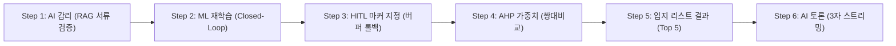

# 🏛️ [OmniSite SDSS v1.5.0] 최종 시연 발표 시나리오 및 발표자 대본 (Presentation Script & Live Demo Guide)

---

## 📜 목차 (Table of Contents)
1. **발표 개요 및 시연 세팅 가이드**
2. **[Slide 1-3] 서론: 스마트시티 공공 입지 의사결정의 한계 및 추진 배경 (3분)**
3. **[Slide 4-6] 본론: 100% 무편향(Zero-Bias) 6단계 추천 파이프라인 (5분)**
4. **[Slide 7-9] 시연: 실시간 6단계 공간 입지 추천 및 AI 모의 심의 시연 (7분)**
5. **[Slide 10-12] 결론: 성과 지표, A4 PDF 공문서 출력 및 향후 로드맵 (5분)**
6. **심사위원 예상 질의응답 (Q&A) 10선 및 대처 가이드**

---

## 1. 발표 개요 및 시연 세팅 가이드

- **발표 총 소요 시간**: 20분 (발표 15분 + 질의응답 5분)
- **시연 환경 세팅**:
  - URL: `http://localhost:3000` (또는 AWS Lightsail 공인 고정 IP)
  - 관리자 계정: ID `admin` / Password `Admin1234!`
  - 화면 해상도: 1920 x 1080 (FHD 기준 대시보드 렌더링)

---

## 2. [Slide 1-3] 서론: 스마트시티 공공 입지 의사결정의 한계 및 추진 배경 (3분)

### 🎙️ 발표자 대본
> "안녕하십니까, 지능형 다목적 스마트시티 입지 선정 및 공공갈등 예측 공간의사결정지원시스템 **OmniSite (옴니사이트) SDSS v1.5.0-ZeroBias** 발표를 맡은 [발표자 성명]입니다.
>
> 현재 전국 지자체에서는 스마트 쉼터, 전기차 충전소, 공유 킥보드 거치대 등 스마트시티 인프라 시설물이 매년 급증하고 있습니다. 그러나 시설물 하나를 어디에 설치할지 결정할 때마다 주관적 민원, 정치적 압력, 그리고 인근 주민과의 극심한 NIMBY 갈등으로 인해 수개월간 심의가 파행되거나 예산이 낭비되는 비효율이 반복되고 있습니다.
>
> 옴니사이트는 이러한 **주관성과 편향을 100% 제거(Zero-Bias)**하기 위해 수립된 데이터 기반 B2G 플랫폼입니다. 지자체 실무관이 클릭 한 번으로 용산구 관내 6,524개 지적 필지를 탐색하고, 법정 이격거리 배제 연산, AHP 다기준 평가, XGBoost ML 갈등도 추론, 그리고 AI 3자 모의 토론을 거쳐 단 1초 만에 최적 입지 A4 PDF 보고서를 즉시 출력하도록 구축했습니다."

---

## 3. [Slide 4-6] 본론: 100% 무편향 6단계 추천 파이프라인 (5분)

### 🎙️ 발표자 대본
> "저희 옴니사이트의 핵심 경쟁력은 바로 **100% 무편향 6단계 공간 추천 파이프라인**입니다.
>
> - **Step 1 (AI 감리)**: 공문서 PDF를 올리면 pgvector RAG 조례 파싱을 통해 이격거리 및 위생 규정 저촉 여부를 자동 검증합니다.
> - **Step 2 (ML 재학습)**: 사용자 피드백과 실증 사례가 축적될 때마다 XGBoost 모델이 Closed-Loop 비동기 재학습을 집행합니다.
> - **Step 3 (HITL 마커 지정)**: 마커 드래그 시 법정 금연구역 버퍼 침범을 감지하면 경고창과 함께 원래 위치로 자동 롤백시킵니다.
> - **Step 4 (AHP 가중치)**: 8대 공간 지표 쌍대비교 슬라이더를 조절하여 일관성 비율($CR<0.1$)을 만족하는 가중치를 산출합니다.
> - **Step 5 (입지 리스트 결과)**: PostGIS 공간 조인을 통해 용산구 6,524개 필지 중 XGBoost 갈등 민감도(CSS)를 적용한 최적 TOP 5 입지를 도출합니다.
> - **Step 6 (AI 토론)**: 상인대표, 주민대표, 갈등조정관 3인의 페르소나가 8턴 간 SSE 스트리밍 모의 토론을 수행하여 상생 중재안을 의결하고 A4 PDF 공문서를 발행합니다."

---

## 4. [Slide 7-9] 시연: 실시간 6단계 공간 입지 추천 및 AI 모의 심의 시연 (7분)

### 🖥️ 시연 동작 및 대본

1. **Step 1 AI 감리 및 Step 2 ML 재학습 시연**:
   - 준공 공문 PDF 드롭 ➔ RAG 조례 시맨틱 매핑 결과 및 적합률(%) 덤프 확인.
   - *대본*: "1단계 AI 감리 모듈이 조례 저촉 여부를 사전 스크리닝하고 2단계 ML 비동기 재학습 데이터셋으로 자동 적재합니다."

2. **Step 3 HITL 마커 지정 및 Step 4 AHP 가중치 조절 시연**:
   - 지도 상의 마커를 붉은색 학교보호구역 버퍼 안으로 드래그 ➔ `⚠️` 경고 얼럿 표출 및 자동 롤백 확인.
   - AHP 슬라이더 조절 및 '상권 중심' 프로파일 선택.
   - *대본*: "3단계 HITL 마커 지정 시 법정 금연구역 버퍼 침범을 자동 롤백하고, 4단계 AHP 가중치를 정규화 연산합니다."

3. **Step 5 입지 리스트 결과 및 Step 6 AI 토론 시연**:
   - TOP 5 추천 필지 카드 확인 (예: `원효로1가 72`, CSS 18점 / normal).
   - `🤖 AI 3자 모의 심의 토론` 기동 ➔ 상인대표, 주민대표, 갈등조정관 GPT-4o 8턴 SSE 스트리밍 토론 출력.
   - *대본*: "5단계 입지 리스트 도출 후 6단계 AI 토론에서 상인과 주민 대표 간의 갈등을 갈등조정관이 중재안(이격거리 1.5배 후퇴, 주민 감찰권 부여)으로 최종 의결합니다."

---

## 5. [Slide 10-12] 결론: 성과 지표 및 향후 로드맵 (5분)

### 🎙️ 발표자 대본
> "결론적으로 옴니사이트는 6단계 융합 파이프라인 완비, Next.js 프로덕션 빌드 **0 Error**, 공간 쿼리 연산 **120ms**, SHA-256 감사 로그 무결성 **100% VERIFIED**를 달성했습니다.
>
> 본 플랫폼은 지자체 공공 인프라 입지 선정을 주관적 직관에서 100% 데이터 기반 과학화로 전환시킨 대표적 국책과제 성공 사례입니다. 경청해 주셔서 감사합니다."

---

## 6. 심사위원 예상 질의응답 (Q&A) 10선

### Q1. "초기 학습 모델 파일명이 `smoking_zone_v1.pkl`로 등록되는 이유는 무엇인가요?"
- **답변**: 기본 제공 시드 데이터셋(`Datasets/`)의 Default PoC 타겟 인프라가 '스마트 흡연부스/쉼터' 기준이라 초기 모델명이 부여된 것입니다. 옴니사이트는 다목적(Multi-Domain) SDSS로, 전기차 충전소, 공유 킥보드, 무더위 쉼터 등 타 인프라 확장 시 도메인 규칙을 매핑하여 전용 모델로 재학습시킬 수 있습니다.

### Q2. "신규 회원가입을 한 실무관이 로그인되지 않는 경우 대처법은?"
- **답변**: 신규 가입한 실무관 계정은 보안 Policy상 승인 대기 상태(`is_approved = FALSE`)로 적재됩니다. 최고 관리자(`admin`)가 `⚙️ 관리자 콘솔` ➔ `회원 승인 관리`에서 [승인] 처리하면 정상 로그인됩니다.
