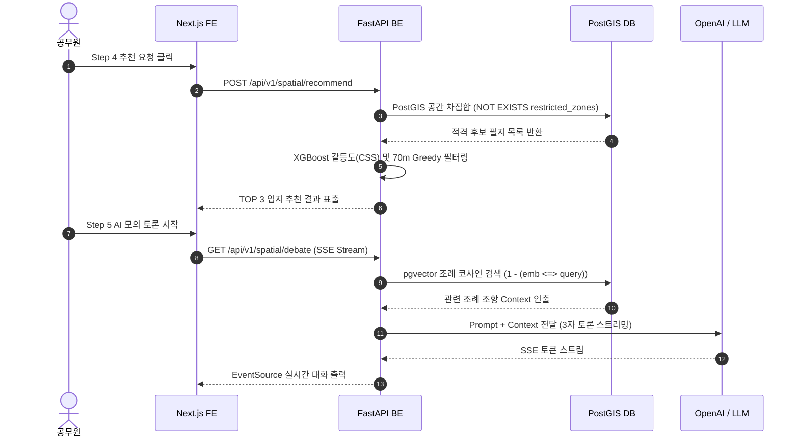
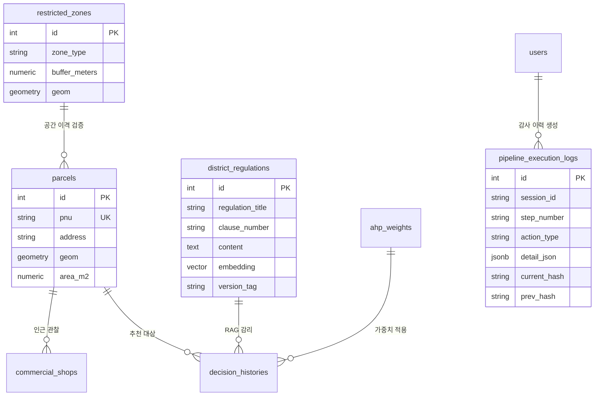

# 🏛️ [OmniSite v2.1.0] 전체 시스템 아키텍처 설계서 및 데이터베이스 ERD 명세서

---

## 📌 1. 계층별 시스템 아키텍처 (Layered Architecture)

```text
 ┌────────────────────────────────────────────────────────────────────────┐
 │ 1. Presentation Layer (프론트엔드 - Next.js 16 Turbopack)              │
 │    - Leaflet 2D GIS Engine (마커 스로틀링 & Ref 비동기 싱글톤)           │
 │    - React 19 UI Components (Modal, Slider, Result Panel)              │
 │    - SSE EventSource Stream Viewer (AI 모의 토론 실시간 타자 효과)       │
 └───────────────────────────────────┬────────────────────────────────────┘
                                     │ (REST API & SSE Protocol)
 ┌───────────────────────────────────▼────────────────────────────────────┐
 │ 2. Application Layer (백엔드 - FastAPI & Uvicorn)                       │
 │    - Router Modules: auth, upload, spatial, ahp, model                 │
 │    - KST Timezone Helper (get_kst_now())                               │
 │    - SHA-256 Audit Log Engine (save_pipeline_log)                       │
 └───────────────────────────────────┬────────────────────────────────────┘
                                     │
 ┌───────────────────────────────────┴────────────────────────────────────┐
 │ 3. AI & Analytics Layer (인공지능 & 머신러닝 엔진)                     │
 │    - OpenAI text-embedding-3-small (1,536D Vectorize)                   │
 │    - XGBoost Conflict Sensitivity Classifier (CSS Prediction)          │
 │    - AHP Math Engine (C.R. <= 0.1 Consistency Auditor)                 │
 └───────────────────────────────────┬────────────────────────────────────┘
                                     │
 ┌───────────────────────────────────▼────────────────────────────────────┐
 │ 4. Persistence Layer (공간 DB & 벡터 지식베이스)                       │
 │    - PostgreSQL 15 + PostGIS (ST_Contains, ST_DWithin GIST Indexing)    │
 │    - pgvector Extension (Vector Cosine Distance ops)                   │
 └────────────────────────────────────────────────────────────────────────┘
```

---

## 🔄 2. 데이터 흐름도 (Data Flow Diagram - DFD)

### [DFD Level 0: 전체 시스템 콘텍스트]
```text
[공무원] ── (공간 CSV/SHP & 조례 PDF) ──> [OmniSite SDSS] ── (공인 PDF 결재문 & 해시 검증) ──> [공무원 & 감사원]
```

### [DFD Level 1: 5단계 프로세스 흐름]
```text
[CSV/SHP 업로드] ➔ [1. AI 감리] ➔ [2. 3D 가상 작도] ➔ [3. AHP 락] ➔ [4. PostGIS/XGBoost 추천] ➔ [5. RAG / AI 모의 토론] ➔ [6. PDF 보안 발급]
```

---

## ⏱️ 3. 핵심 시퀀스 다이어그램 (Sequence Diagrams)

### [시퀀스 1: 5단계 입지 추천 및 AI 모의 토론 실행]


---

## 💾 4. 데이터베이스 ERD 및 10대 테이블 완전 DDL 명세



### 1️⃣ `parcels` (용산구 필지 정보)
```sql
CREATE TABLE parcels (
    id SERIAL PRIMARY KEY,
    pnu VARCHAR(19) UNIQUE NOT NULL,
    address VARCHAR(255),
    geom GEOMETRY(Polygon, 4326),
    area_m2 NUMERIC,
    land_use VARCHAR(50)
);
CREATE INDEX idx_parcels_geom ON parcels USING GIST(geom);
```

### 2️⃣ `commercial_shops` (상가 업종 데이터)
```sql
CREATE TABLE commercial_shops (
    id SERIAL PRIMARY KEY,
    shop_name VARCHAR(100),
    category VARCHAR(50),
    geom GEOMETRY(Point, 4326)
);
CREATE INDEX idx_shops_geom ON commercial_shops USING GIST(geom);
```

### 3️⃣ `restricted_zones` (법정 금연구역 및 규제존)
```sql
CREATE TABLE restricted_zones (
    id SERIAL PRIMARY KEY,
    zone_type VARCHAR(50) NOT NULL,
    buffer_meters NUMERIC NOT NULL,
    geom GEOMETRY(Polygon, 4326)
);
CREATE INDEX idx_zones_geom ON restricted_zones USING GIST(geom);
```

### 4️⃣ `pipeline_execution_logs` (SHA-256 해시 체인 감사 로그)
```sql
CREATE TABLE pipeline_execution_logs (
    id SERIAL PRIMARY KEY,
    session_id VARCHAR(100) DEFAULT 'SESSION_DEFAULT',
    step_number VARCHAR(20) NOT NULL,
    action_type VARCHAR(50) NOT NULL,
    detail_json JSONB,
    created_at TIMESTAMP DEFAULT (CURRENT_TIMESTAMP AT TIME ZONE 'UTC' AT TIME ZONE 'Asia/Seoul'),
    current_hash VARCHAR(64),
    prev_hash VARCHAR(64)
);
```

### 5️⃣ `district_regulations` (pgvector RAG 조례 임베딩 데이터)
```sql
CREATE TABLE district_regulations (
    id SERIAL PRIMARY KEY,
    district_id INT DEFAULT 1,
    regulation_title VARCHAR(255),
    clause_number VARCHAR(50),
    content TEXT,
    embedding VECTOR(1536),
    category VARCHAR(50),
    version_tag VARCHAR(30) DEFAULT 'v1.0',
    effective_date VARCHAR(20)
);
CREATE INDEX idx_regulations_vector ON district_regulations USING ivfflat (embedding vector_cosine_ops);
```

### 6️⃣ `ahp_weights` (AHP 일관성 검증 잠금 테이블)
```sql
CREATE TABLE ahp_weights (
    id SERIAL PRIMARY KEY,
    facility_type VARCHAR(50) UNIQUE NOT NULL,
    weight_json JSONB NOT NULL,
    consistency_ratio NUMERIC NOT NULL,
    is_locked BOOLEAN DEFAULT TRUE,
    created_at TIMESTAMP DEFAULT CURRENT_TIMESTAMP
);
```

### 7️⃣ `user_exclusion_zones` (Step 2 3D 가상 작도 금지구역)
```sql
CREATE TABLE user_exclusion_zones (
    id SERIAL PRIMARY KEY,
    zone_name VARCHAR(100),
    geom GEOMETRY(Polygon, 4326),
    created_at TIMESTAMP DEFAULT CURRENT_TIMESTAMP
);
```

### 8️⃣ `decision_histories` (공간 입지 의사결정 이력)
```sql
CREATE TABLE decision_histories (
    id SERIAL PRIMARY KEY,
    pnu VARCHAR(19) REFERENCES parcels(pnu),
    status VARCHAR(50) DEFAULT '추천 완료',
    score NUMERIC,
    conflict_probability NUMERIC,
    created_at TIMESTAMP DEFAULT CURRENT_TIMESTAMP
);
```

### 9️⃣ `verified_precedents` (준공 선례 확정 데이터)
```sql
CREATE TABLE verified_precedents (
    id SERIAL PRIMARY KEY,
    precedent_title VARCHAR(255),
    pnu VARCHAR(19),
    is_success BOOLEAN DEFAULT TRUE,
    created_at TIMESTAMP DEFAULT CURRENT_TIMESTAMP
);
```

### 🔟 `users` (행정 전산망 사용자 계정)
```sql
CREATE TABLE users (
    id SERIAL PRIMARY KEY,
    username VARCHAR(50) UNIQUE NOT NULL,
    hashed_password VARCHAR(255) NOT NULL,
    role VARCHAR(20) DEFAULT 'admin',
    created_at TIMESTAMP DEFAULT CURRENT_TIMESTAMP
);
```